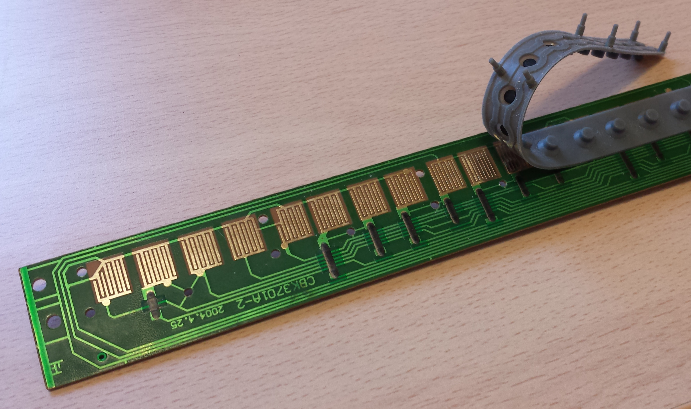
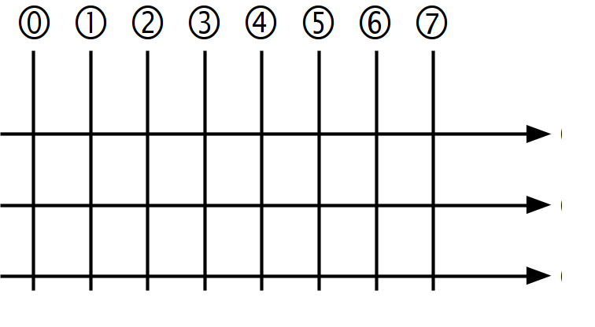
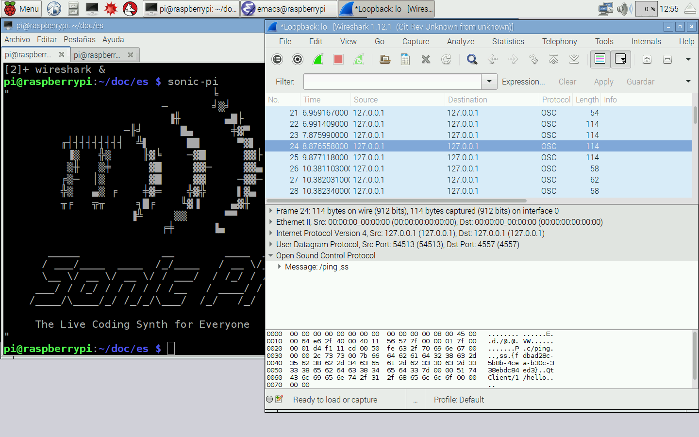

[//]: # (-*- mode: markdown; coding: utf-8 -*-)
# Piano de juguete

<figure style="float:right;padding:10px">
  
  <figcaption style="font-size:smaller;font-style:italic;text-align:center">
	Piano infantil como el que vamos a modificar.
  </figcaption>
</figure>

Vamos a analizar como caso de estudio un piano de juguete.  Supongamos
que tenemos un muchachito travieso que se ha subido en su piano de
juguete y ha estado saltando encima de él hasta que ha dejado de
sonar.  Estas cosas pasan, os lo aseguro, ya no hacen los pianos como
antes.  Supongamos que el muchachito está muy arrepentido y te pide
con su mejor cara de angelito que *le pongas pilas al piano*.  No vale
la pena explicarle que el problema es mayor, hay que hacer algo.
Armados con un destornillador y un poco de paciencia conseguimos
desmontarlo entero e identificamos el teclado de membrana que hay bajo
las teclas del piano.

<figure style="float:right;padding:10px">
  
  <figcaption style="font-size:smaller;font-style:italic;text-align:center">
	Teclado de membrana bajo las teclas del piano.
  </figcaption>
</figure>

Las teclas están físicamente dispuestas como una línea pero
lógicamente dispuestas de forma matricial, como muestra la figura
adjunta.  Hay ocho columnas y tres filas.  Cuando se pulsa una de las
teclas se cortocircuita la columna correspondiente con la fila
correspondiente.  Es así de simple.

Lo que vamos a hacer es eliminar el controlador actual del piano y
sustituirlo por una Raspberry Pi.  Lo ideal sería poner una Raspberry
Pi Zero, pero eso es un detalle menor, puesto que el diseño y el
software es exactamente igual con cualquier otro modelo actual.  Para
los altavoces podemos usar cualquier mecanismo utilizado en un
ordenador convencional.  A mi me gusta especialmente la idea de un
altavoz Bluetooth, que puede ser externo si queremos.  Se puede
conseguir uno resistente al agua por poco más de seis euros en
[Banggood.com](http://www.banggood.com/Mini-Waterproof-Wireless-Bluetooth-Speaker-For-iPad-iPhone-6-6-p-88071.html).

<figure style="float:right;padding:10px">
  
  <figcaption style="font-size:smaller;font-style:italic;text-align:center">
	Disposición matricial del teclado de membrana.
  </figcaption>
</figure>

Bueno, ya tenemos el primer concepto, solo nos falta el software para
tener el prototipo. Hay dos cosas que debemos hacer:

* Detectar las pulsaciones de tecla evitando los rebotes típicos de
los teclados de membrana.

* Tocar notas correspondientes a cada tecla desde el momento que se
  aprieta hasta el momento que se libera.

La biblioteca *Reactor* tal y como la hemos explicado hasta ahora
implementa un tipo de entradas `input_handler` que vale perfectamente
para botones independientes.  Sin embargo con la disposición matricial
no es inmediato que funcione sin modificar nada.  Vamos a explicar
cómo enfrentaríamos este problema suponiendo que la biblioteca no lo
contempla.  Está claro que tenemos que hacer cambios en
`input_handler`, pero ¿cómo?

El otro problema, tocar notas, no es tan simple como parece a primera
vista.  No es cuestión de tocar un *mp3* correspondiente a cada nota y
listos. Podemos apretar varias notas a la vez y deberían sonar todas
simultáneamente.  Eso exige un proceso de síntesis de sonidos y
mezclado digital.

Todo se puede hacer, pero en este taller seguimos la filosofía KISS
(*Keep It Simple, Stupid*).  No vamos a trabajar en algo que ya está
resuelto, bastante trabajo tenemos con lo no resuelto.  Raspbian tiene
preinstalado [*Sonic-Pi*](http://sonic-pi.net), una fantástica
herramienta docente del propio Laboratorio de Computadores de la
Universidad de Cambridge, el mismo que hizo Raspberry Pi.  Nos basta
un simple
[tutorial](https://www.raspberrypi.org/learning/getting-started-with-sonic-pi/)
para ver que hace todo lo que necesitamos y muchísimo más.  Mejor, en
el futuro le añadiremos funcionalidad.

Solo falta ver cómo podemos usar *Sonic-Pi* desde nuestro programa.
Examinando en detalle la documentación descubrimos que Sonic-Pi
utiliza otro programa para generar el sonido,
[*SuperCollider audio synthesis server*](http://supercollider.github.io/),
y se comunica con él a través de mensajes UDP hacia el puerto 4556.
Fantástica idea, vamos a usar el `connector` de la biblioteca
*Reactor* para ésto.

*SuperCollider* tiene un ejecutable independiente llamado `scsynth`
con soporte de conexiones remotas UDP o TCP e incluso un cliente de
línea de órdenes llamado `sclang` (ver página de manual).

Todos los elementos están claros, solo falta sentarse a diseñar el
pegamento:

* El servidor `scsynth` debe arrancarse previamente.  Podemos echar
  una ojeada al código de Sonic-Pi para ver qué opciones serían
  razonables. O más simple aún, podemos capturar los mensajes usando
  *wireshark*.

* Nuestro programa debe explorar el teclado para detectar pulsaciones
  y levantamientos de tecla.

* Cuando se presiona una tecla debe comunicarse con `scsynth` para
  añadir a lo que ya se está tocando una nota más.

* Cuando se libera una tecla debe comunicarse con `scsynth` para
  quitar de lo que se esté tocando la nota correspondiente a esta
  tecla.

## Exploración del teclado


<figure style="float:right;padding:10px">
  
  <figcaption style="font-size:smaller;font-style:italic;text-align:center">
	Esquema eléctrico de cada tecla.
  </figcaption>
</figure>

La estrategia para leer una matriz como la del teclado es conectar las
columnas con salidas digitales y las filas con entradas digitales (o
al revés).  En lo sucesivo asumiremos que se conecta como muestra la
figura.  Fíjate en que la entrada digital correspondiente a cada fila
tiene configurado un *pull-down* para que en caso de que no haya tecla
pulsada se lea como un cero lógico.

El barrido se realiza activando una sola columna cada vez y
comprobando si hay alguna fila a uno lógico.  Si se encuentra una
entonces es que se ha pulsado la tecla correspondiente al cruce de la
columna activa y la fila leída como uno.

El proceso es muy similar al `input_handler` pero al bucle de consulta
de las entradas hay que añadir el bucle de activación de cada columna
y la notificación debe incluir tanto la fila detectada como la columna
activa.  Por tanto partiremos del código de `input_handler` y lo
modificaremos para acomodarlo a nuestras necesidades.

Todo el código de este ejemplo lo tienes disponible en la carpeta
`src/c/ejemplos/piano`.  El código del `input_handler` modificado está
en `matrix_handler.h` y `matrix_handler.c`.  A continuación resumimos
los cambios que hemos realizado:

* Hemos renombrado los archivos y todos los `input_handler` por
  `matrix_handler`.

* El atributo `inputs` pasa a ser `rows` y se crea un nuevo atributo
  `cols`.  El contador `ninputs` se desglosa en `nrows` y `ncols`.

* El atributo `values` pasa a ser un array de `nrows*ncols` valores.

* En lugar de notificar el pin activo notificamos el número de tecla.

* Exploramos todas las filas para cada columna activa en solitario.

Eso es todo pero no debemos parar ahí.  Acabamos de hacer un nuevo
handler que solapa extraordinariamente con el antiguo `input_handler`.
Nunca debemos dejar código replicado.  En este caso podemos convertir
el `input_handler` en un caso particular del `matrix_handler` con cero
columnas.  Para ello tenemos que considerar este caso especial en la
función de exploración `matrix_handler_poll`.

> **Info** No tengas miedo de cambiar *Reactor* para adaptarla a tus
> necesidades.  Es mucho más importante que no haya código replicado
> que preservar el código de la biblioteca intacto.  Si haces
> manejadores que pueden ser útiles a más gente considera compartirlos
> como hemos hecho nosotros.  Contacta con los autores para
> incorporarlos a la distribución oficial.

Hasta la prueba del teclado es casi idéntica a la de `input_handler`.

```C
#include <reactor/reactor.h>
#include "matrix_handler.h"
#include <wiringPi.h>
#include <stdio.h>

static void press(matrix_handler* ev, int key) {
	printf("Press %d\n", key);
}

static void release(matrix_handler* ev, int key) {
	printf("Release %d\n", key);
}

int main() {
    int rows[] = { 4, 17, 27, 22 };
    int cols[] = { 18, 23, 24, 25 };
    wiringPiSetupGpio();
    reactor* r = reactor_new();
    reactor_add(r, (event_handler*) matrix_handler_new(rows, sizeof(rows),
                                                       cols, sizeof(cols),
                                                       press, release));
    reactor_run(r);
    return 0;
}
```

## Control remoto de SuperCollider

Es el momento de aprender algo sobre *SuperCollider* y de su control
remoto en [doc.sccode.org](http://doc.sccode.org).  El control remoto
utiliza una versión simplificada del protocolo
[*Open Sound Control*](http://opensoundcontrol.org/spec-1_1).

* Todos los datos se codifican en *big-endian* (*network byte order*).

* Si es TCP cada mensaje va precedido por un entero de 32 bits que
  contiene la longitud del mensaje, en UDP no hace falta. A
  continuación aparece una orden (*command*) o un paquete de órdenes
  (*bundle*).

* Cada orden (*command*) consiste en una cadena que representa la
  orden, seguida de una coma y una lista de letras que representan los
  tipos de los argumentos.  A continuación vendrían los valores de los
  argumentos en *big-endian*.  Las cadenas codifican el `\0`
  terminador y además requieren relleno (*padding*) hasta el siguiente
  múltiplo de cuatro bytes.

* Cada paquete de órdenes (*bundle*) empieza con la cadena `#bundle`
  (incluido el `'\0'` terminador de las cadenas C). A continuación una
  marca temporal de 64 bits en el formato usado por NTP (*Network Time
  Protocol*) y a continuación todas las órdenes incluidas en el
  paquete codificadas igual que en un mensaje normal (con la longitud
  precediendo a cada orden).  Los paquetes de órdenes no van a ser
  necesarios.

La lista completa de las órdenes soportadas está disponible en
[doc.sccode.org](http://doc.sccode.org/Reference/Server-Command-Reference.html).
Algunas órdenes reciben respuestas usando el mismo protocolo.

Básicamente el procedimiento puede extraerse de
[esta página](http://doc.sccode.org/Guides/ClientVsServer.html).  En
el momento en que se pulsa una tecla enviaremos una orden `/s_new`.
Previamente hay que configurar los `SynthDef` ya compilados en una
carpeta accesible por `scsynth`.

<figure style="float:right;padding:10px">
  
  <figcaption style="font-size:smaller;font-style:italic;text-align:center">
    Captura de *Wireshark* mostrando todo el tráfico OSC de Sonic-Pi.
  </figcaption>
</figure>

Antes de nada vamos a hacer pruebas para asegurarnos del
funcionamiento de los mensajes.  Arranca `wireshark` y empieza una
captura de paquetes en la interfaz de *loopback* `lo`.  Después
arranca `sonic-pi` y escribe el siguiente programa:

```
use_synth :piano
play :e1
```

Y pulsamos el botón *Run*. Ya podemos analizar la captura. La mayoría
del tráfico capturado indica que se trata de protocolo *OSC* (*Open
Sound Control*), pero si exploramos un poco veremos que hay varios
destinatarios. ¿Cómo sabemos cuáles son los mensajes que corresponden
a `scsynth`?  Basta mirar cómo se ha ejecutado en un terminal:

```
pi@raspberrypi:~/src/c $ ps -ef | grep scsynth
pi        2717  2687  7 13:09 pts/1    00:00:01 scsynth -u 4556 -a 64 -m 131072
-D 0 -R 0 -l 1 -z 128 -c 128 -U /usr/lib/SuperCollider/plugins:/opt/sonic-pi/app
/server/native/raspberry/extra-ugens/ -i 2 -o 2
pi        2753  2746  0 13:10 pts/2    00:00:00 grep --color=auto scsynth
```

Como puedes observar se ejecuta con la opción `-u 4556` que indica el
puerto UDP donde escucha.  Por tanto el tráfico que nos interesa es el
que tiene como destino u origen el puerto UDP 4556.  Volvamos a
*Wireshark*, en el recuadro *Filter* basta teclear la expresión
`udp.port == 4556` y pulsar sobre el botón *Apply*.  A continuación se
muestra todo el tráfico destinado al puerto 4556 de forma esquemática.
Guarda la captura entera para consultarla cuando sea necesario.

```
[ "/clearSched" ]
[ "/g_freeAll", 0 ]
[ "/notify", 1 ]
[ "/d_loadDir", "/opt/sonic-pi/etc/synthdefs/compiled" ]
[ "/sync", 1 ]
[ "/b_allocRead", 0, "/opt/sonic-pi/etc/buffers/rand-stream.wav", 0, 0 ]
[ "/clearSched" ]
[ "/sync", 1 ]
[ "/g_freeAll", 0 ]
[ "/g_new", 2, 0, 0 ]
[ "/g_new", 3, 2, 2 ]
[ "/g_new", 4, 2, 3 ]
[ "/g_new", 5, 3, 2 ]
[ "/s_new", "sonic-pi-mixer", 6, 0, 2, "in_bus", 10 ]
[ "/sync", 1 ]
[ "/g_new", 7, 1, 4 ]
[ "/s_new", "sonic-pi-basic_mixer", 8, 0, 2,
	  "amp", 1,
	  "amp_slide", 0.1,
	  "amp_slide_shape", 1,
	  "amp_slide_curve", 0,
	  "in_bus", 12,
	  "amp", 0.3,
	  "out_bus", 10 ]
[ "#bundle"
	[ "/s_new", "sonic-pi-piano", 9, 0, 7,
		  "note", 28.0
		  "out_bus", 12 ]]
[ "/n_set", 8, "amp_slide", 1.0 ]
[ "/n_set", 8, "amp", 0 ]
[ "/n_free", 8 ]
[ "/n_free", 7 ]
[ "/quit" ]
```

Hay mucho más de lo que uno podría pensar a primera vista.  No solo se
instancia el piano sino también un `sonic-pi-mixer` y un
`sonic-pi-basic_mixer`.  La nota no se envía en una orden OSC sino en
un paquete en el que solo está esa nota, parece un poco redundante.  A
priori se observan otras redundancias, como la repetición de
`clearSched` y `g_freeAll`, o la activación de las notificaciones
(`notify`) y varios mensajes de petición de estado (`status`) que no
hemos puesto para hacerlo más legible.  Los mensajes `sync` hacen
pensar que es necesario esperar a que lo anterior se complete para
evitar problemas en los siguientes mensajes.  En general la
aproximación que recomendamos es implementar todo lo que hace
*Sonic-Pi* y cuando todo funcione entonces vamos simplificando.

Ya tenemos claro los elementos.  Hay que ejecutar `scsynth` y usar un
`udp_connector` para enviar mensajes.  Cuando nuestro programa termine
`scsynth` también debe hacerlo.  Una forma sencilla de conseguirlo es
con un `process_handler`, aunque no necesitemos reaccionar ante lo que
imprima el programa.

Osea para este ejemplo necesitamos un `process_handler` y un
`udp_connector`, ¿cómo lo agrupamos?  ¿Definimos otro manejador de
*Reactor*?  La respuesta está en cómo queremos lidiar con la entrada.
*Reactor* es un patrón para definir comportamientos reactivos, si no
hay que reaccionar no es necesario usarlo.  Los manejadores no
obstante podemos usarlos por mera conveniencia.

¿Y si llegan datos del otro extremo?  En el caso del proceso de
`scsynth` no hay nada que podamos hacer con la salida estándar, así
que redirigiremos toda la salida a `/dev/null`.  Sin embargo el
control remoto de `scsynth` puede generar respuestas y notificaciones
(ver la
[guía de referencia de órdenes](http://doc.sccode.org/Reference/Server-Command-Reference.html)).
Por ejemplo, el mensaje `/d_loadDir` es asíncrono y no termina hasta
que se recibe la respuesta `/done`.

Por tanto ¿qué es nuestro sintetizador? Se trata de un `udp_connector`
especializado.  Un `udp_connector` que automáticamente arranca otro
proceso aprovechando un `process_handler` para ello.  Un conector que
al destruirse envía el mensaje `/quit` a `sc_synth` luego destruye el
`process_handler` correspondiente.  Un `udp_connector` con métodos
especializados para enviar y recibir mensajes OSC.  Ahora ya podemos
sentarnos a escribir código.

> **Info** Es conveniente recapacitar un poco sobre el proceso de
> diseño que hemos seguido.  Nuestro problema era la síntesis de
> sonido y ha terminado siendo las comunicaciones con un servidor.
> Esto es muy frecuente en la vida real,**lo que vemos como problema
> no siempre es el problema si aplicamos ciertas dosis de imaginación
> y *pensamiento lateral***.

La mayor parte del trabajo tiene que ver con la codificación de
mensajes OSC iguales que los que tenemos en la captura de *Wireshark*.
En general optaría por utilizar una implementación de OSC ya
disponible, como [*liblo*](http://liblo.sourceforge.net/).  Esto es
una inversión a largo plazo porque permite integrar nuestro piano con
otras aplicaciones OSC.  Lo que queremos es ser capaces de ejecutar
algo como esto:

```C
synth_handler_send(synth, "/d_loadDir",
	               "/opt/sonic-pi/etc/synthdefs/compiled");
```

Dado que los mensajes OSC tienen número variable de argumentos nuestra
función `synth_handler_send` también tiene que tener número variable
de argumentos, como `printf`.  Echa un vistazo a la página de manual
de `stdarg` y al archivo `synth_handler.c` para ver cómo se
implementa.  El caso es que los argumentos acabarán en una lista de
tipo `va_list` que es lo que vamos a usar para componer el mensaje.
Para facilitar el uso de *liblo* añadiremos algún parámetro para
indicar tipos y marcar el final de argumentos.  Se trata de medidas
para detectar posibles errores de programación.  Nuestro ejemplo
quedaría así:

```C
synth_handler_send(synth, "/d_loadDir", "s",
                   "/opt/sonic-pi/etc/synthdefs/compiled",
                   LO_ARGS_END);
```

En los archivos `synth_handler.h` y `synth_handler.c` se incluye toda
la implementación de este manejador.  La interfaz de programación es
extremadamente simple:

```C
synth_handler* synth_handler_new(synth_handler_function handler);
void synth_handler_init(synth_handler* this,
			            synth_handler_function handler);
void synth_handler_destroy(synth_handler* this);
void synth_handler_send(synth_handler* h, const char* cmd,
                        const char* types, ...);
void synth_handler_sync(synth_handler* this);
```

La función `synth_handler_sync` espera hasta que se han recibido
respuesta de todas las operaciones asíncronas pendientes.  Para ello
simplemente utiliza un mensaje `/sync`.

## Juntando todo

Con los dos nuevos manejadores terminar la aplicación es francamente
trivial.  El código de este ejemplo está en `piano.c`.

```C

```
