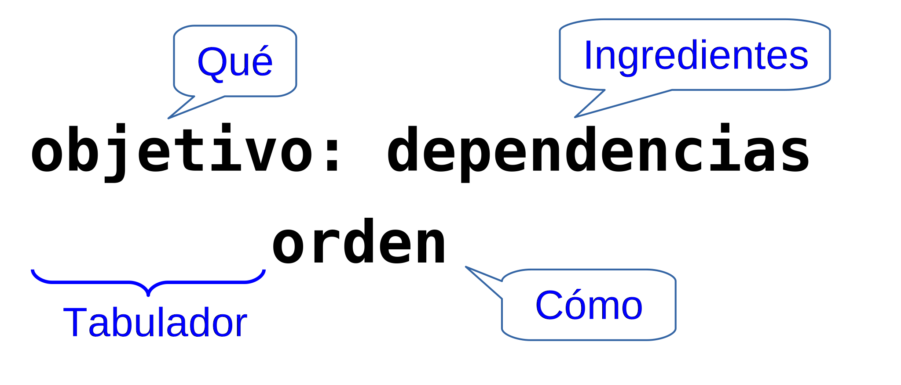

[//]: # (-*- mode: markdown; coding: utf-8 -*-)

# Desarrollo en C

Por primera vez el taller se realizará en versión multi-lenguaje (C y
Python).  Esperamos de esta forma acomodarnos a un número mayor de
alumnos.  En la actualidad usamos Python como primer lenguaje de la
titulación (primer semestre de primer curso, asignatura *Informática*)
pero hasta este curso hemos utilizado C.  Por tanto hay un grupo de
estudiantes que se sienten más cómodos con C y otro que se siente más
cómodo con Python.

Este manual trata de dividir el contenido de forma que no tengas que
leer todo si lo que te interesa es uno solo de estos lenguajes.  En
este capítulo describiremos el conjunto de herramientas que vamos a
usar para hacer programas en C y un ejemplo sencillo de su uso.

## El primer programa

Es tradición empezar por un primer programa que simplemente escribe el
mensaje `Hola, Mundo` por la pantalla.  Se remonta a los
[orígenes de BCPL](https://en.wikipedia.org/wiki/%22Hello,_World!%22_program),
el precursor de C.

Arranca un terminal de órdenes y crea una carpeta para meter los
ejemplos de este capítulo.  Trabajaremos en esa carpeta.  Por ejemplo:


```
pi@raspberrypi:~ $ mkdir test
pi@raspberrypi:~ $ cd test
pi@raspberrypi:~/test $ ▂
```

Utiliza un editor de texto para escribir el siguiente programa en un
archivo de nombre `hola.c`.  Como editor de textos puede usarse
*leafpad*, simplemente pulsando sobre el icono
 o desde la línea de órdenes con
`leafpad hola.c`.

```C
#include <stdio.h>

int main() {
    puts("Hola, Mundo");
    return 0;
}
```

Graba el archivo en la carpeta que habías creado y vuelve al terminal:

```
pi@raspberrypi:~/test $ make hola
cc     hola.c   -o hola
pi@raspberrypi:~/test $ ▂
```

El programa en C ha sido compilado por GNU make (`make`) que a su vez
ha ejecutado el compilador de C (`cc`) para generar el ejecutable
`hola`.  Fíjate que en GNU los ejecutables no tienen una extensión
distintiva.

Ahora podemos ejecutarlo:

```
pi@raspberrypi:~/test $ ./hola
Hola, Mundo
pi@raspberrypi:~/test $ ▂
```

Fíjate que hemos escrito un punto y una barra delante para indicar
dónde se encuentra el archivo.  Es una ruta relativa, de las que ya
hemos hablado.

Te preguntarás por qué tenemos que indicar la ruta para este
ejecutable y no para `leafpad` por ejemplo.  El sistema operativo
encuentra los ejecutables o bien porque el usuario le dice
explícitamente dónde están o bien porque están en una serie de
carpetas que se conocen como las *rutas del sistema*.  Evidentemente
la carpeta actual no está en las rutas del sistema, porque la acabas
de crear, así que nuestra única opción es indicar la ruta.

> **Warning** Es posible que leas textos que te recomiendan añadir la
> carpeta `.` (la carpeta de trabajo) a las rutas del sistema.  No lo
> hagas, es una mala idea en general pero especialmente por motivos de
> seguridad.


## El compilador de C

En GNU/Linux hay varios compiladores de C.  El más utilizado es el del
proyecto GNU (*GNU Compiler Collection*) que se invoca con la orden
`gcc` o simplemente `cc`.  Normalmente no compilaremos a mano los
archivos C, sino que lo haremos a través de una herramienta de
construcción, concretamente *GNU make*.  Sin embargo es necesario
conocer cómo funciona y qué opciones tiene el compilador.

*GNU Compiler Collection* (GCC) es un conjunto de compiladores de muy
diversos lenguajes (C, C++, Objective-C, Java, D, Pascal, Ada, etc.) y
de muy alta calidad.  Se trata de una herramienta muy completa y
compleja, y no es objeto de este manual presentarla en profundidad.
Baste decir que se ha convertido en un estándar de facto en la
industria, que se utiliza incluso por los diseñadores de procesadores
para probar los nuevos diseños antes incluso de su producción
comercial.

Las opciones más comunes son:


<div style="width:100px;">Opción</div> | Significado
-----------|----------------
`-c` | Compila o ensambla, pero no enlaza, obteniéndose un archivo en código objeto con extensión `.o`
`-Wall` | Emite todos los avisos que el compilador pueda generar
`-E` |  Realiza únicamente el preprocesamiento, enviando el resultado a la salida estándar
`-ggdb` | Incluye información de depuración
`-Iruta` | Especifica la *ruta* de una carpeta donde buscar archivos de cabecera
`-Lruta` | Especifica la *ruta* de una carpeta donde buscar bibliotecas
`-lXXX` |  Enlaza con la biblioteca de nombre `libXXX.a`
`-o`*nombre* | Indica el nombre del archivo ejecutable
`-v` | Muestra las fases por las que va pasando el compilador
`-w` | Suprime los mensajes de aviso (*warnings*)
`-S` | Preprocesa y compila, pero no ensambla ni enlaza

El compilador de C puede usarse como compilador, como montador o como
ambas cosas.  Por ejemplo, volvamos a nuestror programa `hola.c` y
escribe en el terminal lo siguiente:

```
pi@raspberrypi:~/test $ gcc -c hola.c
pi@raspberrypi:~/test $ ls
hola  hola.c  hola.o
pi@raspberrypi:~/test $ ▂
```

Ahora tenemos un archivo `hola.o`.  Se trata de un *archivo objeto*,
con las instrucciones máquina correspondientes al archivo `hola.c`
pero sin la estructura de un ejecutable.  Varios archivos objeto se
pueden combinar para generar un único ejecutable usando el *montador*.
En GNU se puede usar el propio compilador de C para montar el
ejecutable:

```
pi@raspberrypi:~/test $ gcc -o hola hola.o
pi@raspberrypi:~/test $ ▂
```

Cuando no usamos la opción `-c` el compilador se comporta como
montador y si es necesario como compilador simultáneamente.  Si no
especificamos un nombre de ejecutable con la opción `-o` el compilador
generará uno con nombre `a.out`.  Esto es así por razones históricas,
por lo que es evidente que normalmente debemos especificar la opción
`-o`.

### Múltiples archivos fuente

Un ejecutable puede componerse a partir de varios archivos fuente.
Por ejemplo, divide el programa en un archivo `hola.c` que tiene el
programa principal y utiliza una función `decir_hola` que está
definida en otro archivo de nombre `f.c`:

```C
#include <stdio.h>

void decir_hola() {
    puts("Hola, Mundo");
}
```

Ahora el archivo `hola.c` sería algo así:

```C
void decir_hola(void);

int main() {
    decir_hola();
    return 0;
}
```

Para generar el ejecutable habría que compilar ambos archivos y luego montarlos:

```
pi@raspberrypi:~/test $ gcc -c hola.c f.c
pi@raspberrypi:~/test $ gcc -o hola hola.o f.o
pi@raspberrypi:~/test $ ▂
```

Vamos a cambiar el programa para que salude y se despida.  Además de
la función `decir_hola` (ahora en el archivo `f_hola.c`) tendremos
otra función `decir_adios` (en el archivo `f_adios.c`).

```
pi@raspberrypi:~/test $ mv f.c f_hola.c
pi@raspberrypi:~/test $ cp f_hola.c f_adios.c
pi@raspberrypi:~/test $ leafpad f_adios.c
```

Ahora cambia el archivo `f_adios.c` para que se despida:

```C
#include <stdio.h>

void decir_adios() {
    puts("Adios, Mundo");
}
```

Y el programa principal `hola.c` para que llame a las dos funciones:

```C
void decir_hola(void);
void decir_adios(void);

int main() {
    decir_hola();
    decir_adios();
    return 0;
}
```

Esto se va pareciendo más a un programa de verdad.  El programa
principal llama a varias funciones que están repartidas por otros
archivos.  Pero no es habitual que se ponga la declaración de las
funciones directamente en el archivo principal.  Es mejor poner esas
declaraciones en un archivo de cabecera que se incluye cuando se
necesita.

Por ejemplo, edita un nuevo archivo `saludar.h` con las declaraciones de
las dos funciones:

```C
#ifndef SALUDAR_H
#define SALUDAR_H
void decir_hola(void);
void decir_adios(void);
#endif
```

Y úsalo en `hola.c`:

```C
#include "saludar.h"

int main() {
    decir_hola();
    decir_adios();
    return 0;
}
```

Ahora podemos compilar todo:

```
pi@raspberrypi:~/test $ gcc -c hola.c f_hola.c f_adios.c
pi@raspberrypi:~/test $ gcc -o hola hola.o f_hola.o f_adios.o
pi@raspberrypi:~/test $ ▂
```

Fíjate que el archivo de cabecera no es necesario compilarlo porque no
tiene nada más que declaraciones y se incluye ahí donde es necesario.


### Bibliotecas de programas

Cuando los programas van creciendo empieza a ser necesario algún
mecanismo de organización más flexible.  Por ejemplo, podemos agrupar
varios de los archivos objeto en una biblioteca y luego montar el
ejecutable con la biblioteca.  Por ejemplo, vamos a meter los archivos
`f_hola.o` y `f_adios.o` en una biblioteca `libsaludar.a` y después
construimos el ejecutable con esta biblioteca.  Para crear la
biblioteca usaremos el programa `ar` (*archiver*):

```
pi@raspberrypi:~/test $ ar rcs libsaludar.a f_hola.o f_adios.o
pi@raspberrypi:~/test $ gcc -L. -o hola hola.o -lsaludar
pi@raspberrypi:~/test $ ▂
```

El programa `ar` es en cierta forma similar a los archivadores que se
utilizan para crear archivos comprimidos (WinZIP, WinRAR, 7zip,
PeaZIP, etc.) salvo que en este caso no se comprime.  En GNU la
compresión y el archivado son procesos separados, de manera que el
usuario pueda elegir cómo archiva y cómo comprime de forma
independiente.

En el mismo archivo `libsaludar.a` podemos meter cualquier número de
archivos objeto con cualquier número de funciones.  Sin embargo a la
hora de construir el ejecutable con `gcc` las cosas no cambian aunque
el número de archivos y de funciones crezca.

Las bibliotecas suelen hacerse en una carpeta independiente.  Por
ejemplo:

```
pi@raspberrypi:~/test $ mkdir saludo
pi@raspberrypi:~/test $ mv *.h f_* saludo
pi@raspberrypi:~/test $ cd saludo
pi@raspberrypi:~/test/saludo $ gcc -c *.c
pi@raspberrypi:~/test/saludo $ ar rcs libsaludar.a *.o
pi@raspberrypi:~/test/saludo $ cd ..
pi@raspberrypi:~/test $ ▂
```

Ahora la biblioteca está en la subcarpeta `saludo` y el programa
principal en la carpeta padre.  Para compilar `hola.c` tenemos que
decirle al compilador dónde pueden estar los archivos de cabecera y al
montar `hola` debemos indicar la nueva carpeta donde buscar
bibliotecas:

```
pi@raspberrypi:~/test $ gcc -c -Isaludo hola.c
pi@raspberrypi:~/test $ gcc -Lsaludo -o hola hola.o -lsaludar
pi@raspberrypi:~/test $ ▂
```

## La herramienta de construcción *GNU make*

Como hemos visto, en cuanto el programa empieza a crecer un poco el
proceso de construcción del ejecutable puede ser realmente tedioso.
El programa `make` que ya usamos en el primer ejemplo nos permite
automatizar la construcción.

Salvo en los casos triviales `make` necesita de un archivo de
configuración que le indique cómo construir el ejecutable.  Debe
llamarse `makefile`, `Makefile` o `GNUmakefile`.  Básicamente se
compone de recetas en las que se le explica a `make` cómo construir un
archivo a partir de un conjunto de archivos especificado.  Asi, en
nuestro último ejemplo podemos hacer un `makefile` dentro de la
subcarpeta `saludo` como éste:

```
libsaludar.a: f_hola.o f_adios.o
    ar rcs $@ $^
```

Esta regla se lee así: *para construir `libsaludar.a` debes construir
primero `f_hola.o` y `f_adios.o` y entonces ejecutar `ar rcs
libsaludar.o f_hola.o f_adios.o`*.  Date cuenta de que usamos la
abreviatura `$@` para representar el objetivo de la regla
(`libsaludar.a`) y `$^` para representar las dependencias de la regla
(todo lo que sigue a los dos puntos).

<figure style="float:right;padding:10px">
  

  <figcaption style="font-size:smaller;font-style:italic;text-align:center">
  Anatomía de una receta de <em>make</em>.
  </figcaption>
</figure>

¿Y cómo le decimos como hacer los archivos objeto `f_hola.o` y
`f_adios.o`? No es necesario. *GNU make* sabe cómo hacerlos a partir
de archivos C con el mismo nombre.  Internamente tiene ya definida una
receta como esta:

```
%.o: %.c
    $(CC) $(CFLAGS) -c $<
```

Que se lee *para construir un archivo objeto a partir de un archivo C
del mismo nombre debes ejecutar `$(CC) $(CFLAGS) -c $<`* Donde el
símbolo `$<` corresponde a una variable especial de *GNU make*.

**Variable** | **Significado**
-------------|----------------
`$@` | Objetivo de la receta
`$^` | Dependencias de la receta
`$<` | Primera dependencia de la receta

Las recetas incluídas ya en *GNU make* hacen que prácticamente no sea
necesario definir nuevas reglas salvo en casos muy sencillos.

Lo interesante de ésto es que las reglas de *make* utilizan una amplia
variedad de variables que ya tienen un valor por defecto, pero que
podemos cambiar para ajustar el funcionamiento.  Veamos unas cuantas:

**Variable** | **Contenido**
-------------|--------------
CC           | Compilador de C (por defecto `cc`)
CFLAGS       | Banderas del compilador (opciones que se le pasan al compilador)
LDFLAGS      | Banderas del montador (opciones que se le pasan al montador)
LDLIBS       | Bibliotecas que deben incluirse en el ejecutable
RM           | Programa que borra archivos (por defecto `rm`)


Por tanto en la carpeta del archivo `hola.c` podemos poner un
`makefile` como éste:

```
CFLAGS=-Isaludo
LDFLAGS=-Lsaludar
LDLIBS=-lsaludo

hola: hola.o
```

Es también habitual poner una regla para limpiar los archivos
intermedios generados:

```
clean:
    $(RM) *.o *~ hola
```

Ahora basta ejecutar `make clean` para borrar los archivos
generados y dejar solo el código que hemos escrito.

Un aspecto interesante del uso de `make` es que solo genera lo
necesario, y se aplican las reglas afectadas por archivos que han
cambiado.  Es decir, si se dispone de un buen `makefile` basta con
ejecutar `make` para que se compile todo lo necesario y solo lo
necesario en cualquier momento.

Si el `makefile` no tiene todas las dependencias *GNU make* no sabrá
si tiene que reconstruir algún archivo.  Por ejemplo, en este pequeño
ejemplo no hemos añadido dependecias de `hola.o` con
`saludo/saludar.h`.  Lo correcto habría sido añadir una regla en la
que solo se indica la dependencia:

```
hola.o: hola.c saludo/saludar.h
```

Si no quieres complicar los `makefile` basta tenerlo presente y cuando
se modifique algo que no está en las dependencias podemos forzar la
compilación con:

```
pi@raspberrypi:~/test $ make -C saludo -B
pi@raspberrypi:~/test $ make -B
```

La primera orden fuerza la construcción de la biblioteca y la segunda
fuerza la construcción del ejecutable.  Éstas son las opciones más
frecuentes de `make`:

**Opción** | **Significado**
-----------|----------------
`-B` | Fuerza la reconstrucción de todo
`-C` carpeta | Cambia primero a la carpeta indicada y luego ejecuta *make*
`-d` | Imprime información de depuración
`-n` | Solo imprime las órdenes que ejecutaría, pero no las ejecuta
`var=valor`  | Asigna `valor` a la variable `var` para esta ejecución de *make*


Cae fuera del ámbito de este curso explicar con más detalle la
sintaxis que utiliza el archivo `makefile`.  En su lugar, utilizaremos
`make` con archivos `makefile` proporcionados en plantillas de
aplicaciones.  Consulta la página de manual y la documentación en
línea {{ "stallman14:_gnu_make" | cite }} para ayudarte a
comprenderlos.


# Depuración de programas con *GNU debugger*

La construcción de programas correctos requiere de la estrecha
cooperación de dos técnicas muy sencillas pero muy importantes: la
prueba y la depuración.

La prueba consiste en la elaboración de pequeños programas que
demuestran que nuestras funciones hacen lo que se supone que deben
hacer.  No hay nada que sustituya a ésto y es esencial en todo proceso
de desarrollo de software.  Trataremos algo este tema más adelante.

La otra técnica que complementa a la prueba es la depuración, que
consisten el la eliminación de errores (*bugs*) previamente detectados
en las pruebas.  La depuración es un proceso relativamente sencillo en
la forma y totalmente sistemático, pero sorprendentemente difícil en
la práctica.

No se necesita ninguna herramienta especial para depurar.  Se puede
emplear un conjunto de sentencias `printf` cuidadosamente elegidas o
cualquier otra forma de examinar el contenido de la memoria.  *GNU
debugger* (abreviado `gdb`) no es por tanto estrictamente necesaria
pero puede ahorrarte una enorme candidad de tiempo.

Las herramientas de depuración permiten detener la ejecución del
programa en puntos específicos, por ejemplo, justo antes de la
ocurrencia de un error en el que se sabe que la ejecución termina
inesperadamente.  La detención del programa permite explorar en ese
punto la memoria, incluso conocer el valor de las variables y
registros del procesador e ir avanzando por la ejecución hasta
encontrar el punto exacto en el que ocurre la disfunción del programa.

## El proceso de depuración

Hablemos primero un poquito acerca del propio proceso de eliminación
de errores.  Es importante porque la experiencia nos dice que es
contra-intuitivo, tendemos de forma natural a saltar pasos esenciales.

Los errores en los programas se pueden clasificar de varias formas.
Es muy habitual clasificarlos según su visibilidad y su persistencia:

&nbsp;          | Visible    | Oculto
----------------|------------|------------
**Persistente** | Ideal      | Desconocido
**Transitorio** | Difícil    | Muy difícil

Un error *visible* es aquél que se ha detectado porque el programa no
hace lo que debe.  Por el contrario un error *oculto* es aquél que no
se ha detectado aunque existe, ya sea porque el código al que afecta
se ejecuta muy raramente o porque hay otro error que lo enmascara.
Los errores visibles se suelen detectar en las pruebas y no suelen
llegar al código en producción.  Sin embargo los ocultos llegan al
código de producción y pueden tener consecuencias desastrosas.
*Ariane 5* o *Therac 25* son algunos ejemplos que todos deberíamos
recordar.  Busca en Google si no los conoces.

Por otro lado también pueden ser clasificados en errores
*persistentes* cuando los errores se manifiestan en todas las
ejecuciones del programa o *transitorios* cuando solo se manifiesta en
algunas ejecuciones o en momentos impredecibles.

Obviamente los ideales para su eliminación son los errores *visibles y
persistentes* y tenemos que hacer todo lo posible para que los
posibles errores sean de este tipo.  Para eso se utilizan técnicas de
programación defensiva y herramientas de depuración de memoria como
`valgrind`.  Cae fuera del ámbito de este curso hablar de estas
últimas, pero te recomendamos que las pruebes si encuentras con un
error elusivo.

Habitualmente los errores se detectan en las pruebas, e incluso aunque
no fuera así deberíamos hacer un programa pequeñ de prueba que
reproduzca el error.  Por tanto podemos asumir que existe un programa
relativamente corto que no hace lo que esperamos.

La clave de la depuración consiste en aplicar de forma *consistente*
el siguiente proceso:

* Estudia los datos.  Mira qué pruebas fallan y cuáles tienen éxito.

* Elabora una *hipótesis* consistente con los datos.

* Diseña un experimento para refutar la hipótesis.  Decide cómo
  interpretar el resultado del experimento *a priori*, antes de
  realizarlo.

* Guarda un registro de todo.

La etapa de diseño del experimento es también muy sistemática.  Se
trata de acotar el espacio de búsqueda, ya sea reduciendo el rango de
de datos a analizar o acotando la región del programa donde se
encuentra el error.

Típicamente se diseña un pequeño programa que ejercita las funciones
que pueden contener el error.  A partir de este caso de prueba fallida
se realiza una *búsqueda binaria* del error.  Si el programa no
funciona correctamente es porque alguno de los valores devueltos o
almacenados no es el que esperábamos.  Aproximadamente en el punto
medio tendremos que comprobar si los valores intermedios calculados
hasta el momento son los esperados.  Si son correctos el error debe
estar en la segunda mitad, en caso contrario estaría en la primera
mitad.  Repetimos este proceso hasta que encontramos el punto del
error.

Es en esta etapa del proceso de depuración en la que pueden ser útiles
los depuradores como *GNU debugger*.  Por supuesto siempre podemos
examinar los valores intermedios con un `printf` en el sitio adecuado.
Pero cada vez que tengamos que examinar otro punto tendremos que
recompilar el programa.  El depurador, por el contrario, permite
examinar y modificar cualquier dato del programa y parar la ejecución
del programa en cualquier punto.

### Usando *GNU debugger*

Para que `gdb` pueda ser aprovechado al máximo es necesario compilar
el programa con soporte para depuración.  Esto se especifica con la
opción `-ggdb` del compilador.  Típicamente se realiza añadiendo esta
opción a la variable `CFLAGS` del `makefile`.

Utilizando interfaz de línea de órdenes, el primer paso consiste en
invocar `gdb` especificando el ejecutable a depurar:

```
pi@raspberrypi:~/test $ gdb hola
GNU gdb (Raspbian 7.7.1+dfsg-5) 7.7.1
...
Reading symbols from hola...done.
(gdb) ▂
```

Muestra el *prompt* de GDB indicando que espera una orden.  Muy
resumidas, estas son las órdenes más frecuentes:

<div style="width:170px">Orden (abreviatura)</div> | Significado
----------|----------------
`list` (`l`) | Lista el código del programa o de una función.  Sin argumentos muestra desde la posición actual. El argumento puede ser una función, un archivo o incluso un rango de líneas (dos números separados por comas).
`break` (`b`) |  Coloca un punto de ruptura en la función, línea o archivo indicado.  El depurador interrumpe automáticamente la ejecución del programa al llegar a un punto de ruptura.
`run` | Ejecuta el programa con los argumentos que se indiquen hasta el siguiente punto de ruptura.
`print` (`p`) |  Imprime el valor de variables o expresiones.  Sólo se pueden visualizar aquellas expresiones que aún formen parte del contexto actual de ejecución.
`continue` (`c`) | Cuando se interrumpe la ejecución del programa esta orden permite continuar desde el mismo punto.
`next` (`n`) | Ejecuta la siguiente línea sin entrar en las funciones, es decir, las funciones se ejecutan en un sólo paso.
`step` (`s`) | Ejecutan la siguiente línea y si es una llamada a función accede al código de la misma.
`backtrace` (`bt`) | Muestra la traza de llamadas actual, es decir, las funciones que han sido invocadas y desde dónde.
`clear` (`cl`) | Borra punto de ruptura actual o especificado.
`info break` (`i b`) | Muestra los puntos de ruptura activos.
`quit` (`q`) | Salir de GDB.

### *Watchpoints*

Un *watchpoint* es una indicación al depurador para interrumpir la
ejecución del programa cada vez que se lea o se modifique el valor de
una variable.  Varias órdenes de GDB nos permiten trabajar con ellos.

<div style="width:100px">Orden (abreviatura)</div> | Significado
----------|----------------
`watch` *var*  | Interrupe cuando *var* cambia.
`rwatch` *var* | Interrumpe  cuando *var* es leída.
`awatch` *var* | Interrumpe cuando *var* es leída o escrita.
`info watch` (`i wat`) | Muestra los *watchpoints* activos.


### Alterar variables y flujo

Es frecuente que en una sesión de GDB se detecte más de un error.  A
veces puede interesar arreglar temporalmente un problema para
encontrar otro sin necesidad de recompilar.  Con GDB es posible fijar
valores a variables o alterar la secuencia normal de ejecución.


<div style="width:100px">Orden (abreviatura)</div>| Significado
----------|----------------
`set` *var*=*valor* | Cambia el valor de *var* al indicado.
`return`*valor* | Termina la función actual y devuelve el valor indicado.


### Trabajo con procesos

Algunos de nuestros programas serán multiproceso.  GDB permite
trabajar con múltiples procesos simultáneamente, incluso si
corresponden a distintos ejecutables.  Las siguientes órdenes permiten 

<div style="width:250px">Orden (abreviatura)</div> | Significado
----------|----------------
`set follow-fork-mode`*modo* | Si *modo* es `parent` cuando se crean nuevos procesos no se ejecutan bajo el control de GDB.  Si es `child` al crearse un proceso nuevo GDB pasa a controlar al hijo en lugar de al padre.
`set detach-on-fork`*modo* | Si *modo* es `on` (valor por defecto) el proceso no gestionado por GDB (hijo o padre según el valor de `follow-fork-mode`) se desasocia de GDB.  Si *modo* es `off` ambos procesos pasan a ser gestionados por GDB (múltiples procesos *inferiores*).
`info inf` (`i i`) | Muestra todos los procesos *inferiores*.
`inferior`*n* | Conmuta GDB al proceso inferior *n*.
`attach`*pid* | Asocia GDB a un proceso previamente en ejecución.
`detach` | Desasocia GDB del proceso en ejecución.

### Trabajo con hilos

También usaremos en ocasiones los *hilos*.  Se trata de un mecanismo
de concurrencia mucho más eficiente que los procesos, pero
sensiblemente más propenso a errores difíciles de encontrar.

<div style="width:200px">Orden (abreviatura)</div> | Significado
----------|----------------
`info threads` (`i th`) | Lista de los hilos actualmente en ejecución.
`thread`*n* (`t`*n*) | Conmuta al hilo *n*.
`thread apply`*id... orden* | Aplica la *orden* a los hilos especificados.  Si se indica `all` se aplica a todos los hilos.
