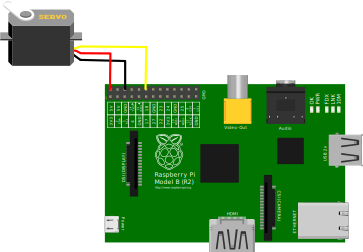

[//]: # (-*- mode: markdown; coding: utf-8 -*-)


Para la programación de entradas y salidas digitales en C tenemos tres
bibliotecas disponibles: [*wiringPi*](http://wiringpi.com/) de Gordon
Henderson, [*bcm2835*](http://www.airspayce.com/mikem/bcm2835/) de
Mike McCauley y [*pigpio*](http://abyz.co.uk/rpi/pigpio/index.html) de
joan@abyz.co.uk.  Todas ellas son más o menos equivalentes para los
propósitos del taller, aunque cada una tiene sus ventajas e
inconvenientes.  Veamos ejemplos con las tres.


### Entradas y salidas digitales con *wiringPi*

Echa un vistazo al
[manual de referencia de `wiringPi`](http://wiringpi.com/reference/)
y muy especialmente a las
[funciones principales](http://wiringpi.com/reference/core-functions/).
Explica qué hace el siguiente programa:

``` C
#include <wiringPi.h>
#include <unistd.h>

int main() {
    wiringPiSetupGpio();

    pinMode(18,OUTPUT);
    for(int v = 0;;v = !v) {
        digitalWrite(18,v);
        delay(1000);
    }
}
```

Para compilarlo podemos hacer un archivo `makefile` sumamente
sencillo.  Asumiendo que el archivo anterior se llama `test-gpio.c`:

```
LDLIBS=-lwiringPi
test-gpio: test-gpio.o
```

Compílalo usando `make` y demuestra que funciona usando un LED en la
pata J8-12, correspondiente a GPIO 18.  Cuidado con no superar la
corriente de 16 mA.

Si intentas ejecutarlo verás que no funciona, porque el usuario *pi*
no tiene suficientes privilegios.  Hay que ejecutarlo con `sudo`.
Esto va a ser bastante frecuente en software que manipula dispositivos
físicos. Ningún sistema operativo serio puede permitir que un usuario
normal manipule directamente los dispositivos, podría comprometer
incluso la integridad física del sistema.

Sin emabrgo esto es un 

### Uso de PWM

También podemos programar la generación de señales PWM con la ayuda de
la biblioteca *wiringPi*. La frecuencia base para PWM en Raspberry Pi
es de 19.2Mhz.  Esta frecuencia puede ser dividida mediante el uso de
un divisor indicado con `pwmSetClock`, hasta un máximo de 4095.  A
esta frecuencia funciona el algoritmo interno que genera la secuencia
de pulsos, pero en el caso del BCM2835 se dispone de dos modos de
funcionamiento, un modo equilibrado (*balanced*) en el que es difícil
controlar la anchura de los pulsos, pero permite un control PWM de muy
alta frecuencia, y un modo *mark and space* que es mucho más intuitivo
y más apropiado para controlar servos.  El modo *balanced* es
apropiado para controlar la potencia suministrada a la carga o para
transmisión de información.

En el modo *mark and space* el módulo PWM incrementará un contador
interno hasta llegar a un límite configurable, el rango de PWM, que
puede ser de como máximo 1024. Al comienzo del ciclo el pin se pondrá
a 1 lógico, y se mantendrá hasta que el contador interno llegue al
valor puesto por el usuario.  En ese momento el pin se pondrá a 0
lógico y se mantendrá hasta el final del ciclo.

Veamos su aplicación al control de un servomotor. Un servomotor tiene
una entrada de señal para indicar la inclinación deseada. Cada 20ms
espera un pulso y la anchura de este pulso determina la inclinación
del servo.  Alrededor de 1.5ms es la anchura del pulso necesaria para
la posición centrada. Una anchura menor hace girar el servo en sentido
antihorario (hasta 1ms aproximadamente) y una duración mayor lo hace
girar en sentido horario (hasta 2ms aproximadamente).  En este caso
hay que calcular el rango y el divisor para que el pulso se produzca
cada 20ms y el control de la anchura del pulso alrededor de los 1.5ms
sea con la máxima resolución posible.

El montaje es tal como muestra la figura. El cable rojo del servo (V+)
se conecta a +5V en P1-2 o P1-4, el cable negro o marrón (V-) a GND en
P1-6 y el cable amarillo, naranja o blanco (signal) a GPIO18 en
P1-12. No se necesita ningún otro componente.

<figure style="padding:10px">
  

  <figcaption style="font-size:smaller; font-style:italic">
  <div style="width:500px">
  Montaje de un microservo para ser controlado
  directamente desde GPIO18 configurado como salida PWM.
  </div>
  </figcaption>
</figure>


``` C
#include <wiringPi.h>
#include <stdlib.h>

int main(int argc, char* argv[])
{
  if (argc < 5) {
    printf("Usage: %s divisor rango min max\n", argv[0]);
    exit(0);
  }

  int div = atoi(argv[1]);
  int range = atoi(argv[2]);
  int min = atoi(argv[3]);
  int max = atoi(argv[4]);

  wiringPiSetupGpio();

  pinMode(18,PWM_OUTPUT);
  pwmSetMode(PWM_MODE_MS);
  pwmSetClock(div);
  pwmSetRange(range);

  for(;;) {
    pwmWrite(18,min);
    delay(1000);
    pwmWrite(18,max);
    delay(1000);
  }
}
```

Para tener máximo control de la posición del servo probaremos con el
rango máximo, de 1024.  En ese caso el divisor tiene que ser tal que
la frecuencia del pulso PWM sea:

$$
f = \frac{f_{base}}{rango \times div} = \frac{19.2\times 10^6Hz}{1024 \times div} = \frac{1}{20ms} = 50Hz
$$

Es decir, el divisor habría que configurarlo a 390.  El rango completo
del servo depende del modelo concreto.  Teóricamente debería ser entre
52 y 102, siendo el valor completamente centrado 77.  En la práctica
habrá que probar el servo concreto, nuestros experimentos dan un rango
útil entre 29 y 123 para el microservo de TowerPro disponible en el
laboratorio.

## Ejercicios


1. Configura y programa el hardware y el software necesario para
  tener dos LEDs parpadeando al mismo ritmo pero manteniendo solo uno
  de ellos encendido a la vez.
  
1. Modifica el ejemplo anterior para que la conmutación se produzca
  solamente cuando se aprieta un pulsador.  Uno de los LEDs estará
  encendido cuando el pulsador no esté apretado, el otro estará
  encendido solamente cuando el pulsador esté apretado.

## Retos para la semana

1. **Fácil** Diseña un mecanismo para poder controlar tiras de LEDs
  empleando la interfaz SPI.

1. **Moderado** Diseña un mecanismo para poder controlar una matriz de
  LEDs de como mínimo 16x32 con la Raspberry Pi.
