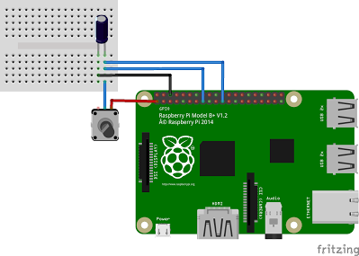

[//]: # (-*- mode: markdown; coding: utf-8 -*-)

# Programación en C de SPI

Las tres bibliotecas que hemos usado para la programación de entradas
y salidas digitales soportan también el uso de la interfaz SPI.  Los
módulos SPI se benefician de la capacidad de envío y recepción
concurrente y pueden conseguirse tasas muy razonables (30MHz).

## Programación de SPI con *wiringPi*

La programación es sencilla en cuanto que solo utiliza dos funciones,
pero puede ser realmente enrevesada de entender la comunicación con
algunos dispositivos SPI.  El motivo es que en SPI para poder leer
datos hay que escribir datos, de hecho se lee a la vez que se escribe.
Esto hace que en los dispositivos reales haya que hacer muchas
transacciones que se descartan por completo.

Este ejemplo reproduce el que describíamos en el capítulo anterior
utilizando la herramienta `pigs`, esta vez empleando *wiringPi*.

``` C
#include <stdio.h>
#include <stdlib.h>
#include <wiringPiSPI.h>

void ads1118_rw(int ch, char buf[4]) {
	buf[0] = 0x80; buf[1] = 0x4b;
	buf[0] = 0x80; buf[1] = 0x4b;
    wiringPiSPIDataRW (0, buf, 4);
}

int main (void) {
    wiringPiSPISetup(0, 4000000);

	char data[4];
	ads1118_rw(0, data);
	printf("Control reg = %02x%02x\n", data[2], data[3]);
	delay(100);
	ads1118_rw(0, data);
	short v = data[0] << 8 | data[1];
	printf("AD0 = %02x%02x (%d)\n", data[0], data[1], v);
    return 0;
}
```

La función `wiringPiSPISetup` inicializa la comunicación para el canal
0 a 10Mz. Hay dos canales disponibles (0 y 1) que utilizan las mismas
patas salvo la de selección `SPI_CE0` y `SPI_CE1` respectivamente.

Las llamadas a `wiringPiSPIDataRW` realizan una transacción SPI
donde se escribe y se lee de manera concurrente un conjunto de bytes.
El significado preciso de lo que se lee y se escribe depende del
dispositivo y en algunos casos puede requerir descartar parte o toda
la información.  En este caso el primer byte es la orden y a
continuación se envían los argumentos.

Un resumen de las funciones involucradas:

Función                                   | Descripción
------------------------------------------|----------------------
`wiringPiSPISetup(canal, velocidad)`      | Prepara un canal SPI y lo configura a una velocidad determinada.
`wiringPiSPIDataRW(canal, bytes, long)`   | Escribe y lee a la vex un conjunto de bytes.

La simplicidad es máxima pero también se pierden las capacidades del
hardware para poder acomodar todos los modos de transferencia de SPI.
Pueden consultarse más detalles en el artículo de Gordon Henderson
disponible en
[projects.drogon.net](https://projects.drogon.net/understanding-spi-on-the-raspberry-pi/).

El problema de *wiringPi* es que para transferencias SPI no permite
seleccionar el modo.  Su autor considera que la gran mayoría de los
módulos SPI usan el modo 0.  Puede ser cierto, pero los ADS1118 que
usamos en el taller son modo 1.

> **Warning** La biblioteca *wiringPi* asume que utilizamos SPI0 con
> el modo 0.  Por este motivo no la recomendamos, porque el módulo
> CJMCU-1118 utiliza el modo 1.

## Programación de SPI con *bcm2835*

En la biblioteca *bcm2835* contamos con una gama de funciones más
próxima al hardware.  Algunas funciones son similares a *wiringPi*
pero añade muchas más para configurar el modo de transferencia y la
interfaz SPI.

``` C
#include <stdio.h>
#include <bcm2835.h>

int main (void) {
    bcm2835_init();
    bcm2835_spi_begin();
    bcm2835_spi_setDataMode(1);
    bcm2835_spi_setClockDivider(5); // 19.2MHz / 5 ~ 4MHz
    bcm2835_spi_chipSelect(0);
    
	char tdata[4] = { 0x80, 0x4b, 0x80, 0x4b };
	char rdata[4];
    bcm2835_spi_transfernb(tdata, rdata, 4)
	printf("Control reg = %02x%02x\n", rdata[2], rdata[3]);
	bcm2835_delay(100);
    bcm2835_spi_transfernb(tdata, rdata, 4)
	short v = rdata[0] << 8 | rdata[1];
	printf("AD0 = %02x%02x (%d)\n", rdata[0], rdata[1], v);

	bcm2835_spi_end();
	bcm2835_close();
    return 0;
}
```

Aunque parece más complejo realmente se debe al mayor control de la
inicialización.  La inicialización es más larga, pero la posibilidad
de usar buffers distintos de transmisión y recepción simplifica muchos
casos frecuentes.

Un resumen de las funciones involucradas:

Función                                   | Descripción
------------------------------------------|----------------------
`bcm2835_spi_begin()`                     | Inicializa el módulo de SPI.
`bcm2835_spi_end()`                       | Libera los recursos empleados en la inicialización.
`bcm2835_spi_setClockDivider(div)`        | Define el divisor del reloj.
`bcm2835_spi_setDataMode(modo)`           | Modo SPI según se comentó en capítulo 2.
`bcm2835_spi_chipSelect(cs)`              | Pin de CS (0, 1, 2), 3 = ninguno.
`bcm2835_spi_setChipSelectPolarity(cs, v)` | Define la polaridad del pin *cs* como activa a valor *v*.
`bcm2835_spi_transfer(v)`                 | Transmite y recibe (devuelve) un byte.
`bcm2835_spi_transfernb(tbuf, rbuf, len)` | Transmite y recibe *len* bytes.
`bcm2835_spi_transfern (buf, len)`        | Transmite y recibe *len* bytes en el mismo buffer.
`bcm2835_spi_writenb (buf, len)`          | Transmite *len* bytes.


## Programación de SPI con *pigpio*

Con *pigpio* es posible utilizar el periférico auxiliar SPI (SPI1)
además del principal (ver bandera *A* del campo de banderas en
*spiOpen*).  La ventaja es que esta otra interfaz SPI tiene tamaño de
palabra configurable y tres líneas de *chip select* disponibles (en
lugar de dos).  Por otro lado la interfaz principal es sensiblemente
más rápida, por lo que utilizaremos esa normalmente.

``` C
#include <stdio.h>
#include <pigpio.h>

int main (void) {
	gpioInitialise();
	int spi = spiOpen(0, 4000000, 1);
	char tdata[4] = { 0x80, 0x4b, 0x80, 0x4b };
	char rdata[4];
    spiXfer(spi, tdata, rdata, 4)
	printf("Control reg = %02x%02x\n", rdata[2], rdata[3]);
	bcm2835_delay(100);
    spiXfer(spi, tdata, rdata, 4)
	short v = rdata[0] << 8 | rdata[1];
	printf("AD0 = %02x%02x (%d)\n", rdata[0], rdata[1], v);
	spiClose(spi);
	gpioTerminate();
    return 0;
}
```

Al igual que *bcm2835* utiliza buffers diferentes para la transmisión
y la recepción, lo que en muchos casos simplifica el trabajo y permite
usar buffers constantes en la transmisión.

Función                       | Descripción
------------------------------|----------------------
`spiOpen(ch, b, f)`           | Abre un canal SPI con una frecuencia *b* y banderas *f* (ver capítulo 2).
`spiClose(spi)`               | Cierra canal SPI.
`spiRead(spi, buf, n)`        | Lee *n* bytes del canal SPI.
`spiWrite(spi, buf, n)`       | Escribe *n* bytes por el canal SPI.
`spiXfer(spi, tbuf, rbuf, n)` | Lee y escribe simultáneamente *n* bytes del canal SPI.

## Medir tiempos de forma precisa

La medición del tiempo de descarga de un condensador se ha propuesto
como técnica para
[medir magnitudes analógicas usando las entradas digitales](https://learn.adafruit.com/basic-resistor-sensor-reading-on-raspberry-pi/overview)
de la Raspberry Pi.  La propuesta de Adafruit utiliza el número de
iteraciones de un bucle para medir el tiempo.  Como ellos mismos
reconocen esto no es muy preciso.

Raspbian es un sistema de tiempo compartido. La Raspberry Pi ejecuta
varios programas a la vez y esto implica que el procesador puede
[desalojar](https://en.wikipedia.org/wiki/Preemption_(computing))
nuestro programa para ejecutar otro programa. En ese caso el número de
iteraciones del bucle será sensiblemente menor de lo normal. Pero,
¿cómo sabemos si ha habido desalojo? La triste realidad es que un
programa de usuario no puede saberlo, no tiene control sobre esto.  Ni
siquiera es ésta la única causa de incertidumbre, puede haber
interferencia de los manejadores de interrupción, de los manejadores
de dispositivo, etc.

Pero hay una forma de medir el tiempo con bastante precisión, usando
la pata MISO de la interfaz SPI y una pata de salida digital.

Supongamos que tenemos un dispositivo sensor cuya medida se
materializa en el valor de una resistencia.  Puede tratarse de una
LDR, como en el caso del artículo de Adafruit, o de un simple
potenciómetro, o un termistor, o un sensor piezoresistivo, o un sensor
magnetorresistivo, ...  Construimos un circuito RC similar a la
figura.

<figure style="float:right; padding:10px">
  
  <figcaption style="font-size:smaller; font-style:italic">
  <div style="width:350px">
	Montaje para la medición precisa de una resistencia.
  </div>
  </figcaption>
</figure>


Descargamos el condensador poniendo la pata GPIO22 a nivel bajo
durante un tiempo suficiente.  Configuramos la pata GPIO22 como
entrada para que quede en alta impedancia y empezamos una
transferencia SPI de gran tamaño.  El buffer debe estar lleno de ceros
hasta que la carga del condensador es suficiente para poder ser
interpretada como un 1. El primer byte distinto de cero marca el
instante de tiempo en que el condensador está razonablemente
cargado. Este tiempo es proporcional a RC y por tanto a R.  Se puede
realizar un calibrado para medir con precisión absoluta, pero en
cualquier caso tenemos una medida precisa que nos permite comparar.

El código es sumamente sencillo. Lo proporcionamos solamente en
*wiringPi*.

``` C
#include <stdio.h>
#include <stdlib.h>
#include <unistd.h>
#include <wiringPi.h>
#include <wiringPiSPI.h>

enum {
    BUF_SIZE = 4096,
    DISCHARGE = 22
};

int main (void) {
    wiringPiSPISetup(0, 500000);

    char* buf = malloc(BUF_SIZE);

    wiringPiSetupGpio();
    pinMode(DISCHARGE, OUTPUT);
    digitalWrite(DISCHARGE, 0);
    sleep(1);
    pinMode(DISCHARGE, INPUT);

    wiringPiSPIDataRW (0, buf, BUF_SIZE);
    for (int i = 0; i < BUF_SIZE; ++i)
        if (buf[i] != 0) {
            printf("%d %02x\n", i, buf[i]);
            break;
        }
    free(buf);
    return 0;
}
```

El programa imprime la posición del buffer donde la entrada empieza a
ser distinta de cero y el primer valor distinto de cero. Esa posición
habría que multiplicarla por 8 para traducirla a ciclos de SCLK y
podría ajustarse con el valor para obtener el número exacto de ciclos.

La precisión depende del periodo de reloj empleado.  En el ejemplo
hemos empleado un reloj de 500KHz, pero puede subirse hasta 32MHz con
seguridad.  El problema es que a mayor reloj, mayor es el buffer que
tenemos que usar en la transferencia SPI.

Para buffers mayores de 4KB hay que especificarlo en la línea de
órdenes del kernel (`/boot/cmdline.txt`) y reiniciar la Raspberry Pi.
Por ejemplo, para 256KB se añadiría:

```
spidev.bufsiz=262144
```

Puede mejorarse el código haciendo búsqueda por bisección. Es
deliberadamente simple para que se entienda desde el punto de vista
conceptual.  El resultado es que podríamos medir RC con una precisión
de hasta 1/32 us. Si usamos un condensador de 1uF esto implica que
podemos medir R con una precisión de 1/32 Ohm. Incluso si usamos el
reloj de 500KHz tendremos una precisión de 2 Ohm, que tampoco está
nada mal.

Los resultados reales pueden ser algo peores por *jitter* o
inestabilidad en SCLK o ruido en la resistencia. Un condensador
cerámico en paralelo con el electrolítico puede ayudar a quitar ruido
de alta frecuencia.  En cualquier caso el método es mucho más preciso
que la propuesta original de Adafruit, y no depende del estado de
carga del sistema.


## Retos para la semana

1. **Fácil** Diseña un mecanismo para poder controlar tiras de LEDs
  empleando la interfaz SPI.
