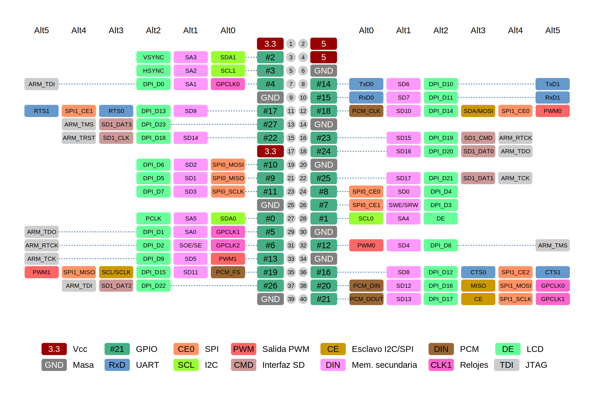

[//]: # (-*- mode: markdown; coding: utf-8 -*-)

# Entradas y salidas digitales

La versión online de este libro incorpora una línea de tiempo
interactiva con la historia de la Raspberry Pi.  Repasa un poco la
evolución del concepto de la Raspberry Pi.  Inicialmente parecía que
iba a ser un pincho USB, similar a los mediacenters que se enchufan
directamente en el televisor.  Si el objetivo era reducir coste ¿por
qué terminó siendo mucho más grande?

La respuesta la tenemos que buscar en los objetivos del proyecto.  Sus
diseñadores querían que fuera una plataforma docente, no simplemente
un ordenador barato.  Querían que los alumnos de la secundaria
experimentaran por sí mismos no solo la programación, sino la
construcción de sus propios equipos electrónicos.  Era esencial que
fuera fácil conectar cosas.

Por eso desde el primer modelo la Raspberry Pi cuenta con un buen
número de pines que pueden configurarse como entradas o salidas
digitales para controlar cualquier periférico, sensor o actuador
externo.  Se trata de los pines de *GPIO (General Purpose
Input/Output)*.  En este capítulo trataremos sus características
generales y posteriormente veremos los detalles de programación.

<figure style="padding:10px">
  <iframe src="https://docs.google.com/spreadsheets/d/1PgLL0qUC8KiJsmHOVumi-X9tgjcEINyay8LSjMT4br0/pubhtml?gid=0&amp;single=true&amp;headers=false&amp;range=A1:N21&amp;chrome=false&amp;gridlines=false" style="overflow:hidden;border-style:none;width:700px;height:470px"></iframe>

  <figcaption style="font-size:smaller; font-style:italic">
  <div style="width:600px">
  Comparación de los pines de E/S para los modelos originales y los
  modelos A+ y B+.
  </div>
  </figcaption>
</figure>


## Conector de *GPIO*

<figure style="float:right; padding:10px">
  

  <figcaption style="font-size:smaller; font-style:italic">
  <div style="width:200px">
  Configuración de los pines de E/S en los zócalos P1 y P5
  de los modelos A y B revisión 2.
  </div>
  </figcaption>
</figure>

Los modelos originales cuentan con un conector de 2x13 pines
etiquetado como P1.  Todos los modelos posteriores son compatibles con
estos primeros 26 pines.  Éste es el único pensado realmente para
proporcionar entradas y salidas digitales de propósito general.  El
conector P1 proporciona acceso a 17 pines de *GPIO*.  En la revisión 2
de la Raspberry Pi modelo B, junto a P1 se encuentra un zócalo
despoblado, el P5 de 2x4 pines, que proporciona acceso a 4 pines de
*GPIO* adicionales.

Los modelos A+ y B+ amplían considerablemente el número de pines
disponibles del conector P1 de 26 pines a un nuevo conector J8 de 40
pines.  Entre ellos 9 pines más de GPIO.  Sin embargo la
compatibilidad es total, puesto que los 26 primeros pines mantienen su
función original.

En lo sucesivo utilizaremos la numeración correspondiente al nuevo
conector de 40 pines.  Su equivalente en los conectores P1 y P5 puede
verse en la tabla al inicio de este capítulo.  Cuando hablemos de
números de pines nos referiremos al nuevo conector J8 a menos que se
indique lo contrario.

* Por un lado la mayoría de los pines son entradas/salidas digitales
  de propósito general. Pueden configurarse como entradas o salidas,
  pueden leerse o pueden escribirse con un valor digital, alto o bajo,
  uno o cero.  Ten presente que el nivel alto es de 3.3V y no son
  tolerantes a tensiones de 5V.

* Los pines 8 y 10 pueden configurarse como interfaz UART para un
  puerto serie convencional. De hecho ésta es su configuración por
  defecto en Raspbian, ya que la UART se usa como consola.

* Por otro lado los pines 3 y 5, se pueden configurar como interfaz
  I2C para interactuar con periféricos que siguen este protocolo.  En
  el taller ya lo hemos configurado de este modo.

* El pin 12 puede configurarse como salida PWM.  En teoría los pines
  12 y 13 pueden configurarse también como interfaz I2S (audio
  digital) pero hacen falta pines que no están disponibles fácilmente.

* Los pines 19, 21, 23, 24 y 26 se pueden configurar como la primera
  interfaz SPI (SPI0) para interactuar con periféricos que siguen este
  protocolo.  En el taller ya los hemos configurado de este modo.

* Los pines 27 y 28 no están disponibles.  Están reservados para la
  incorporación opcional de una memoria serie en las placas de
  expansión conforme a la especificación HAT.  Son los únicos pines
  que en el arranque se configuran como salidas, todos los demás son
  configurados inicialmente como entradas para evitar problemas.

* Los pines 29, 31, 32, 33, 35, 36, 37, 38 y 40 proporcionan acceso a
  nuevas patas de GPIO que no estaban disponibles en los modelos
  originales.  Estas patas pueden tener otros usos adicionales.  Por
  ejemplo los pines 32, 33 y 35 pueden utilizarse para salidas PWM
  (solo dos canales disponibles). Además estas patas completan los
  pines necesarios para configurar otra interfaz SPI (SPI1), que no
  vamos a utilizar en el taller.

> **Warning**

> El zócalo P5 de los modelos originales está originalmente pensado
> para poblarlo desde la capa inferior del circuito. Los pines de la
> figura adjunta están consignados según este criterio. Si se monta en
> la capa superior la asignación de pines será su reflejo especular.

En total disponemos de 26 pines para entradas y salidas digitales y
dos de ellos pueden usarse para control PWM.

## Protección de *GPIO*

Cuando se utilizan los pines de *GPIO* para interfaz con hardware de
cualquier tipo hay que poner mucho cuidado para no dañar la propia
Raspberry Pi.  Es muy importante comprobar los niveles de tensión y la
corriente solicitada.  Los pines de GPIO pueden generar y consumir
tensiones compatibles con los circuitos de 3.3V (no son tolerantes a
5V) y pueden sacar hasta 16 mA.  Eso es suficiente para iluminar un
LED, pero para poco más.

Sin embargo hay que tener presente que la corriente que sale de esos
pines proviene de la fuente de alimentación de 3.3V y esta fuente está
diseñada para una carga pico de unos
[3 mA por cada pin de GPIO](http://www.scribd.com/doc/101830961).  Es
decir, aunque el SoC de Broadcom permita drenar hasta 16 mA por cada
pin la fuente no podrá dar mas de unos 78 mA en total (51 mA en los
modelos originales).  No supone riesgo alguno si intentas superar este
límite, pero no funcionará.

> **Warning**

> Los pines GPIO de la Raspberry Pi no son tolerantes a tensiones de
> 5V. Están pensados para su utilización con circuitos de 3.3V y no
> tienen ningún tipo de protección. No debes drenar más de 16mA por
> pin.

Para evitar problemas se han fabricado una amplia variedad de tarjetas
de expansión, que protegen de diversas formas los pines de GPIO.  Las
más conocidas son:

* [Pi-Face Digital](http://www.piface.org.uk/products/piface_digital/)

* [Gertboard](http://www.element14.com/community/docs/DOC-51726/l/assembled-gertboard-for-raspberry-pi)
  de Gert van Loo, uno de los primeros voluntarios de la Raspberry Pi
  Foundation.

Una amplia variedad de métodos de protección está disponible en el
tutorial de `elinux.org` titulado
[GPIO Protection Circuits](http://elinux.org/RPi_Tutorial_EGHS:GPIO_Protection_Circuits).

## Programar entradas y salidas digitales

La referencia definitiva para programar cualquiera de los periféricos
del BCM2835 es
[la hoja de datos del fabricante](http://www.raspberrypi.org/wp-content/uploads/2012/02/BCM2835-ARM-Peripherals.pdf)
{{ "12:_bcm28_arm_perip" | cite }}, aunque se trata de un documento
denso y árido.  Es también ilustrativo el documento de Gert van Loo
[GPIO pads control](http://www.scribd.com/doc/101830961).

En capítulos posteriores veremos algunos ejemplos para familiarizarnos
con este periférico, pero es posible que te interese ampliar la
información.  Para empezar probablemente el mejor tutorial es el de
[elinux.org](http://elinux.org), que lleva por título
[RPi Tutorial: Easy GPIO Hardware & Software](http://elinux.org/RPi_Tutorial_Easy_GPIO_Hardware_&_Software)
y especialmente los
[ejemplos de programación utilizando diversos lenguajes y mecanismos](http://elinux.org/RPi_GPIO_Code_Samples).
El
[manual de la Gertboard](http://www.element14.com/community/servlet/JiveServlet/previewBody/51727-102-1-265829/Gertboard_UM_with_python.pdf)
también tiene abundante información pero el software es difícil de
encontrar.

Desde el punto de vista del programador los pines de GPIO de la
Raspberry Pi se ven como dispositivos mapeados en memoria.  Es decir,
para configurar los pines, sacar valores digitales o leer señales
digitales tenemos que leer o escribir en posiciones de memoria
determinadas.  Sin embargo el procesador de la Raspberry Pi utiliza un
mecanismo denominado *memoria virtual*, en el que cada proceso ve un
espacio de direcciones diferente, que no necesariamente tiene que
corresponder con el espacio físico y que garantiza el aislamiento
entre procesos.  En GNU/Linux para poder acceder a direcciones físicas
determinadas es necesario emplear un dispositivo (`/dev/mem`) que a
todos los efectos se comporta como un archivo normal.  Por ejemplo, en
la posición `0x20200034` del dispositivo `/dev/mem` puede leerse el
valor de las entradas GPIO0 a GPIO31.

Obviamente acceder a todo el espacio físico de direcciones es muy
peligroso, puesto que permite que desde un proceso se pueda acceder a
todo el espacio de direcciones de los demás procesos.  No solo se
compromete el aislamiento entre procesos sino también la seguridad del
sistema.  Un proceso malicioso podría utilizar funciones
privilegiadas.  Si piensas que eso no te afecta es que no sabes lo
suficiente de seguridad informática.  De vez en cuando echa un vistazo
a las ponencias de [Blackhat](http://blackhat.com) para ver qué se
cuece en el mundo de la seguridad y verás que afecta a todo (robots,
equipamiento médico, televisores, equipamiento industrial, domótica,
sistemas de telecomunicación, ...).  Un usuario malicioso podría
incluso dañar físicamente la Raspberry Pi.  Por este motivo el
dispositivo `/dev/mem` tiene permisos de escritura solamente para el
superusuario.

Las versiones recientes de Raspbian tienen un dispositivo
`/dev/gpiomem` que permite acceder solo al rango de direcciones de los
pines de GPIO y tiene permiso de escritura para el grupo `gpio`.  El
usuario `pi` es del grupo `gpio`.  Por tanto los programas del usuario
`pi` pueden actuar sobre los pines de GPIO.  En la práctica esto puede
no ser así porque muchas bibliotecas no utilizan aún `/dev/gpiomem`.

## Características de los pines de GPIO

<figure style="float:right; padding:10px">
  
  <figcaption style="font-size:smaller; font-style:italic">
	<div style="width:230px"> Circuito equivalente de un pin de GPIO
		(Fuente: <a
		href="http://www.mosaic-industries.com/embedded-systems/microcontroller-projects/raspberry-pi/gpio-pin-electrical-specifications">Mosaic
		Industries</a>).
	</div>
  </figcaption>
</figure>

Los pines de GPIO de la Raspberry Pi incorporan un conjunto de
características muy interantes:

* Tienen capacidad de limitar el *slew rate*.  Esto permitiría mejorar
  la inmunidad al ruido y reducir el ruido de *crosstalk*, pero a
  costa de alargar los tiempos de propagación.

* Se puede programar su *drive stregth*, es decir, su capacidad de
  entregar corriente, entre 2 mA y 16 mA en saltos de 2 mA (ocho
  posibles valores).  Básicamente consiste en la posibilidad de
  activar más o menos drivers en paralelo.  Para mayor detalle
  consulta el documento de Gert van Loo referido arriba.  Normalmente
  en el arranque está configurado a 8 mA.  Esto no significa que no
  podamos pedir más corriente.  Hasta 16 mA es seguro.  Sin embargo si
  superamos los 8 mA la tensión bajará hasta el punto de que un uno
  lógico pueda dejar de interpretarse como uno y la disipación de
  calor será mayor.  Por otro lado si programamos los pines a su
  máxima capacidad tendremos picos de corriente que afectan al consumo
  y pueden llegar a afectar al funcionamiento de la trajeta microSD,
  especialmente con cargas capacitivas.  Este efecto se nota más
  cuanto mayor número de salidas conmuten simultáneamente.

* Es posible configurar las entradas con o sin *Schmitt trigger* de
  manera que la transición a nivel bajo y a nivel alto tengan umbrales
  diferentes.  Esto permite dotar de cierta tolerancia a ruido.

* Es posible habilitar una resistencia de *pullup* y/o *pulldown*.  Su
  valor es en torno a los 50KOhm.

La configuración de limitación de *slew rate*, *drive strength* y
entrada con *Schmitt trigger* no se realiza pin a pin sino en bloques
(GPIO0-27, GPIO28-45, GPIO46-53).  Para los intereses del taller no
debería haber problemas con la configuración por defecto.

Es posible examinar el estado y configuración de Para ello vamos a
utilizar la utilidad `gpio` que incluye la biblioteca *wiringPi*.

```
pi@raspberrypi:~ $ gpio readall
 +-----+-----+---------+------+---+---Pi 3---+---+------+---------+-----+-----+
 | BCM | wPi |   Name  | Mode | V | Physical | V | Mode | Name    | wPi | BCM |
 +-----+-----+---------+------+---+----++----+---+------+---------+-----+-----+
 |     |     |    3.3v |      |   |  1 || 2  |   |      | 5v      |     |     |
 |   2 |   8 |   SDA.1 | ALT0 | 1 |  3 || 4  |   |      | 5V      |     |     |
 |   3 |   9 |   SCL.1 | ALT0 | 1 |  5 || 6  |   |      | 0v      |     |     |
 |   4 |   7 | GPIO. 7 |   IN | 1 |  7 || 8  | 1 | ALT0 | TxD     | 15  | 14  |
 |     |     |      0v |      |   |  9 || 10 | 1 | ALT0 | RxD     | 16  | 15  |
 |  17 |   0 | GPIO. 0 |   IN | 0 | 11 || 12 | 0 | IN   | GPIO. 1 | 1   | 18  |
 |  27 |   2 | GPIO. 2 |   IN | 0 | 13 || 14 |   |      | 0v      |     |     |
 |  22 |   3 | GPIO. 3 |   IN | 0 | 15 || 16 | 0 | IN   | GPIO. 4 | 4   | 23  |
 |     |     |    3.3v |      |   | 17 || 18 | 0 | IN   | GPIO. 5 | 5   | 24  |
 |  10 |  12 |    MOSI | ALT0 | 0 | 19 || 20 |   |      | 0v      |     |     |
 |   9 |  13 |    MISO | ALT0 | 0 | 21 || 22 | 0 | IN   | GPIO. 6 | 6   | 25  |
 |  11 |  14 |    SCLK | ALT0 | 0 | 23 || 24 | 1 | OUT  | CE0     | 10  | 8   |
 |     |     |      0v |      |   | 25 || 26 | 1 | OUT  | CE1     | 11  | 7   |
 |   0 |  30 |   SDA.0 |   IN | 1 | 27 || 28 | 1 | IN   | SCL.0   | 31  | 1   |
 |   5 |  21 | GPIO.21 |   IN | 1 | 29 || 30 |   |      | 0v      |     |     |
 |   6 |  22 | GPIO.22 |   IN | 1 | 31 || 32 | 0 | IN   | GPIO.26 | 26  | 12  |
 |  13 |  23 | GPIO.23 |   IN | 0 | 33 || 34 |   |      | 0v      |     |     |
 |  19 |  24 | GPIO.24 |   IN | 0 | 35 || 36 | 0 | IN   | GPIO.27 | 27  | 16  |
 |  26 |  25 | GPIO.25 |   IN | 0 | 37 || 38 | 0 | IN   | GPIO.28 | 28  | 20  |
 |     |     |      0v |      |   | 39 || 40 | 0 | IN   | GPIO.29 | 29  | 21  |
 +-----+-----+---------+------+---+----++----+---+------+---------+-----+-----+
 | BCM | wPi |   Name  | Mode | V | Physical | V | Mode | Name    | wPi | BCM |
 +-----+-----+---------+------+---+---Pi 3---+---+------+---------+-----+-----+
pi@raspberrypi:~ $ ▂
```

La columna *BCM* indica la numeración de Broadcom (*GPIO n*).  La
columna *Physical* contiene el número de pin en el conector J8 y la
columna *V* contiene el valor leído.  La columna *Name* representa la
función del pin pero debes tener cuidado porque cuando aparece
`GPIO.21` no se refiere a la nomenclatura de Broadcom, que es la
usual, sino a una nomenclatura propia de la biblioteca *wiringPi*.
Para interpretarlo correctamente debes mirar en el número
correspondiente de la columna `BCM`, así que `GPIO.21` es en realidad
*GPIO 5*.  Esta confusión artificial ha sido objeto de numerosas
críticas a la biblioteca *wiringPi* pero parece que los usuarios de
Arduino lo ven como algo natural.

## Funciones alternativas

Todos los pines de GPIO tienen la posibilidad de ser usados con otras
funciones alternativas.  Cada pin de GPIO puede configurarse como
entrada, salida o como una de las seis funciones alternativas (desde
*Alt0* hasta *Alt5*).  No todas las configuraciones tienen sentido,
consulta {{ "12:_bcm28_arm_perip" | cite }} para mayor detalle.

Junto a tu kit de iniciación en el taller recibirás una tarjeta que
resume las funciones que a nosotros nos interesan.  Para mayor detalle
consulta el *flyer* que también te proporcionamos o la documentación
de [elinux.org](http://elinux.org/RPi_BCM2835_GPIOs) que incluye toda
la información dispersa.  Si no encuentras ejemplos de alguno de los
periféricos y no consigues hacerlo funcionar pregunta en el
[foro del taller](https://sites.google.com/site/tallerraspberrypi/).

Este esquema puede resultarte útil para usos avanzados:



De todas formas debes tener presente que algunos elementos no pueden
seleccionarse con seguridad porque ya se han utilizado en otras partes
de la Raspberry Pi.  Por ejemplo, el BCM2837 tiene dos interfaces SD y
dos UART.  Sin embargo ambas interfaces SD están ocupadas (una para la
tarjeta microSD y otra para la comunicación WiFi.  Análogamente UART0
se destina a la interfaz Bluetooth en la Raspberry Pi 3 y solo se
expone UART1 en los pines 8 y 10.  Otro ejemplo son los relojes de
propósito general (*GPCLKx*) que permiten generar relojes de
frecuencia programable en determinadas patas.  *GPCLK1* está reservado
para uso interno (Ethernet) y si se intenta usar lo más probable es
que se cuelgue la *Raspberry Pi*.  Nada grave, pero tampoco es
agradable.


## Manipulando pines en la consola

Vamos a empezar a usar los componentes sin escribir ni una línea de
código, empleando programas que tienes disponibles.  Conecta un LED a
una de las patitas (por ejemplo GPIO18) con una resistencia para
limitar la corriente a 15mA.  Para ello te puedes ayudar de esta tabla
tomada de [theledlight.com](http://www.theledlight.com/LED101.html)
corrigiendo el valor para los LEDs de Banggood que tenemos en el kit.

*Tipo*   | *Caída* | *Resistencia* (15mA)
---------|---------|---------------------
Rojo     | 1.7V    | 100 Ohm
Amarillo | 2V      | 87 Ohm
Verde    | 2.1V    | 80 Ohm
Blanco   | 2.7V    | 40 Ohm
Azul     | 2.9V    | 27 Ohm

El kit tiene un conjunto de componentes discretos que incluye LEDs y
resistencias.  En teoría se incluyen tres de cada uno de los colores
rojo, amarillo, verde y blanco.  En la práctica dependiendo de la
disponibilidad pueden incluir otro tipo de LEDs e incluso otro número.
Por ejemplo, en un pedido de prueba que realizamos al comenzar el año
recibimos 15 LEDs (5 rojos, 5 amarillos y 5 azules).  Los objetivos
del taller no se ven afectados en absoluto, así que esto nos parece
una anécdota menor.

Los LEDs del kit no están coloreados, así que es difícil saber de qué
color son.  En las bolsitas suelen tener una letra (R, G, Y, W) para
indicar el color, pero no siempre.  De todas formas si ponemos una
resistencia de 100 Ohm estamos seguros de no superar los límites y se
enciende sin problemas hasta el LED azul.  Veamos cómo encender y
apagar el LED conectado a la pata GPIO18:

```
pi@raspberrypi:~ $ gpio -g mode 18 out
pi@raspberrypi:~ $ gpio -g write 18 1
pi@raspberrypi:~ $ gpio -g write 18 0
pi@raspberrypi:~ $ ▂
```

En la primera línea hemos configurado la pata como salida.  En las
siguientes simplemente escribimos un valor en esa pata (1 y 0).  La
opción `-g` le indica a `gpio` que use la numeración de patas normal.

> **Nota**
> Estamos de suerte en el kit de BangGood porque los diodos
> blancos tienen una caída de tensión moderada.  Por desgracia, en
> muchas otras ocasiones esto no es así y es frecuente tener caídas de
> tensión de 3.4V en un LED blanco.  Una consecuencia de esto es que
> no podemos encenderlos con salidas de 3.3V.  En esos casos puedes
> usar el *level shifter* o un transistor, pero ¿es necesario?  Aquí
> tienes el reto, si tuvieras un LED blanco con caída de 3.4V ¿qué
> harías? Usa los mismos componentes que antes pero configura el
> circuito para que se encienda sin problemas con una pata de GPIO.

[//]: # ( solución: no conectar a masa sino a 5V y usar lógica inversa)

El siguiente paso es utilizar las patas de GPIO como entradas
digitales.  Para ello conecta uno de los pulsadores entre otra pata
de GPIO y masa.  Lo normal es además poner una resistencia de
*pull-up* de 10K entre la pata y 3.3V para que la entrada no este
flotando mientras el pulsador no está apretado.  Puedes hacerlo, pero
te recordamos que también puedes usar el *pull-up* interno.

```
pi@raspberrypi:~ $ gpio -g mode 23 in
pi@raspberrypi:~ $ gpio -g mode 23 up
pi@raspberrypi:~ $ gpio -g read 23
1
pi@raspberrypi:~ $ ▂
```

Cada vez que ejecutemos `gpio -g read 23` nos devolverá el estado (0
para el conmutador *pulsado* y 1 para *no pulsado*).

[//]: # ( comentar uso de sysfs? )


## Modulación de anchura de pulsos

*Pulse Width Modulation* (PWM) es una técnica que consiste en la variación del
*duty cycle* de una señal digital periódica, fundamentalmente con dos posibles
objetivos:

* Por un lado se puede utilizar como mecanismo para transmitir
  información.  Por ejemplo, los servo-motores tienen una entrada
  digital por la que se transmite el ángulo deseado codificado en PWM.

* Por otro lado se puede utilizar para regular la cantidad de potencia
  suministrada a la carga.  Por ejemplo, las luminarias LED
  frecuentemente utilizan reguladores PWM para permitir el control de
  intensidad.

La Raspberry Pi tiene una varias patas de GPIO (GPIO12, GPIO13, GPIO18
y GPIO19) que puede configurarse como salida de alguno de los dos
canales PWM. El propio BCM2835 se encarga de gestionar la generación
de la señal, liberando completamente al procesador principal.

El periférico PWM de la Raspberry Pi es muy flexible pero solo dispone
de dos canales (*PWM0* y *PWM1*).  Puede funcionar en modo PWM o en
modo serializador.  En el modo serializador simplemente saca por la
pata correspondiente los bits de las palabras que se escriben en un
*buffer*.  Veamos primero el modo PWM.

El usuario puede configurar dos valores:

* Un *rango* de valores disponible (hasta 1024).
* Un *valor* que determina el *duty cycle*. El módulo PWM se encarga de
mantener el *duty cycle* en la relación valor/rango.

La frecuencia base para PWM en Raspberry Pi es de 19.2Mhz.  Esta
frecuencia puede ser dividida mediante el uso de un divisor indicado
con `pwmSetClock`, hasta un máximo de 4095.  A esta frecuencia
funciona el algoritmo interno que genera la secuencia de pulsos, pero
en el caso del BCM2835 se dispone de dos modos de funcionamiento, un
modo equilibrado (*balanced*) en el que es difícil controlar la
anchura de los pulsos, pero permite un control PWM de muy alta
frecuencia, y un modo *mark and space* que es mucho más intuitivo y
más apropiado para controlar servos.  El modo *balanced* es apropiado
para controlar la potencia suministrada a la carga.

En el modo *mark and space* el módulo PWM incrementará un contador
interno hasta llegar a un límite configurable, el rango de PWM, que
puede ser de como máximo 1024. Al comienzo del ciclo el pin se pondrá
a 1 lógico, y se mantendrá hasta que el contador interno llegue al
*valor* puesto por el usuario.  En ese momento el pin se pondrá a 0
lógico y se mantendrá hasta el final del ciclo.

Veamos su aplicación al control de un servomotor. Un servomotor tiene
una entrada de señal para indicar la inclinación deseada. Cada 20ms
espera un pulso y la anchura de este pulso determina la inclinación
del servo.  Alrededor de 1.5ms es la anchura del pulso necesaria para
la posición centrada. Una anchura menor hace girar el servo en sentido
antihorario (hasta 1ms aproximadamente) y una duración mayor lo hace
girar en sentido horario (hasta 2ms aproximadamente).  En este caso
hay que calcular el rango y el divisor para que el pulso se produzca
cada 20ms y el control de la anchura del pulso alrededor de los 1.5ms
sea con la máxima resolución posible.

El montaje es tal como muestra la figura. El cable rojo del servo (V+)
se conecta a +5V en P1-2 o P1-4, el cable negro o marrón (V-) a GND en
P1-6 y el cable amarillo, naranja o blanco (signal) a GPIO18 en
P1-12. No se necesita ningún otro componente.

<figure style="padding:10px">
  

  <figcaption style="font-size:smaller; font-style:italic">
  <div style="width:500px">
  Montaje de un microservo para ser controlado
  directamente desde GPIO18 configurado como salida PWM.
  </div>
  </figcaption>
</figure>

Para tener máximo control de la posición del servo probaremos con el
rango máximo, de 1024.  En ese caso el divisor tiene que ser tal que
la frecuencia del pulso PWM sea:

$$
f = \frac{f_{base}}{rango \times div} = \frac{19.2\times 10^6Hz}{1024 \times div} = \frac{1}{20ms} = 50Hz
$$

Es decir, el divisor habría que configurarlo a 390.  El rango completo
del servo depende del modelo concreto.  Teóricamente debería ser entre
52 y 102, siendo el valor completamente centrado 77.  En la práctica
habrá que probar el servo concreto porque los límites de 1ms y 2ms no
son estrictos.  Nuestros experimentos dan un rango útil entre 29 y 123
para el microservo de TowerPro disponible en el kit del alumno.

Veamos cómo se puede controlar sin programar nada. Primero
configuramos la pata GPIO18 como habíamos calculado:

```
pi@raspberrypi:~ $ gpio -g mode 18 pwm
pi@raspberrypi:~ $ gpio pwm-ms
pi@raspberrypi:~ $ gpio pwmr 1024
pi@raspberrypi:~ $ gpio pwmc 390
pi@raspberrypi:~ $ ▂
```

Ahora podemos cambiar el valor correspondiente para que gire a la
posición deseada.

```
pi@raspberrypi:~ $ gpio -g pwm 18 52
pi@raspberrypi:~ $ gpio -g pwm 18 102
pi@raspberrypi:~ $ ▂
```

> **Warning** Recuerda que solo hay dos canales PWM disponibles y que
> estos canales solo se pueden asignar a ciertas patas (PWM0 en GPIO12
> y GPIO18, PWM1 en GPIO13 y GPIO19).


## Más sobre PWM

Para los propósitos del taller no nos detendremos más en el módulo
PWM, pero tened en cuenta que la gama de posibilidades es mucho mayor.
No descartamos incorporar a esta sección en el futuro más información
sobre los otros modos de funcionamiento.  De momento preferimos
avanzar para conocer otros periféricos.

Ten presente que el audio analógico incluido en la Raspberry Pi
utiliza los dos canales PWM, así que si usas sonido analógico procura
evitar el uso de PWM.  Nuestra recomendación es que uses un altavoz
Bluetooth o bien puedes emplear una placa de audio externa
(*HiFi-Berry*, por ejemplo).
