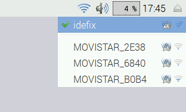
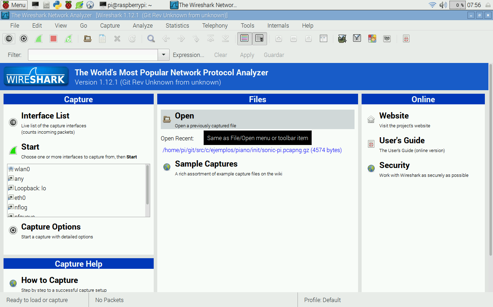
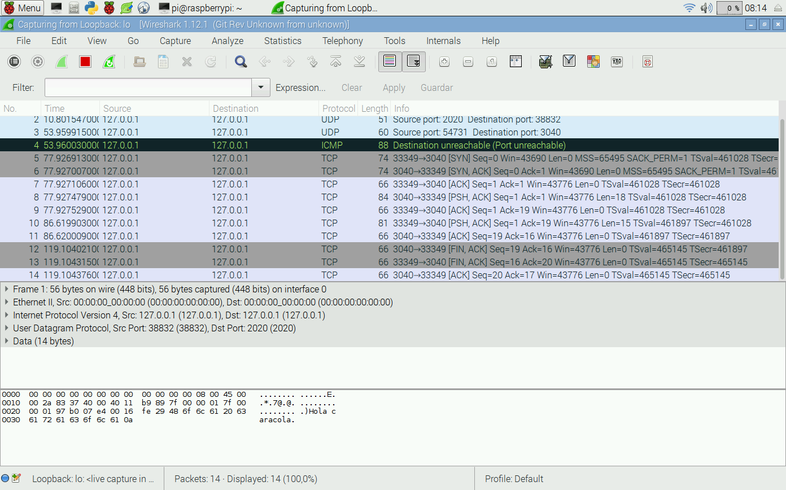
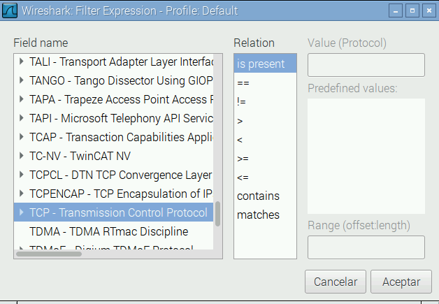
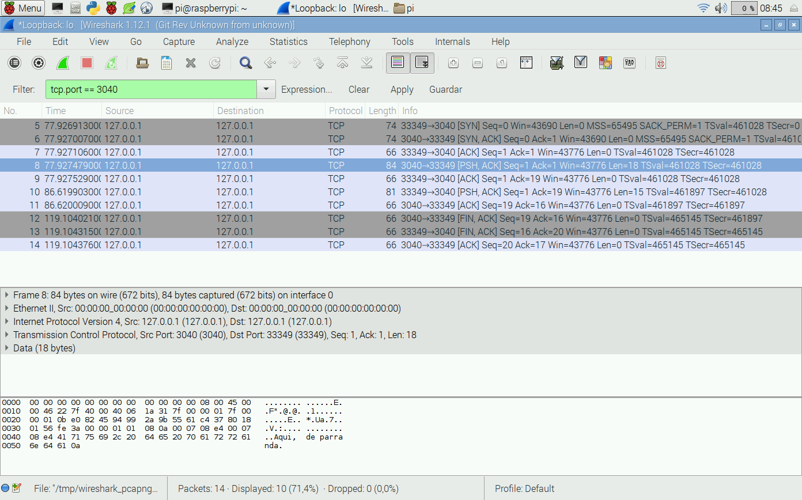
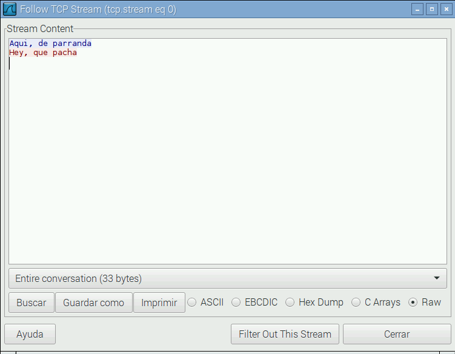

[//]: # (-*- mode: markdown; coding: utf-8 -*-)

# Comunicaciones en red

Los modelos de Raspberry Pi más utilizados (B, B+, 2B y 3B) incorporan
interfaz Ethernet.  El nuevo modelo 3B incorpora además una interfaz
WiFi y la mayoría de los usuarios de otros modelos utilizan un pincho
USB WiFi (*dongle WiFi*) para actualizar el sistema.  Por tanto es
obligado que hablemos un poco de comunicaciones, aunque lo haremos
desde una perspectiva puramente práctica, sin entrar en detalles
excesivamente técnicos.  Por supuesto te recomendamos que amplíes la
información con la amplia bibliografía existente, por ejemplo {{
"forouzan07:_trans" | cite }}.

Abre un terminal de órdenes y teclea lo siguiente:

```
pi@raspberrypi:~ $ ip addr
1: lo: <LOOPBACK,UP,LOWER_UP> mtu 65536 qdisc noqueue state UNKNOWN group default
    link/loopback 00:00:00:00:00:00 brd 00:00:00:00:00:00
    inet 127.0.0.1/8 scope host lo
       valid_lft forever preferred_lft forever
    inet6 ::1/128 scope host
       valid_lft forever preferred_lft forever
2: eth0: <NO-CARRIER,BROADCAST,MULTICAST,UP> mtu 1500 qdisc pfifo_fast state DOWN group default qlen 1000
    link/ether b8:27:eb:0c:0c:03 brd ff:ff:ff:ff:ff:ff
    inet6 fe80::84bc:c6c6:4e28:fc2a/64 scope link tentative
       valid_lft forever preferred_lft forever
3: wlan0: <BROADCAST,MULTICAST,UP,LOWER_UP> mtu 1500 qdisc mq state UP group default qlen 1000
    link/ether 00:13:ef:71:03:d0 brd ff:ff:ff:ff:ff:ff
    inet 192.168.1.38/24 brd 192.168.1.255 scope global wlan0
       valid_lft forever preferred_lft forever
    inet6 fe80::146d:4f11:30bf:17a4/64 scope link
       valid_lft forever preferred_lft forever
pi@raspberrypi:~ $ ▂
```

Precedidos por un número aparecen todas las interfaces de red con las
que cuenta en este momento tu Raspberry Pi.  En mi caso `lo`, `eth0` y
`wlan0`.

*   `lo` es la interfaz de *loopback*, una interfaz virtual que
	conecta el ordenador consigo mismo.  Es muy útil para trabajar con
	programas de red sin necesidad de usar una red física.
*   `eth0` es la interfaz Ethernet cableada (IEEE 802.3). Tanto el
    modelo B original como los modelos B+, 2B y 3B disponen de una
    interfaz Ethernet integrada.  Los demás modelos pueden
    incorporarla fácilmente usando un *dongle* USB-Ethernet.  Permite
    hasta Fast Ethernet (velocidades de transferencia de hasta 100
    Mbits/s).  No es fácil que se actualice a GbE o 10GbE porque
    internamente la interfaz Ethernet utiliza un puerto USB y de
    momento los SoC de Broadcom no incorporan nada más que USB 2.0.
*  `wlan0` es la interfaz WiFi (*Wireless Local Area Network*).  Solo
   el modelo 3B incorpora interfaz WiFi pero es mu sencillo y muy
   frecuente añadir una interfaz WiFi USB.

Las redes de comunicaciones hoy en día utilizan en su gran mayoría la
familia de protocolos TCP/IP.  Se trata de los protocolos que se
diseñaron para construir Internet, la red de redes.  Hay dos versiones
actualmente en uso IPv4 (*Internet Protocol v4*) e IPv6.  Aunque son
bastante similares hay importantes diferencias que en su mayoría
escapan del interés y alcance de este taller.  Veremos lo suficiente
de IPv4 como para manejarnos en nuestras necesidades de comunicación
entre dispositivos y dejaremos IPv6 para futuras ediciones, cuando su
grado de adopción sea mayor.

La familia de protocolos TCP/IP está principalmente construida sobre
el protocolo IP, que proporciona unas capacidades y garantías básicas.
Entre ellas cabe destacar el direccionamiento y el encaminamiento.

## Direcciones IPv4

Cada interfaz de red puede tener varias direcciones IP y podemos
gestionarlas si así lo deseamos de forma manual.  Las direcciones IP
funcionan básicamente como códigos postales.  Están organizadas de
forma jerárquica, lo que facilita la entrega.  Por ejemplo, si
enviamos una carta al código postal 45005 el cartero sabe que es de
Toledo porque empieza por 45.  Por tanto llegará en primer término a
la central de correos de Toledo, que a su vez la repartirá a sus
distintas delegaciones provinciales.  En Internet cada central de
correos se denomina *router* y las direcciones IP, a diferencia de los
códigos postales, identifican plenamente al ordenador destinatario.

Pero ¿cómo llegan los mensajes a un ordenador? Claramente se necesita
una interfaz de red.  Por tanto las direcciones están asociadas a esa
interfaz de red.  Puede entenderse como una puerta de una casa.  El
cartero deja la carta en una puerta, pero nada impide que una casa
tenga más de una puerta.  Cada puerta tiene asociada una dirección
(número) diferente.

Vamos a examinar un poquito la red de mi propia Raspberry Pi y luego
veremos cómo configurar la tuya. Nos interesa la ultima parte de la
salida de la orden `ip addr`, que también se puede conseguir así:

```
pi@raspberrypi:~ $ ip addr list wlan0
3: wlan0: <BROADCAST,MULTICAST,UP,LOWER_UP> mtu 1500 qdisc mq state UP group default qlen 1000
    link/ether 00:13:ef:71:03:d0 brd ff:ff:ff:ff:ff:ff
    inet 192.168.1.38/24 brd 192.168.1.255 scope global wlan0
       valid_lft forever preferred_lft forever
    inet6 fe80::146d:4f11:30bf:17a4/64 scope link
       valid_lft forever preferred_lft forever
pi@raspberrypi:~ $ ▂
```

Aparecen tres listas de direcciones: `link/ether` corresponden a lo
que se conoce como *direcciones de nivel de enlace*.  Es un término
técnico muy importante, pero que no veremos en el taller. La etiqueta
`inet` corresponde a los datos de IPv4, que son los que usaremos en el
taller.  La etiqueta `inet6` corresponden a los datos de IPv6 que
dejaremos para futuras ampliaciones.  Vamos a detenernos en los datos
de IPv4.

Campo     | Valor             | Descripción
----------|-------------------|-----------------
Protocolo | `inet`            | Direcciones IPv4.
Dirección | `192.168.1.38/24` | Dirección de 4 octetos donde los 24 primeros bits son indicativos de la subred a la que pertenece.
Difusión  | `192.168.1.255`   | Dirección de difusión a toda la subred.
Ámbito    | `global`          | Ámbito de validez de la dirección.
Interfaz  | `wlan0`           | Primera interfaz WiFi.

La dirección IP (e.g. *192.168.1.38*) es una secuencia de 4 octetos
(números de 0 a 255) habitualmente separados por puntos.

El sufijo `/24` sirve para indicar qué parte de la dirección (en bits
contados desde el más significativo) es común para toda la subred y
qué parte es específica de cada ordenador de la subred.  Con la
metáfora del correo equivaldría a determinar qué parte de la dirección
es el nombre de la calle y qué parte es el número de casa.  En nuestro
caso `192.168.1` es común para toda la red y solo el último número es
indicativo del ordenador.

El ámbito o *scope* de la dirección indica en qué contextos tiene
sentido esa dirección.  Las direcciones interesantes tienen alcance
global, permiten comunicar al ordenador con cualquiera de los
conectados a toda Internet.  Otras direcciones tendrán ámbito `host`,
como ocurre con la interfaz `lo`.  Esas direcciones no están pensadas
para comunicar procesos más allá de tu ordenador y sería un error
pretender usarla para comunicar dos ordenadores diferentes.

La dirección de *broadcast* o difusión es una dirección especial que
se utiliza para enviar mensajes a toda la subred a la que está
conectada la interfaz.  Se puede construir tomando la parte común de
las direcciones de la red (`192.168.1`) y añadiendo unos en todos los
bits restantes hasta los 32 que componen una dirección IPv4.  En este
caso solo quedan ocho bits por completar, que al ponerlos a uno
dejarían un 255 en el último octeto.

Vamos a hacer primero pruebas dentro de nuestro propio ordenador y
para ello vamos a usar la interfaz de *loopback*.

Campo     | Valor             | Descripción
----------|-------------------|-----------------
Protocolo | `inet`            | Direcciones IPv4.
Dirección | `127.0.0.1/8`     | Dirección de 4 octetos donde los 8 primeros bits son indicativos de la subred a la que pertenece.
Ámbito    | `host`            | Ámbito de validez de la dirección.
Interfaz  | `lo`              | Interfaz de *loopback*.

Podemos añadir direcciones a la interfaz de *loopback* con:

```
pi@raspberrypi:~ $ sudo ip addr add 192.168.1.39 dev lo
pi@raspberrypi:~ $ ip addr list lo
1: lo: <LOOPBACK,UP,LOWER_UP> mtu 65536 qdisc noqueue state UNKNOWN group default
    link/loopback 00:00:00:00:00:00 brd 00:00:00:00:00:00
    inet 127.0.0.1/8 scope host lo
       valid_lft forever preferred_lft forever
    inet 192.168.1.39/32 scope global lo
       valid_lft forever preferred_lft forever
    inet6 ::1/128 scope host
       valid_lft forever preferred_lft forever
pi@raspberrypi:~ $ ▂
```

Fíjate que necesitamos utilizar `sudo` para poder añadir direcciones
IP, puesto que es una operación de administración.

Así podemos añadir direcciones de forma manual, aunque lo habitual
será que éstas se añadan de forma automática.  Para ello se emplea un
protocolo denominado DHCP (*Dynamic Host Configuration Protocol*).  Si
conectas un cable Ethernet desde tu router, o desde tu conmutador
Ethernet, o uno de los cables de red del laboratorio a la interfaz
Ethernet de la Raspberry Pi verás cómo se añade de forma automática
una dirección.  Lo mismo ocurre con los puntos de acceso WiFi.  Por
ejemplo pincha en el símbolo WiFi en la parte superior derecha de la
pantalla.  Verás todas las redes disponibles.

<figure style="padding:10px">
  

  <figcaption style="font-size:smaller; font-style:italic">
  <div style="width:500px">
  Menú de redes WiFi disponibles.
  </div>
  </figcaption>
</figure>

Selecciona la que corresponde a `eduroam` o a tu punto de acceso WiFi
y aparecerá un cuadro de diálogo para que introduzcas los datos de
autenticación.  Estos datos dependen del tipo de red WiFi, pero es muy
similar a la configuración de tu portátil o teléfono móvil, así que
seguro que no te resulta complicado.

Cuando estés conectado a la red WiFi verás que aparece una nueva
dirección IPv4 y posiblemente otra IPv6 en la interfaz `wlan0`.

## Servicio de nombres

¿Y no te extraña que después de todos estos años usando Internet no
hayas tenido que usar direcciones IP nunca?  Bueno, tal vez en la
configuración del punto de acceso WiFi, o para compartir archivos
entre móviles, pero poco mas. ¿Me equivoco?

El motivo es que este mecanismo de direcciones se simplifica con otro
protocolo adicional, el servicio de nombres (DNS, *Domain Name
System*).  Es un servicio similar a las páginas amarillas de los
teléfonos.  No tenemos que saber o recordar todos los teléfonos,
simplemente tenemos que buscar el nombre en la guía telefónica.  El
DNS funciona de forma similar.  Asocia las direcciones IP a nombres
fácilmente recordables, como `www.uclm.es` o `google.com`.  Cuando sea
necesario utilizaremos el servicio de nombres para obtener la
dirección IP correspondiente.  Por ejemplo, vamos a averiguar la
dirección IP de `www.uclm.es`:

```
pi@raspberrypi:~ $ host www.uclm.es
www.uclm.es has address 161.67.137.169
pi@raspberrypi:~ $ ▂
```

> **Warning** 
> Todos los ejemplos de consulta a DNS o conexiones a
> servidores externos necesitan conexión a Internet.  Puedes usar el
> cable Ethernet de tu puesto de laboratorio.

Puede haber más de una dirección asociada a un nombre.  Por ejemplo:

```
pi@raspberrypi:~ $ host twitter.com
twitter.com has address 104.244.42.1
twitter.com has address 104.244.42.65
twitter.com mail is handled by 20 alt1.aspmx.l.google.com.
twitter.com mail is handled by 30 ASPMX3.GOOGLEMAIL.com.
twitter.com mail is handled by 20 alt2.aspmx.l.google.com.
twitter.com mail is handled by 10 aspmx.l.google.com.
twitter.com mail is handled by 30 ASPMX2.GOOGLEMAIL.com.
pi@raspberrypi:~ $ ▂
```

Bueno, aquí vemos que el DNS no solo tiene direcciones IP, pero eso es
otra historia y se sale de los objetivos del taller.  Lo importante es
que observes que hay dos direcciones asociadas a *twitter.com* y
cualquiera de ellas se puede usar

## Protocolos de transporte

Una red de comunicaciones está para comunicar, así que vamos a ello.
En este capítulo solo utilizaremos herramientas de tu Raspberry Pi,
sin teclear ni una sola línea de programas.  Empezaremos con *netcat*,
una maravillosa herramienta para probar programas de red.  Abre dos
terminales diferentes y ejecuta en el primero lo siguiente:

```
pi@raspberrypi:~ $ nc -l 8888
```

El programa se queda esperando (la opción `l` significa *listen*,
escucha) sin hacer nada.  Es lo que se conoce como un servidor.  Vete
al otro terminal y ejecuta lo siguiente.

```
pi@raspberrypi:~ $ nc 127.0.0.1 8888
Prueba de mensaje
```

Esta vez ejecutamos *netcat* como un cliente conectado a la dirección
*127.0.0.1*.  Esa es la dirección de la interfaz de *loopback*, asi
que conectamos con nuestro propio ordenador.  Mira en el primer
terminal. ¡Magia!  Teclea ahora en el primer terminal:

```
pi@raspberrypi:~ $ nc -l 8888
Prueba de mensaje
Otra prueba de mensaje
```

¿Se ve? Tienes un canal bidireccional de datos, puedes enviar y
recibir indistintamente.  Para salir pulsa la tecla *Ctrl* y sin
soltarla pulsa la letra *C*.

El número 8888 es lo que se conoce como un número de puerto.  Si
seguimos con la metáfora de correos equivaldría al buzón dentro de una
casa de pisos.  Se reserva un puerto para cada servicio.  Los puertos
por debajo de 1024 son privilegiados en el sentido de que se utilizan
para servicios del sistema y por tanto un usuario normal no puede
atender peticiones en esos puertos.  Veamos un ejemplo, el puerto 80
es el puerto del servidor web.  Ejecuta esto:

```
pi@raspberrypi:~ $ sudo ip addr add 161.67.137.169 dev lo
pi@raspberrypi:~ $ sudo nc -l 80 << EOF
HTTP/1.0 200 OK

<html><body><h1>You fool!</h1></body></html>
EOF
```

Ahora ejecuta el navegador web e intenta ver la página
*www.uclm.es*. ¿Sorprendido?

Hemos añadido una dirección IP a la interfaz de *loopback* que
coincide con la de *www.uclm.es*.  Cuando introducimos este sitio en
el navegador éste utiliza el DNS para obtener la dirección IP
correspondiente y envía un mensaje de petición a esa dirección IP.
Como se trata de una dirección IP conocida el mensaje ni siquiera sale
del ordenador, se lo queda la interfaz de *loopback*.  En todas las
direcciones del ordenador tenemos a *netcat* escuchando en el puerto
80, así que ese mensaje de petición le llega a *netcat*.  Lo que hay
entre `<< EOF` y `EOF` no es más que una forma de indicar que eso es
lo que debe escribir por entrada estándar.  Y lo que se escribe por
entrada estándar *netcat* se encarga de mandarlo al otro extremo de la
comunicación. ¡Voilà! Un servidor web de pobres.

Este ejemplo te habrá dejado claro por qué las direcciones IP solo las
puede poner el administrador del sistema.  En caso contrario sería
trivial hacer ataques de *man-in-the-middle* contra los usuarios de
ese ordenador.  Yo creo que ya puedes borrar esa dirección de la
interfaz de *loopback*.

```
pi@raspberrypi:~ $ sudo ip addr del 161.67.137.169 dev lo
pi@raspberrypi:~ $ ▂
```

Ya sabes comunicar datos, pero no solo entre dos terminales del
mismo ordenador.  Si estás conectado a la red prueba a conectar los
dos *netcat* ejecutando cada uno en distinto ordenador. ¡Ya sabes
comunicar datos con TCP/IP!

### Transmission Control Protocol

Internet es mucho más hostil de lo que puedes apreciar con una prueba
en tu propia Raspberry Pi.  Las comunicaciones entre ordenadores que
distan más de diez mil kilómetros involucran a decenas de dispositivos
intermedios. Hay una probabilidad nada despreciable de que algo no
vaya bien.  Pérdidas de mensajes, o incluso reorganizaciones de la red
son normales durante el mismo proceso de comunicación. ¿Qué debes
hacer entonces? La respuesta es a la vez simple y reconfortante: nada.
Lo que se puede hacer ya lo hace el protocolo subyacente, TCP
(*Transmission Control Protocol*).  Cuando usabas *netcat* estabas
usando TCP sin saberlo.  Se trata de un *protocolo de transporte*
construido sobre IP.  Este protocolo proporciona mecanismos de control
de flujo, fragmentación, reensamblado, integridad de datos,
reordenación y retransmisión para que la experiencia de comunicación
sea lo más parecida posible a la ideal, incluso aunque las cosas no
vayan bien.  Es tan importante que a toda la familia de protocolos de
Internet se le llama TCP/IP, aunque TCP e IP son solo dos protocolos
de la familia.

No cabe duda de que ha tenido éxito.  La gran mayoría de los servicios
a gran escala de Internet se construyen sobre TCP: la web, el correo
electrónico, los sistemas de mensajería instantánea, el servicio de
directorio, y prácticamente todo lo que requiera cifrado de extremo a
extremo.

Sin embargo para proporcionar garantías de entrega TCP tiene que
utilizar una serie de mecanismos que consumen tiempo, y es un tiempo
que no es fácilmente controlable.  Se dice que TCP *introduce latencia
no acotada*.  Es decir, no es posible cuantificar exactamente el
tiempo máximo que tardará en llegar un mensaje a su destino, ni
siquiera poner un límite superior.

Piensa en sistemas que requieran una respuesta en un tiempo acotado.
Es lo que se conoce como *sistemas de tiempo real*.  Hay de todo tipo,
desde sistemas de control de maquinaria, hasta sistemas multimedia.

* *Sistemas de tiempo real crítico (Hard Real-Time Systems)*.  Un
  sistema de control de un robot, un avión o un helicóptero no se
  puede plantear la retransmisión indefinida de los mensajes.  Si hay
  un problema debe tratarse a tiempo para garantizar en todo momento
  la seguridad de los usuarios y la propia integridad física del
  aparato.  En ocasiones los tiempos de respuesta no pueden superar un
  puñado de microsegundos y si no responde a tiempo el resultado puede
  ser fatal.  Este tipo de sistemas no se puede tratar con GNU/Linux
  tal y como lo hemos visto hasta ahora.  No descartamos un futuro
  taller para este tipo de sistemas, pero desde luego se sale de los
  objetivos del curso actual.
  
* *Sistemas de tiempo real blando (Soft Real-Time Systems)*. En otros
  casos la respuesta en un tiempo acotado es deseable, pero no tiene
  consecuencias catastróficas si no se cumple.  Es el caso de los
  sistemas multimedia.  Cuando se realizan comunicaciones de voz y
  vídeo es deseable que la tasa de llegadas sea más o menos constante
  y sobre todo que no se acumulen retrasos de más de la duración del
  *buffer*.  Si no se cumple veremos cortes en el video y molestos
  clicks metálicos en el audio.  Este tipo de sistemas se pueden
  tratar sin problemas con GNU/Linux pero TCP no suele ser la mejor
  opción posible.

### Unreliable Datagram Protocol

Todos los sistemas de tiempo real tienen un requisito común: necesitan
reducir la latencia al mínimo posible.  La latencia es el tiempo que
pasa desde que se envía un mensaje hasta que se entrega en el otro
extremo.

Para tratar estos problemas existe un protocolo complementario de TCP,
el *Unreliable Datagram Protocol* (UDP).  En UDP no hay control de
flujo, no hay retransmisiones, no hay reordenación, no hay nada más
que encaminamiento y garantía de integridad.  Osea, sabemos cómo
llevar los mensajes a su destino y si llegan seguro que son los que se
enviaron.  Eso es todo.  Pueden llegar en orden distinto al de envío,
pueden perderse por el camino, pueden incluso duplicarse.  Y el
emisario nunca tendrá ningún tipo de realimentación sobre si el
mensaje ha sido recibido correctamente o no.  Poco, ¿verdad?

La parte positiva es que la latencia, especialmente en redes con
pérdidas o congestionadas, es sensiblemente inferior.  Así que se usa
para difusión de video y audio.  Por su simplicidad también se suele
usar para comunicar con dispositivos muy pequeños (microcontroladores
de 8 bits, FPGAs, etc.).  Todas las garantías necesarias quedan como
responsabilidad de la aplicación.  Por ejemplo, si necesita
confirmaciones debe enviar mensajes UDP solicitando esas
confirmaciones.

Bueno, suficiente teoría, manos a la obra.  Prepara los dos terminales
como en el caso de la comunicación TCP anterior y ejecuta lo siquiente
en el primero.

```
pi@raspberrypi:~ $ nc -u -l 8888
```

Este es el servidor UDP.  Servidor es el nombre del rol pasivo en la
comunicación, el que espera.  Eso no significa que no hable, pero no
habla hasta que alguien (un cliente) inicia una conversación.

En el otro terminal ejecuta el cliente:

```
pi@raspberrypi:~ $ nc -u 127.0.0.1 8888
```

Prueba a transitir datos en los dos sentidos. Como ves funciona de
forma muy similar y no podrás apreciar la diferencia si no usas
equipos relativamente distantes y redes algo congestionadas.  Para los
efectos del taller son prácticamente equivalentes, y nos decantaremos
por uno u otro según los requisitos de la aplicación.

## Wireshark

Cuando se utilizan comunicaciones en red es muy frecuente que
aparezcan problemas de todo tipo. ¿Cómo los diagnosticamos?  La forma
más sencilla es utilizar una herramienta de captura y análisis de
tráfico.  En tu Raspberry Pi ya tienes instalada una de las mejores
herramientas disponibles: *Wireshark*.

<figure style="padding:10px">
  

  <figcaption style="font-size:smaller; font-style:italic">
  <div style="width:500px">
  Pantalla inicial de Wireshark.
  </div>
  </figcaption>
</figure>

Al arrancar la aplicación muestra algo parecido a la figura.  Aparece
una lista con las interfaces de red que ya conocemos y alguna más que
se escapa de lo que se pretende con este taller.  Selecciona la
interfaz *loopback: lo* y pulsa en *Start*.

Ahora vuelve a repetir el ejemplo de comunicación TCP y UDP que hemos
hecho en este capítulo.  Es interesante incluso equivocarse a
propósito.  Prueba por ejemplo a ejecutar el cliente UDP sin que haya
servidor al otro extremo.  El resultado será algo así:

<figure style="padding:10px">
  

  <figcaption style="font-size:smaller; font-style:italic">
  <div style="width:500px">
  Captura de mensajes de la interfaz *loopback*.
  </div>
  </figcaption>
</figure>

Lo normal en una red es ver centenares de paquetes y es relativamente
difícil encontrar lo que nosotros queremos examinar.  Por eso
*Wireshark* incorpora características de filtrado muy avanzadas.  Para
la captura pulsando sobre el botón del cuadrado rojo y vamos a filtrar
los paquetes que nos interesan.  Por ejemplo, vamos a ver los paquetes
TCP destinados al puerto que hayas usado.  Para ello pulsa en
*Expression..*.  Tendrás un diálogo como el de la figura en el que
puedes escribir TCP para encontrar todos los campos de TCP.

<figure style="padding:10px">
  

  <figcaption style="font-size:smaller; font-style:italic">
  <div style="width:500px">
  Edición de filtros de la captura.
  </div>
  </figcaption>
</figure>

Despliega todos los parámetros del protocolo TCP y selecciona
`tcp.port`.  En la columna *Relation* elige `==` y en la columna
*Value* elige el número de puerto que hayas usado.  Para terminar
pulsa *Aceptar*.  Ahora verás en la casilla *Filter* la expresión que
has seleccionado, algo del estilo a `tcp.port == 3040`.  Pero todavía
no la hemos aplicado.  Pulsa al botón *Apply*. Ya solo aparece la
conversación que nos interesa.  Como ves las cosas son más complicadas
de lo que parecen:

<figure style="padding:10px">
  

  <figcaption style="font-size:smaller; font-style:italic">
  <div style="width:500px">
  Conversación TCP con un solo mensaje (Len distinto de 0).
  </div>
  </figcaption>
</figure>

Los tres primeros mensajes son el establecimiento de conexión (*triple
handshake*) y hasta el cuarto mensaje no vemos lo que nosotros hemos
enviado.  En la ventana centras aparecen diseccionados los distintos
elementos de cada mensaje capturado.

Otra opción muy útil es el seguimiento del flujo completo.  Pulsa el
botón derecho sobre cualquiera de los mensajes en la parte superior de
la pantalla y selecciona la opción *Follow TCP Stream* en el menú
contextual que te aparece.

<figure style="padding:10px">
  

  <figcaption style="font-size:smaller; font-style:italic">
  <div style="width:500px">
  Seguimiento del flujo TCP.
  </div>
  </figcaption>
</figure>

Aparece toda la secuencia de intercambio de datos sin toda la
parafernalia de TCP.  Solo los datos.  En azul en un sentido y en rojo
en el otro.  Además podemos seleccionar solo el tráfico en uno de los
sentidos.  Esto es extraordinariamente útil cuando queremos replicar
el comportamiento de otros programas.

## Programando en red

La historia de las redes de comunicaciones entre ordenadores está muy
relacionada con la historia de Unix y por tanto indirectamente con
GNU/Linux.  En la Universidad de California en Berkeley se generalizó
la idea original de Unix, en la que todo es un archivo, a las redes.
Las comunicaciones se programan de forma muy similar al uso de
archivos.  Estos archivos especiales se denominan *sockets*.

La interfaz de programación basada en *sockets* (API socket) sigue
siendo la dominante hoy en día para tratar con redes de comunicaciones
y es la que que veremos en el capítulo correspondiente.
