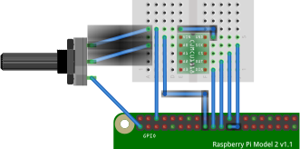

[//]: # (-*- mode: markdown; coding: utf-8 -*-)

# Comunicaciones SPI

SPI es un protocolo alternativo a I2C que utilizan muchos
dispositivos.  Hoy en día es frecuente encontrar dispositivos que
implementan tanto I2C como SPI.

La elección de cuál utilizar depende de la aplicación:
* I2C utiliza menos pines y permite direccionar muchos más dispositivos.
* SPI utiliza más pines pero permite una velocidad muy superior.

Al igual que I2C es un protocolo serie, pero la dirección de los
dispositivos no se transmite por el canal de datos sino que se
utilizan patas específicas para seleccionarlos.  Al igual que en I2C
hay un maestro que toma el rol activo en la comunicación y uno o
varios esclavos que asumen el rol pasivo.

Casa interfaz SPI cuenta con al menos cuatro patas:

* **SCLK** (*Serial CLocK*). Señal de reloj respecto a la que se
  sincronizan el resto de las señales.
* **MISO** (*Master In, Slave Out*). Entrada de datos para el maestro,
  salida de datos para el esclavo.
* **MOSI** (*Master Out, Slave In*). Salida de datos para el maestro,
  entrada de datos para el esclavo.
* **CEn** (*Chip Enable*). Una o varias señales de selección de
  destino activas a nivel bajo.  Para enviar o recibir del dispositivo
  cero se activa la señal CE0, para el dispositivo uno se activa CE1,
  etc.

En la Raspberry Pi disponemos de tres periféricos independientes para
implementar el modo esclavo y el maestro.  El modo esclavo lo
incorpora en el mismo BSI (*Broadcom Serial Interface*) que implementa
también el esclavo de I2C.  En el taller veremos el modo maestro, que
tiene mucho más interés práctico.

La Raspberry Pi cuenta con tres interfaces maestro SPI (SPI0, SPI1 y
SPI2) aunque solo una de ellas (SPI0) es visible para los modelos
originales y dos de ellas (SPI0 y SPI1) para los modelos con conector
J8 de 40 pines.  Cada una de estas interfaces cuenta con dos líneas de
selección de destino (*CE0* y *CE1*).  De ellas SPI0 es más
evolucionada, puesto que permite DMA (acceso directo a memoria).  SPI0
está diseñada para transferencias de alta velocidad (reloj de hasta
125Mhz) sin producir una carga significativa para el procesador.  Sin
embargo SPI1 no tiene posibilidad de usar DMA y solo dispone de una
pequeña FIFO de cuatro palabras de 32 bits.

El kit del alumno dispone de un conversor analógico-digital con
interfaz SPI CJMCU-1118, que incorpora el Texas Instruments ADS1118.
Se trata de un conversor analógico-digital de 16 bits con amplificador
de ganancia programable y con un sensor de temperatura.  Puede medir
cuatro señales analógicas referidas a masa o dos señales analógicas
diferenciales.  Vamos a ilustrar el uso de SPI con este módulo.

Para ello tendremos que estudiar bien su
[hoja de datos](http://www.ti.com/lit/ds/sbas457e/sbas457e.pdf) antes
de trabajar con él.  De momento para familiarizarnos con el
dispositivo conectaremos un potenciómetro de 10K como muestra la
figura.

<figure style="padding:10px">
  

  <figcaption style="font-size:smaller; font-style:italic">
  <div style="width:500px">
  Montaje de un potenciómetro de 10KOhm como fuente analógica para el
  CJMCU-1118.
  </div>
  </figcaption>
</figure>

Para comunicarnos con un dispositivo SPI tenemos que configurar
primero una serie de parámetros:

* La polaridad de la señal *chip select* (**CSPOL**).  Normalmente es
  activa a nivel bajo y no necesita modificarse.
* La polaridad del reloj (**CPOL**). Un valor 0 significa que el nivel
  de descanso del reloj es bajo.  Un valor 1 significa que el nivel de
  descanso del reloj es alto.
* La fase del relok (**CPHA**). Si tiene un valor 0 significa que las
  transiciones de *SCLK* ocurren en la mitad de cada bit de datos
  transmitido.  Un valor 1 significa que las transiciones de *SCLK*
  ocurren al principio de cada bit.
* Frecuencia del reloj. Se configura seleccionando una fuente de reloj
  y un divisor (**CDIV**).  La fuente de reloj normalmente es de 125MHz.

Las diferentes combinaciones de CPOL y CPHA dan lugar a los cuatro
modos posibles:

Modo | CPOL | CPHA
---------|----------|---------
0 | 0 | 0
1 | 0 | 1
2 | 1 | 0
3 | 1 | 1

De la hoja de datos del ADS1118 podemos ver que el dispositivo es
compatible con el modo 1 (CPOL=0, CPHA=1), la polaridad de CE es
también activa baja y admite un reloj de hasta 4MHz.

Para interactuar con él vamos a usar las herramientas incluidas en la
biblioteca *pigpio*.  En particular usaremos `pigpiod` y su interfaz
de órdenes `pigs`.

Primero ejecutamos el servidor `pigpiod`:

```
pi@raspberrypi:~ $ sudo gpiod
pi@raspberrypi:~ $ ▂
```

Utilizamos `sudo` para que se ejecute con permisos de superusuario.
Se llama servidor porque atiende peticiones de los clientes.  Por sí
mismo no hace nada, sino que espera a que un cliente le solicite
operaciones concretas.

El cliente se llama `pigs` y puede ejecutarse como usuario normal.
Por ejemplo:

```
pi@raspberrypi:~ $ pigs help
...
pi@raspberrypi:~ $ ▂
```

La lista de órdenes que admite es muy larga, pero nos quedaremos con
las relativas a SPI:

<div style="width:100px;">Orden</div> | Significado
----------|----------------
`spio c b f` | Abre el canal SPI *c* usando un reloj de frecuencia *b* y con las banderas especificadas en *f*. Devuelve un número (*handle*) que debe usarse en todas las demás órdenes.
`spir h num` | Lee *num* bytes del canal SPI asociado al handle *h*.
`spiw h bvs` | Escribe bytes en el canal SPI asociado al handle *h*.
`spix h bvs` | Escribe bytes en el canal SPI asociado al handle *h* y a la vez recibe el mismo número de bytes por el mismo canal.
`spic h` | Cierra el canal SPI asociado al handle *h*.

La orden `spio` tiene un parámetro `f` que corresponde a una serie de
banderas (*flags*) de configuración, que siguen el siguiente formato
de 22 bits:

21-16  | 15  | 14  | 13-10 | 9   |  8  | 7-5 | 4-2 | 1-0
:-----:|:---:|:---:|:-----:|:---:|:---:|:---:|:---:|:---:
bbbbbb |  R  |  T  |  nnnn |  W  |  A  | uuu | ppp |  mm

Donde cada uno de los campos significa lo siguiente:

Campo    | Significado
---------|------------
*mm*     | Modo SPI.
*ppp*    | Polaridad de *CEi*. 0 = activa baja, 1 = activa alta.
*uuu*    | Uso de *CEi*. 0 = se usa, 1 = no se usa.
*A*      | SPI auxiliar. 0 = SPI normal, 1 = SPI auxiliar.
*W*      | Número de cables. 0 = 4 cables (normal), 1 = 3 cables.
*nnnn*   | Número de bytes a escribir antes de cambiar MOSI a MISO (solo para *W* = 1).
*T*      | Orden de bits transmitidos. 0 = MSb primero, 1 = LSb primero.
*R*      | Orden de bits recibidos. 0 = MSb primero, 1 = LSb primero.
*bbbbbb* | Tamaño de palabra en bits (0-32). 0 = 8 bits. Solo para SPI auxiliar.

Tenemos suerte porque la mayoría de los parámetros por defecto
corresponden a los valores que necesita el módulo CJMCU-1118.  Tan
solo hay que cambiar el modo SPI.

```
pi@raspberrypi:~ $ pigs spio 0 4000000 1
0
pi@raspberrypi:~ $ ▂
```

Ahora tenemos que configurar el módulo con las entradas referidas a
masa, en modo continuo a 64 SPS y con rango de medida (FSR) de
±4.096V.  El ADS1118 escribe su configuración a la vez que lee datos.
Si no se desea escribir el registro de configuración simplemente hay
que escribir ceros.  Este es el formato del registro de configuración:

15   | 14-12 | 11-9 | 8    | 7-5 | 4       | 3   | 2-0 
:---:|:-----:|:----:|:----:|:---:|:-------:|:---:|:---:
SS   | MUX   | PGA  | MODE | DR  | TS_MODE | PU  | NOP

Donde cada campo corresponde a lo siguiente:

Campo    | Significado
---------|------------
SS       | A 1 para empezar una conversión cuando está en modo *single shot*.
MUX      | Configura el multiplexor de la entrada de conversor. Para señales referidas a masa es *1xx* con *xx* correspondiente a la entrada que se desea.
PGA      | Define el rango a plena escala del amplificador de ganancia programable. *000* para ±6.144V, *001* para ±4.096V, *010* para ±2.048V, *011* para ±1.024V, *100* para ±0.512V y el resto para ±0.256V.
MODE     | 0 para *modo continuo*, 1 para modo *single shot*.
DR       | Tasa de muestreo. Desde 8 hasta 860 SPS. 8·2ⁿ SPS.
TS_MODE  | 0 = Modo ADC, 1 = modo sensor de temperatura.
PU       | Habilita *pull-up* en DOUT.
NOP      | Siempre *xx1*. *011* = Actualizar registro de configuración.

En nuestro caso escribimos `0100 0000 0100 1011`.  Es decir,
selecciona la primera entrada analógica referida a masa, con el máximo
rango a plena escala, en modo *single shot* a 32 muestras por segundo y
habilitando el *pull-up*.

```
pi@raspberrypi:~ $ pigs spix 0x80 0x4b 0x80 0x4b
4 0 0 128 75 
pi@raspberrypi:~ $ ▂
```

Para leer el valor del potenciómetro basta volver a repetir la
orden. Con esto iniciamos otra conversión y leemos la anterior.

```
pi@raspberrypi:~ $ pigs spix 0x80 0x4b 0x80 0x4b
4 75 230 128 75 
pi@raspberrypi:~ $ ▂
```

Para interpretarlo hay que imprimir los dos primeros octetos como un
número de 16 bits en complemento a 2 y multiplicar el resultado por
los voltios que suponen cada bit (rango a plena escala dividido por el
valor máximo, es decir, 6.144/32768).

```
pi@raspberrypi:~ $ V=$(printf "0x%02x%02x" 75 230)
pi@raspberrypi:~ $ echo "$(($V))/32768*6.144" | bc -l
3.64312500000000000000
pi@raspberrypi:~ $ ▂
```

