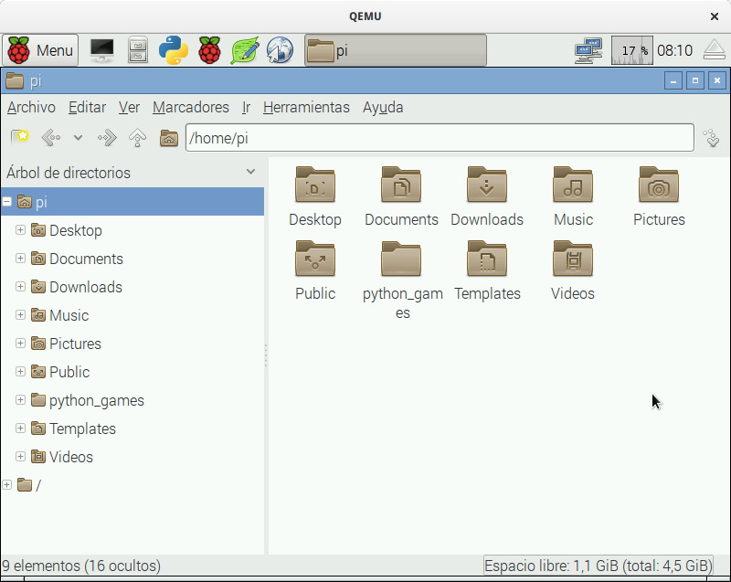

[//]: # (-*- markdown; coding: utf-8 -*-)
# Familiarización con GNU

<figure style="float:right; padding:10px">
  

  <figcaption style="font-size:smaller; font-style:italic">
  <div style="width:350px">
  Entorno gráfico en el que arranca el sistema inicialmente.
  </div>
  </figcaption>
</figure>

La Raspberry Pi cuenta con un completo sistema operativo, con entorno
gráfico y herramientas de programación de diverso tipo.  Vamos a
utilizar este entorno para realizar la mayor parte del taller.  Sin
embargo debemos precisar que la forma de trabajo habitual en
desarrollo de sistemas empotrados es que se utilice un PC y
programemos la Raspberry Pi remotamente.

*GNU/Linux* es el nombre habitual del sistema operativo que lleva
la Raspberry Pi.  *Raspbian* y *Debian* no son más que
distribuciones de este sistema operativo.  Es decir, *Raspbian*
es una seleccion de paquetes de GNU/Linux, compilados para una
arquitectura concreta, y empaquetados con ayuda de herramientas
específicas para conseguir una experiencia de usuario agradable.  En
lugar de ir aquí y allá en busca de instaladores y drivers como
hacemos en Microsoft Windows, en GNU se especializan en conjuntos de
paquetes con fines específicos.

*GNU* es el nombre correcto del sistema operativo. Quiere decir
*GNU's Not Unix*, es decir, GNU no es Unix. Es un acrónimo
recursivo.  Hace referencia a que no contiene ni una sola línea de
Unix, el sistema operativo privativo de AT&T, que luego vendió a SCO
y licenció a IBM, Sun, HP, Silicon Graphics, Fujitsu, Microsoft, etc.
El sufijo *Linux* se refiere al kernel (núcleo) del sistema
operativo.  *GNU* tiene su propio kernel, el *HURD*, pero
todavía no está listo para su uso general. Por eso la mayoría de las
distribuciones añaden a GNU alguno de los kernels libres que hay por
ahí (Linux, FreeBSD, NetBSD, etc.)

> **Info**

> 
> En 1983 Richard M. Stallman, que trabajaba como
> investigador en el AI Lab del MIT, decidió empezar el proyecto GNU
> con el objetivo de hacer innecesario el uso de cualquiero otro
> software no libre. Todavía está lejos de alcanzar su objetivo pero
> GNU ya se utiliza en multitud de equipos electrónicos.
> Puedes leer más sobre el objetivo inicial del proyecto en el
> [El manifiesto de GNU](http://www.gnu.org/gnu/manifesto.html)
> {{ "Stallman:1985:GM" | cite }}.

> En 1985 crea la *Free Software Foundation* con el objetivo de
> difundir el *movimiento del software libre* y de ayudar al
> desarrollo del sistema GNU.  Escucha al propio Richard Stallman
> [explicando la filosofía del
> movimiento](http://audio-video.gnu.org/video/short--2008--rms--free-software-and-beyond-part-1--spanish.ogv).


Nada más conectar la Raspberry Pi a la alimentación arrancará en un
entorno gráfico como el que se muestra en la figura al comienzo del
capítulo.  En la parte superior aparecen los siguientes elementos.

*  Menú de aplicaciones.
*  Terminal de línea de órdenes.
*  Herramienta de configuración de Raspberry Pi.
*  Herramienta de administración de archivos.
*  Entorno integrado de desarrollo en Python (IDLE).
*  Editor de textos.
*  Navegador básico de web.

Desde el menú es posible ejecutar la mayoría de las aplicaciones
instaladas.  No obstante con los botones de lanzamiento rápido de
aplicaciones tendremos suficiente para la mayoría de las actividades
del taller.

## El sistema de archivos

<figure style="float:right; padding:10px">
  

  <figcaption style="font-size:smaller; font-style:italic">
  <div style="width:350px">
  Administrador de archivos.
  </div>
  </figcaption>
</figure>

Vamos primero a familiarizarnos con la estructura de carpetas y
archivos del sistema.  Para ello pincha sobre el botón de lanzamiento
rápido del administrador de archivos. La situación será similar a la
figura adjunta.

La caja de texto en la parte superior indica `/home/pi` que es la
carpeta actual.  Las rutas de los archivos y las carpetas utilizan el
caracter `/` como separador.  No es posible tener una carpeta con ese
carácter en el nombre porque el sistema no podría diferenciarlo de una
ruta de dos componentes.  La carpeta `/` sin más es la carpeta *raíz*,
de donde cuelga todo.  Aquí no hay nombres de unidades, todas las
unidades se ven en algún punto del arbol de carpetas que nace en la
carpeta raiz.  La ruta `/home/pi` hace referencia a que se encuentra
en la carpeta `pi` de la carpeta `home`.  Como puedes imaginar se
trata de la carpeta personal.  El nombre `home` se refiere a que
contiene todas las carpetas personales (casa en inglés). Y dentro de
esa carpeta, la carpeta `pi` es la del usuario `pi`.  Efectivamente,
`pi` es el nombre del usuario creado por defecto en el sistema cuando
se instala.  En el taller usaremos este usuario en exclusiva, pero te
animamos a que te hagas su propio usuario.  Verás que en esta carpeta
ya hay algunos archivos. Son ejemplos de programas en varios lenguajes
de programación, que usaremos en el curso.

Aunque el sistema no lo requiere, las distintas variantes de GNU
tienden a mantener una estructura común de carpetas.  Por ejemplo, los
siguientes suelen estar presentes en la práctica totalidad de los
sistemas GNU:

* `/home/` Carpetas personales de los usuarios.
* `/root/` Carpeta personal del administrador (usuario `root`).
* `/etc/` Archivos de configuración del sistema.
* `/boot/` Archivos necesarios para el arranque del sistema.
* `/bin/` Órdenes básicas (ejecutables del sistema).
* `/usr/bin/` Resto de órdenes del sistema (ejecutables).
* `/lib/` Bibliotecas básicas del sistema (biblioteca en inglés es *library*).
* `/usr/lib/` Resto de bibliotecas del sistema.
* `/usr/local/` Software instalado de forma manual, no perteneciente al sistema.
* `/tmp/` Carpeta temporal.
* `/dev/` Dispositivos del sistema. En GNU todos los dispositivs se ven como archivos especiales.

Usa el administrador de archivos para navegar por el sistema y
familiarizarte con él.  No te preocupes, como usuario `pi` no puedes
destruir nada esencial para el sistema. Te proponemos los siguientes
ejercicios:

1. Encuentra el archivo `wpa_supplicant.conf`. Se trata del archivo
  donde podrás *configurar* la red WiFi para que la Raspberry Pi se
  conecte automáticamente a tu punto de acceso.

1. Encuentra el archivo `parpadeo.py` que es un programa de ejemplo
  escrito en Python que usaremos en el curso.

1. Encuentra el programa `gcc`. Se trata del compilador de C.

1. Encuentra el programa `idle`. Se trata del entorno integrado de
  programación con Python.

> **Warning**

> Tradicionalmente en sistemas operativos se utiliza el
> término *directorio* para referirse a una carpeta.  Del mismo modo
> muchos textos en español hablan de *ficheros* para referirse a
> archivos.  Nosotros intentaremos utilizar el término *carpeta*
> (*folder* en ingles) que encaja mejor en la metáfora del escritorio.

> *File* es archivo en inglés.  Un *file* es una de esas carpetas de
> cartón que se meten en los archivadores de oficina.  El problema es
> que no se puede llamar carpeta también a los archivos.  Por eso se
> buscaron traducciones más neutras.  Fichero es realmente el
> archivador, más que el contenido del archivador. Así que *archivo*
> nos parece una traducción más correcta.

> Pero te avisamos porque en la documentación que leas por ahí es
> fácil que aparezcan.  **Directorio es lo mismo que carpeta y fichero
> es lo mismo que archivo**.

## El entorno de línea de órdenes

Ejecuta la terminal de línea de órdenes pulsando sobre el icono
correspondiente .  Aunque
aparentemente se trata de una interfaz primitiva ésta es una de las
formas más flexibles para comunicarse con el sistema operativo.

Al pulsar el icono veremos que se abre una nueva ventana. Esa ventana
corresponde al programa simulador de terminal.  Se comporta como una
consola antigua con teclado y pantalla alfanumérica.  A su vez el
programa terminal ejecuta otro programa que se encarga de interpretar
las órdenes textuales, la *shell*.  La *shell* es el intermediario
entre el usuario y el sistema operativo.

En GNU/Linux la *shell* que se utiliza normalmente se llama `bash`
(*Bourne Again SHell*).  Tiene multitud de características que la
convierten en un completo lenguaje de programación por sí misma.
Nosotros no veremos las características avanzadas, sino unas nociones
básicas que te permitirán desenvolverte con soltura durante el curso.


sistemas GNU/Linux, sobre todo en cuanto al uso de la consola o
terminal del sistema se refiere.  Con esta intención, proponemos este
capítulo como guía práctica para aquéllos que nunca han trabajado
sobre un entorno de línea de órdenes. Se comenta también, de manera
muy sucinta, la organización del sistema de archivos en entornos
GNU/Linux, algo que creemos fundamental para que el alumno pueda
comenzar a trabajar con este tipo de plataformas.  Sin embargo,
remitimos al alumno a otras fuentes más extensas, que se enumeran en
la sección de referencias, para estudiar estos temas con más nivel de
detalle.

### El sistema de directorios

Lo primero que se debe tener claro cuando se comienza a
trabajar con plataformas GNU/Linux es que todo el sistema de
directorios cuelga de un directorio raíz, el '/'.  El resto de
directorios y ficheros del sistema cuelgan de este punto, organizados
a su vez en una jerarquía de directorios.


Aunque desde el entorno del escritorio se pueden realizar
casi todas las tareas, hay algunas para las que será imprescindible
manejar la consola del sistema.

Cuando abrimos una consola, desde el menú `Aplicaciones |
  Accesorios | Terminal`, lo usual es que ésta parta del directorio
del usuario, que a su vez cuelga del directorio `/home`, y se
suele representar como `~`. Idealmente, el alumno debería
crearse a partir de este punto de la jerarquía de directorio uno
propio donde ir organizando todo el trabajo de prácticas.

El sistema diferencia entre letras mayúsculas y minúsculas.  Además,
aunque también permite manejar espacios en blanco en el nombre de los
directorios y ficheros, es preferible que éstos se substituyan por
guiones o carácter de subrayado, por simplicidad.

### Creación de directorios: `mkdir`

La orden `mkdir` permite la creación de directorios en
aquellos puntos en los que el usuario tiene permisos para ello. Este
comando se utiliza de la siguiente forma:

```
mkdir [OPCION] DIRECTORIO
```

El directorio, salvo que se especifique una ruta absoluta,
lo creará como un subdirectorio que cuelga de la ubicación actual en
la consola.  Por ejemplo, suponiendo que nos encontramos en el home del
usuario `usuario`, se desea crear el directorio `rpi` y dentro de
éste, otro que sea `practicas` y otro que sea `practica1`, que
cuelgue de `practicas`:

```
usuario@maquina:~$ mkdir rpi
usuario@maquina:~$ mkdir rpi/practicas
usuario@maquina:~$ mkdir rpi/practicas/practica1
```


### Listado de ficheros: `ls`

Esta orden muestra el listado de los ficheros y
directorios que cuelgan o están contenidos en un directorio concreto.
Por defecto, no muestra los ficheros ocultos, que son aquéllos cuyo
nombre comienza con `.` Se utiliza de la siguiente manera:

```
ls [OPCION] [FICHERO]
```

Además, esta orden acepta la siguientes opciones:

* [`-a`] Muestra también los ficheros ocultos, aquellos que
empiezan por .
* [`-l`] Utiliza un formato de listado largo, con información de
permisos, usuarios, tamaños, fecha, etc.
* [`-R`] Lista los subdirectorios de manera recursiva.
* [`-{`-help}] Muestra la ayuda de la orden, junto con una lista
extendida de las opciones del mismo.


Suponiendo que el intérprete de órdenes está en el home del
usuario, para listar el contenido del directorio `rpi`:

```
usuario@maquina:~$ ls rpi
practicas
usuario@maquina:~$ ls -R rpi
rpi/:
practicas

rpi/practicas:
practica1

rpi/practicas/practica1:
```

### Especificación de ruta: `cd`

Cambia al directorio especificado.  Si no se especifica
ninguna ruta va al directorio home del usuario.  Se utiliza de la
siguiente manera:

```
cd [RUTA]
```

Conviene conocer también cómo cambiar de directorio
utilizando rutas relativas a la ubicación actual y no únicamente
con rutas absolutas.

```
usuario@maquina:~$ cd rpi
usuario@maquina:~/rpi$ cd ..
usuario@maquina:~$ cd rpi/practicas/practica1
usuario@maquina:~/rpi/practicas/practica1$ cd
usuario@maquina:~$ cd /home/usuario/rpi/practicas/practica1
usuario@maquina:~/rpi/practicas/practica1$
```

Las tres primeras líneas utilizan rutas relativas, dado que
la ruta no empieza por ``/''.  Por ejemplo, la primera línea utiliza
una ruta relativa en la que el directorio `rpi` es hijo del
directorio actual.  La segunda línea utiliza el directorio especial
``..'', que representa al directorio padre del actual.  Es decir, sube
un nivel.  La cuarta línea (sin especificar ruta) equivale a `cd
  ~`, es decir, cambia al directorio (`home`) del usuario.

Si dentro del directorio `practica1` guardamos el código fuente
del *Hola Mundo* en un archivo `hello.c`, lo
compilamos y generamos el ejecutable como `hello`, se puede
comprobar lo siguiente:

```
usuario@maquina:~$ cd rpi/practicas/practica1
usuario@maquina:~/rpi/practicas/practica1$ ls
hello.c
usuario@maquina:~/rpi/practicas/practica1$ gcc -o hello hello.c
usuario@maquina:~/rpi/practicas/practica1$ ./hello
Hola Mundo
usuario@maquina:~/rpi/practicas/practica1$ cd
usuario@maquina:~$ /home/usuario/rpi/practicas/practica1/hello
Hola Mundo
```

Para ejecutar un binario también será necesario especificar
la ruta donde el mismo se encuentra localizado.  La ruta se podrá
indicar de manera absoluta o relativa.  La línea 5 especifica la ruta
relativa a la posición actual, como es el mismo directorio se indica
por `./`.  Sin embargo la línea 7 especifica la ruta absoluta.

### Ubicación actual: `pwd`

Esta orden muestra la ruta completa al directorio actual.

```
usuario@maquina:~$ cd rpi/practicas/practica1
usuario@maquina:~/rpi/practicas/practica1$ pwd
/home/usuario/rpi/practicas/practica1
```

### Borrado de archivos y directorios: `rm`

Esta orden se utiliza para borrar archivos y directorios.
Esta orden no se puede deshacer, de ahí que sea conveniente utilizarla
con cautela, o en su defecto, forzar la petición de comprobación
utilizando la opción `-i`.  Se utiliza de la siguiente manera:

```
rm [OPCION] FILE
```

Entre las diferentes opciones que acepta esta orden,
destacamos las siguientes:


* [`-r`] Procesa subdirectorios de forma recursiva.
* [`-i`] Pide confirmación para cada borrado.
* [`-f`] Forzado, ignora archivos no existentes y elimina
cualquier aviso de confirmación.


La orden `rmdir` se puede utilizar también para borrar un
directorio, y tiene el mismo efecto que el de borrado recursivo.

### Copia de archivos y directorios: `cp`

Esta orden se utiliza para efectuar la copia de archivos y
directorios el sistema de archivos.  Se utiliza de la siguiente
manera:

```
cp [OPCION] origen destino
```

Donde *origen* es el fichero o directorio que se
desea copiar y *destino* la ubicación donde se copiará y
opcionalmente, si la ruta va acompañada de un nombre, indicará una
copia renombrada.  Por defecto, si el destino es un directorio, se
copia con el mismo nombre que el origen.

Dentro de esta sección comentaremos también la orden `mv`.  Se
utiliza como la orden `cp`, con la diferencia de que en lugar de
crear una copia del objeto, la orden `mv`, mueve el objeto
*origen* a un *destino*.

```
usuario@maquina:~$ cd rpi/practicas
usuario@maquina:~/rpi/practicas$ cp -r practica1 practica2
```

## Herramientas

Para la realización de estas prácticas utilizaremos un
conjunto muy reducido de herramientas: un editor de textos, la
consola, el compilador `gcc`, la herramienta `make`, y el
depurador `gdb`.

La Raspberry Pi cuenta con un editor de textos simple, `nano` que
puede ser lanzado desde la consola del sistema.  Aunque no
vengan instalados con la distribución, posteriormente se podrán
instalar otros como vi, vim, o joe.  En otro orden de magnitud, el
editor `emacs` está orientado a la edición de código, pero su uso
requiere un estudio más pormenorizado que el resto de herramientas.
Se deja a decisión del alumno la herramienta de edición que más se
ajuste a sus necesidades.

Este documento no detallará el uso del depurador, ya que éste se
estudiará y documentará en mayor profundidad en la sección
correspondiente.  Por lo tanto, en este documento presentaremos los
detalles esenciales del compilador `gcc` y de la herramienta
`make`.  Al final del documento se proporciona una lista de las
referencias donde se podrá obtener información más profunda y
detallada de los mismos.  Aquí, sólo se pretende apuntar de manera
sucinta lo esencial para que el alumno pueda practicar con los
ejemplos de código que se le proporcionan en las primeras sesiones,
hasta que se familiarice con la plataforma utilizada en los
laboratorios.

### Compilador: GCC

Las siglas GCC provienen de *GNU Compiler
  Collection*, y como su propio nombre indica, se trata de un conjunto
de compiladores para diversos lenguajes de programación: C, C++,
Objective C, Chill, Fortran, y Java, distribuido bajo licencia GPL.

Se trata de una herramienta muy completa y compleja, y no es objeto de
este documento presentarla en profundidad.  Las opciones más comunes
son:


* [`-c`] Compila o ensambla, pero no enlaza, obteniéndose un
  archivo en código objeto con extensión `.o`.
* [`-E`] Realiza únicamente el preprocesamiento, enviando el
  resultado a la salida estándar.
* [`-g`] Incluye información estándar para el depurado.
* [`-I`*ruta*] Especifica la ruta al directorio donde
  encontrar los archivos de cabecera.
* [`-L`*ruta*] Especifica la ruta al directorio donde
  encontrar bibliotecas de funciones.
* [`-l`*FICH*] Enlaza con la biblioteca de nombre
  `libFICH.a`.
* [`-o` *archivo*] Indica el nombre del archivo
  ejecutable (`gcc -o hola hola.c`).
* [`-S`] Preprocesa y compila, pero no ensambla ni enlaza.
* [`-v`] Muestra las fases por las que va pasando el compilador.
* [`-w`] Suprime los mensajes de aviso (*warnings*).
* [`-Wall`] Emite todos los avisos que el compilador pueda
  generar.


### La herramienta de construcción `make`

`Make` es una herramienta que permite automatizar la
construcción de archivos a partir de otros archivos.  En particular es
especialmente útil para automatizar la compilación del código C para
generar archivos objeto y el montaje de los archivos objeto para
generar un ejecutable.

El archivo `Makefile` debe contener el conjunto de dependencias
y reglas que construcción que determinan cómo generar el código.
Veamos un ejemplo sencillo para compilar un programa `ejecutable`
a partir de dos archivos fuente `archivo1.c` y
`archivo2.c`, y un archivo de cabecera `archivo1.h`
incluido por ambos:

```
ejecutable: archivo1.o archivo2.o
        gcc -o ejecutable archivo1.o archivo2.o

archivo1.o: archivo1.c archivo1.h
        gcc -c archivo1.c

archivo2.o: archivo2.c archivo1.h
        gcc -c archivo2.c
```

Con este `Makefile` estamos indicando a `make` que para
construir `ejecutable` necesita primero disponer de los archivos
`archivo1.o` y `archivo2.o` (los archivos objeto).  Y una
vez que disponga de ellos puede construirlo empleando la orden que
aparece en la segunda línea (uso de `gcc` como montador o linker).

En la línea 4 se indica que para construir `archivo1.o` se
precisa primero de los archivos `archivo1.c` y
`archivo1.h`.  Y una vez que se disponga de ellos puede
construirlo con la orden de la línea 5 (uso de `gcc` como
compilador).  Las líneas 7 y 8 son similares a las líneas 4 y 5 pero
indican como construir `archivo2.o`.

Un aspecto interesante del uso de `make` es que solo se genera lo
necesario, y se aplican las reglas afectadas por archivos que han
cambiado.  Es decir, si se dispone de un buen `Makefile` basta
con ejecutar `make` para que se compile todo lo necesario y solo
lo necesario en cualquier momento.

Cae fuera del ámbito de este curso explicar con más detalle la
sintaxis que utiliza el archivo `Makefile`.  En su lugar,
utilizaremos `make` con archivos `Makefile` proporcionados
en plantillas de aplicaciones.

### GNU Debugger

Se suele asociar el uso de herramientas de depuración a la
resolución de aquellos problemas o fallos que aparecen en tiempo de
ejecución, causantes de que programas aparentemente bien escritos
terminen su ejecución inesperadamente con un error del tipo
*segmentation fault*.

Las herramientas de depuración permiten detener la ejecución del
programa en puntos específicos, por ejemplo, justo antes de la
ocurrencia de un error en el que se sabe que la ejecución termina
inesperadamente.  La detención del programa permite explorar en ese
punto la memoria, incluso conocer el valor de las variables y
registros del procesador e ir avanzando por la ejecución hasta
encontrar el punto exacto en el que ocurre la disfunción del programa.
En cualquier caso, el manejo de herramientas de depuración es
fundamental para que el programador pueda llevar a cabo una
programación confiable.

Sin embargo, el uso de los depuradores no se limita únicamente al campo
de la localización y resolución de errores, sino que también se
emplean para explorar la arquitectura sobre la que está ejecutando un
programa.  Con esta finalidad esta sesión expondrá someramente una guía
de uso de una herramienta de depuración.  La siguiente sesión,
utilizará conjuntamente el emulador de la consola y el depurador para
explorar el código, la organización de la memoria y los registros del
procesador.

Existe un amplio abanico de herramientas de depuración.  Este
documento presentará el depurador de GNU, abreviado `gdb`, como un
depurador simbólico avanzado con soporte de infinidad de
arquitecturas, formatos de ejecutable y lenguajes de programación.
Aunque existen numerosos interfaces de usuario para gdb, comenzaremos
su estudio con la interfaz de línea de órdenes, ya que ésta será
común para todos los demás, aunque también se comentarán algunas
herramientas gráficas.

#### Uso de `gdb`

Para que `gdb` pueda ser aprovechado al máximo en la
depuración de un programa, será necesario que éste haya sido compilado
con soporte para depuración, lo cual se especifica al compilador
`gcc` mediante la opción `-g`.

Utilizando interfaz de línea de órdenes, el primer paso consiste en
invocar `gdb` y para ello, la forma más usual de realizar la
invocación es especificando el ejecutable a depurar:

```
$ gdb programa
```

Una vez que se ha cargado el ejecutable, se podrán realizar las
siguientes operaciones:

#### list (l)

Lista el código del programa o de una función.  Se utiliza como:

```
(gdb) l
(gdb) l funcion
(gdb) l 1,40
```

La línea 1 lista las 10 próximas líneas.  La línea 2 lista la función
\src{funcion} y la línea 3, lista de las líneas 1 a 40.

#### break (b)

Coloca un punto de ruptura en la función, línea o fichero
indicado.  Los puntos de ruptura indican al depurador aquellos puntos
del código en los que se debe detener la ejecución del programa.

```
(gdb) b funcion
(gdb) b 30
(gdb) b codigo.c:30
```

La línea 1 pone un punto de ruptura al comienzo de la función
`funcion`.  La línea 2 lo pone en la línea número 30, mientras
que la línea 3 pone un punto de ruptura en el archivo
`codigo.c` en la línea 30.

#### run

Ejecuta el programa, con los argumentos de entrada que se
especifiquen.  Se ejecutará desde el comienzo, deteniéndose en aquellos puntos
en los que se hayan colocado algún punto de ruptura o watchpoint.

```
(gdb) run
(gdb) run arg1 arg2
```

La línea 1 lanza la ejecución del programa sin argumentos de entrada.
La línea 2 pasa los argumentos arg1 y arg2.

#### print (p)

Se utiliza para imprimir el valor de las variables.  Sólo se
pueden visualizar aquellas expresiones que aún formen parte del
contexto actual de ejecución, por lo que no será posible visualizar el
valor de una variable local a una función cuando se ha salido del
contexto de la misma.

```
(gdb) print i
$1 = 3
(gdb) print i+2
$2 = 5
```

#### backtrace (bt)

Muestra la traza de llamadas del programa, es decir, las
funciones que han sido invocadas y desde dónde.  Las funciones
aparecen apiladas, siendo la base la primera función invocada.

#### continue (c)

Cuando la ejecución del programa está detenida, bien por un
breakpoint o porque se haya lanzado una ejecución paso a paso, esta
orden continúa la ejecución.

#### next (n)

Ejecuta la siguiente línea del programa, sin entrar en las
funciones, es decir, las funciones se ejecutan en un sólo paso.

#### step (s)

Como la anterior, esta instrucción ejecuta la siguiente línea del
programa, con la diferencia de que si es una función, accede al código
de la misma.

#### jump (j)

Salta al punto del programa especificado, sin ejecutar el
código intermedio.  Ese punto puede ser una línea del programa o una
función.

```
(gdb) j 50
(gdb) j funcion
```

La línea 1 indica el salto de la ejecución del código a la línea
número 50 del programa.  La línea 2 salta a la función de nombre
\src{funcion}.

#### until

Lleva la ejecución del programa hasta llegar a la siguiente
línea.  Esta orden será útil para ejecutar bucles en un paso.

#### watch

Los watchpoints se utilizan para vigilar el valor de una
variable y cuando ésta cambie detener la ejecución del programa.  Se
puede utilizar de las siguiente maneras.

```
(gdb) watch expr
(gdb) rwatch expr
(gdb) awatch expr
(gdb) info watchpoints
```

La línea 1 para la ejecución cada vez que la expresión \src{expr}
cambia.  La línea 2 detiene la ejecución cuando se lee la expresión
\src{expr}, la línea 3 cuando \src{expr} es leída o escrita.  La
última línea muestra un listado de todos los watchpoint establecidos.

#### info (i)

Muestra información sobre los breakpoints o watchpoints
definidos.

```
(gdb) info breakpoints
(gdb) info b
(gdb) info watchpoints
```

#### clear

Elimina breakpoints o watchpoints.

```
(gdb) clear 10
```

Elimina el breakpoint o watchpoint establecido en la línea
10.

#### set

Set establece el contenido de una variable al valor dado.

```
(gdb) set variable=1
```

#### return

Termina la función en el punto en el que se encuentra el
depurador y devuelve el valor que se especifica.

```
(gdb) return 3
```

#### whatis

Muestra el tipo de la variable.

```
(gdb) whatis i
type = int
(gdb)
```

#### quit

Con esta orden se sale del depurador.

```
(gdb) quit
$
```

### Front-ends para `gdb`

Un frontend no es más que una interfaz gráfica entre la
aplicación y los usuarios.  Por lo tanto, los front-ends para gdb
realmente no son depuradores en sí mismos, sino sólo interfaces
gráficas que redirigen las peticiones en forma de órdenes al
`gdb`.

Dentro del amplio abanico de front-ends que existe para `gdb` aquí
sólo presentamos las propuestas más relevantes de entre aquéllos que
da soporte a la depuración remota, esencial cuando se desarrolla para
plataformas mediante compilación cruzada, como es el caso de la
compilación y depuración de código para la Raspberry Pi. Excluiremos
Eclipse, que será cubierto con más detalle en sesiones posteriores.

#### `KDbg`

`KDbg` es un front-end desarrollado utilizando la arquitectura
de componentes KDE.  La invocación de `kdbg` sobre la consola del
sistema se realiza de la siguiente manera:

```
$ apt-get install kdbg
$ kdgb ejecutable
```

La figura \ref{fig:kdbg} presenta la ventana principal de la
aplicación.  El ejecutable a depurar también se puede indicar después
de la invocación de la aplicación, en el menu `File |
  Executable`.

La **ventana de código** muestra el código fuente del ejecutable, sobre
el que se podrán insertar directamente los breakpoints, haciendo
doble click sobre las líneas en las que se deberá detener la ejecución
del programa (en el margen izquierdo de la línea aparecerá entonces un
punto rojo indicando la existencia de un breakpoint).  En todo momento
el punto actual de ejecución viene determinado por un puntero verde
que se va desplazando por las sucesivas líneas del código, saltando
incluso a otros archivos, cuando la ejecución del programa pasa al
codigo presente en otro archivo fuente.  También a la izquierda del
código, el símbolo `+' expande el equivalente en ensamblador de la
línea actual.

\imagenhere{img/kdbg-main.png}{13cm}{Pantalla principal de
  KDbg.}{fig:kdbg}

El código fuente se muestra cuando se abre el ejecutable, pero para
abrir cualquier otro archivo de código se accede al menú *File
  $\rightarrow$ Open Source*.


La **ventana de las variables locales** se abre desde el menú
*View $\rightarrow$ Locals*.  El conjunto de variables que se
muestra dependerá del stack frame seleccionado.  Para ver la
**ventana del stack** seleccionar en el menú *View
  $\rightarrow$ Stack*.

Cuando la ejecución se detiene, `KDbg` muestra el contenido de
los registros del procesador en la **ventana de registros**
(*View $\rightarrow$ Registers*).  Los registros se muestran
agrupados según su tipo y en un formato de tres columnas.  La columna
`Register` muestra el nombre del registro.  La columna
`Value` muestra el valor hexadecimal del registro mientras que
la column `Decoded Value` muestra el contenido decodificado del
registro.

La **ventana del volcado de memoria** muestra el contenido de la memoria
de programa (*View $\rightarrow$ Memory*).  Para ver el valor contenido en
una posición concreta basta con introducir la dirección en el campo
editable de la misma ventana.

#### `DDD`

`DDD` son las siglas de *Data Display
  Debugger*.  Lo más característico de este front-end es que permite
explorar los datos mediante interacción con la representación gráfica
de los mismos, pues las estructuras de datos se representan como
grafos.

\imagenhere{img/ddd.png}{13cm}{Pantalla principal de DDD.}{fig:ddd}

Para la invocación desde la consola del sistema:

```
$ apt-get install ddd
$ ddd ejecutable
```

La ventana principal de `DDD` se compone de otras
tres ventanas principales, la ventana de datos, la de código y la
consola de depuración, como se puede ver en la figura~\ref{fig:ddd}.
Además de estas ventanas hay otras más que son opcionales como la de
órdenes, la ventana de código máquina y la de ejecución.

Para lanzar la depuración del ejecutable se selecciona la opción del
menu *Program $\rightarrow$ Run*, seguidamente aparece un cuadro de dialogo
donde se pueden introducir los argumentos de entrada al programa, si
los tuviera.

Este front-end propone varias maneras para examinar las variables:

* La forma más rápida de examinar las variables es acceder al texto
  del código fuente.  Situando el puntero sobre la variable, seguidamente
  aparecerá una ventana con el valor.  Esto es muy útil para un examen
  rápido de variables simples.
* Para estructuras de datos más grandes se puede utilizar la
  consola del depurador para imprimir su valor.
* La ventana de datos permite la representación gráfica de
  estructuras de datos más complejas, muy útil cuando las estructuras
  de datos son dinámicas, ya que la representación se actualiza cada
  vez que se detiene la ejecución del programa.
* Para examinar arrays de valores numéricos éstos se puede
  representar gráficamente como una función en una ventana separada.
* También se podrá acceder al contenido de la memoria y darle el
  formato deseado.


%### Emacs
### Instalación

En esta sección se describen los pasos necesarios para poder
visualizar el ejemplo de ``Hola, mundo'' en la pantalla de la
Raspberry Pi.  Además, se detallará todo lo necesario para poder
desarrollar, compilar y ejecutar una aplicación en la Raspberry Pi.

### Ejemplos de prueba

De nuevo, como ejemplo de prueba eligiremos el ``Hola,
mundo'' que implementamos en C al principio de este documento.
Utiliza un cliente SSH (por ejemplo putty) para conectarte a tu
Raspberry Pi. Edita el archivo `hello.c` con el editor
*nano*:

```
$ mkdir /tmp/hello
$ nano /tmp/hello/hello.c
```

Con estos dos pasos hemos creado el directorio
`/tmp/hello` y posteriormente hemos editado el archivo
`hello.c` dentro de él. Debería quedar más o menos así:

\begin{lstlisting}[language=C]
#include <stdio.h>
void main() {
    puts("Hola, mundo");
}
\end{lstlisting}

Para compilarlo podemos usar directamente la herramienta *make*:

```
$ cd /tmp/hello
$ make hello
```

Con la primera orden nos ubicamos en el directorio donde se
encuentra el programa.  La orden `make` llevará a cabo todo el
proceso de compilación y generará el `hello` que ya podremos
ejecutar.

```
$ ./hello
Hola, mundo
```

La herramienta *make* ha podido construirlo porque solo había un
archivo fuente con el mismo nombre que el ejecutable. Normalmente
necesitará más instrucciones que se le proporcionan en un archivo
llamado `Makefile`.  Por ejemplo, prueba a editar un
*Makefile* para nuestro caso:

```
$ nano Makefile
```

Puede tener este contenido:

\begin{lstlisting}[language=]
CXXFLAGS= -Wall -O3
hello: hello.o
\end{lstlisting}

En este caso le decimos a *make* que por defecto debe hacer
*hello*, que para poder hacerlo necesita hacer primero
*hello.o*. Además hemos definido una variable que contiene
opciones del compilador.  Éstas permiten tener todas las advertencias
posibles (`-Wall`) y optimizar al máximo (`-O3`).

TODO: procesos, redirecciones

depuracion, compilacion
