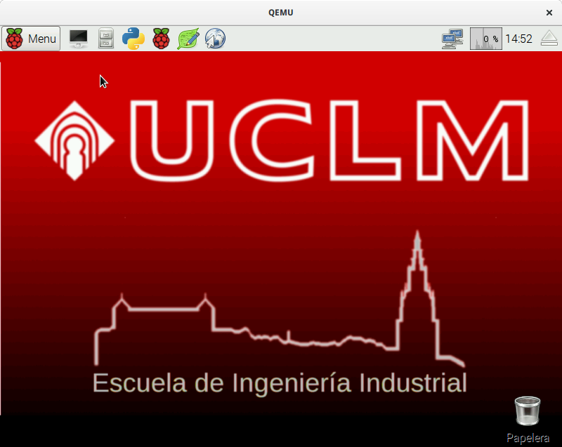
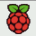
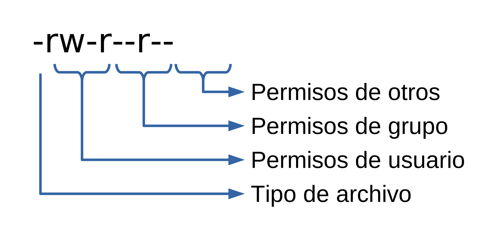

[//]: # (-*- mode: markdown; coding: utf-8 -*-)
# El sistema GNU/Linux

<figure style="float:right; padding:10px">
  

  <figcaption style="font-size:smaller; font-style:italic">
  <div style="width:350px">
  Entorno gráfico en el que arranca el sistema inicialmente.
  </div>
  </figcaption>
</figure>

La Raspberry Pi cuenta con un completo sistema operativo, con entorno
gráfico y herramientas de programación de diverso tipo.  Vamos a
utilizar este entorno para realizar la mayor parte del taller.  Sin
embargo debemos precisar que la forma de trabajo habitual en
desarrollo de sistemas empotrados es que se utilice un PC y
programemos la Raspberry Pi remotamente.

*GNU/Linux* es el nombre habitual del sistema operativo que lleva
la Raspberry Pi.  *Raspbian* y *Debian* no son más que
distribuciones de este sistema operativo.  Es decir, *Raspbian*
es una seleccion de paquetes de GNU/Linux, compilados para una
arquitectura concreta, y empaquetados con ayuda de herramientas
específicas para conseguir una experiencia de usuario agradable.  En
lugar de ir aquí y allá en busca de instaladores y drivers como
hacemos en Microsoft Windows, en GNU se especializan en conjuntos de
paquetes con fines específicos.

*GNU* es el nombre correcto del sistema operativo. Quiere decir
*GNU's Not Unix*, es decir, GNU no es Unix. Es un acrónimo
recursivo.  Hace referencia a que no contiene ni una sola línea de
Unix, el sistema operativo privativo de AT&T, que luego vendió a SCO
y licenció a IBM, Sun, HP, Silicon Graphics, Fujitsu, Microsoft, etc.
El sufijo *Linux* se refiere al kernel (núcleo) del sistema
operativo.  *GNU* tiene su propio kernel, el *HURD*, pero
todavía no está listo para su uso general. Por eso la mayoría de las
distribuciones añaden a GNU alguno de los kernels libres que hay por
ahí (Linux, FreeBSD, NetBSD, etc.)

> **Info**

> 
> En 1983 Richard M. Stallman, que trabajaba como
> investigador en el AI Lab del MIT, decidió empezar el proyecto GNU
> con el objetivo de hacer innecesario el uso de cualquiero otro
> software no libre. Todavía está lejos de alcanzar su objetivo pero
> GNU ya se utiliza en multitud de equipos electrónicos.
> Puedes leer más sobre el objetivo inicial del proyecto en el
> [El manifiesto de GNU](http://www.gnu.org/gnu/manifesto.html)
> {{ "Stallman:1985:GM" | cite }}.

> En 1985 crea la *Free Software Foundation* con el objetivo de
> difundir el *movimiento del software libre* y de ayudar al
> desarrollo del sistema GNU.  Escucha al propio Richard Stallman
> [explicando la filosofía del
> movimiento](http://audio-video.gnu.org/video/short--2008--rms--free-software-and-beyond-part-1--spanish.ogv).


Nada más conectar la Raspberry Pi a la alimentación arrancará en un
entorno gráfico como el que se muestra en la figura al comienzo del
capítulo.  En la parte superior aparecen los siguientes elementos.

*  Menú de aplicaciones.
*  Terminal de línea de órdenes.
*  Herramienta de configuración de Raspberry Pi.
*  Herramienta de administración de archivos.
*  Entorno integrado de desarrollo en Python (IDLE).
*  Editor de textos.
*  Navegador básico de web.

Desde el menú es posible ejecutar la mayoría de las aplicaciones
instaladas.  No obstante con los botones de lanzamiento rápido de
aplicaciones tendremos suficiente para la mayoría de las actividades
del taller.

## El sistema de archivos

<figure style="float:right; padding:10px">
  

  <figcaption style="font-size:smaller; font-style:italic">
  <div style="width:350px">
  Administrador de archivos.
  </div>
  </figcaption>
</figure>

Vamos primero a familiarizarnos con la estructura de carpetas y
archivos del sistema.  Para ello pincha sobre el botón de lanzamiento
rápido del administrador de archivos. La situación será similar a la
figura adjunta.

La caja de texto en la parte superior indica `/home/pi` que es la
carpeta actual.  Las rutas de los archivos y las carpetas utilizan el
caracter `/` como separador.  No es posible tener una carpeta con ese
carácter en el nombre porque el sistema no podría diferenciarlo de una
ruta de dos componentes.  La carpeta `/` sin más es la carpeta *raíz*,
de donde cuelga todo.  Aquí no hay nombres de unidades, todas las
unidades se ven en algún punto del arbol de carpetas que nace en la
carpeta raiz.  La ruta `/home/pi` hace referencia a que se encuentra
en la carpeta `pi` de la carpeta `home`.  Como puedes imaginar se
trata de la carpeta personal.  El nombre `home` se refiere a que
contiene todas las carpetas personales (casa en inglés). Y dentro de
esa carpeta, la carpeta `pi` es la del usuario `pi`.  Efectivamente,
`pi` es el nombre del usuario creado por defecto en el sistema cuando
se instala.  En el taller usaremos este usuario en exclusiva, pero te
animamos a que te hagas su propio usuario.  Verás que en esta carpeta
ya hay algunos archivos. Son ejemplos de programas en varios lenguajes
de programación, que usaremos en el curso.

Aunque el sistema no lo requiere, las distintas variantes de GNU
tienden a mantener una estructura común de carpetas.  Por ejemplo, los
siguientes suelen estar presentes en la práctica totalidad de los
sistemas GNU:

* `/home/` Carpetas personales de los usuarios.
* `/root/` Carpeta personal del administrador (usuario `root`).
* `/etc/` Archivos de configuración del sistema.
* `/boot/` Archivos necesarios para el arranque del sistema.
* `/bin/` Órdenes básicas (ejecutables del sistema).
* `/usr/bin/` Resto de órdenes del sistema (ejecutables).
* `/lib/` Bibliotecas básicas del sistema (biblioteca en inglés es *library*).
* `/usr/lib/` Resto de bibliotecas del sistema.
* `/usr/local/` Software instalado de forma manual, no perteneciente al sistema.
* `/tmp/` Carpeta temporal.
* `/dev/` Dispositivos del sistema. En GNU todos los dispositivs se ven como archivos especiales.

Usa el administrador de archivos para navegar por el sistema y
familiarizarte con él.  No te preocupes, como usuario `pi` no puedes
destruir nada esencial para el sistema. Te proponemos los siguientes
ejercicios:

1. Encuentra el archivo `wpa_supplicant.conf`. Se trata del archivo
  donde podrás *configurar* la red WiFi para que la Raspberry Pi se
  conecte automáticamente a tu punto de acceso.

1. Encuentra el archivo `parpadeo.py` que es un programa de ejemplo
  escrito en Python que usaremos en el curso.

1. Encuentra el programa `gcc`. Se trata del compilador de C.

1. Encuentra el programa `idle`. Se trata del entorno integrado de
  programación con Python.

> **Warning**

> Tradicionalmente en sistemas operativos se utiliza el
> término *directorio* para referirse a una carpeta.  Del mismo modo
> muchos textos en español hablan de *ficheros* para referirse a
> archivos.  Nosotros intentaremos utilizar el término *carpeta*
> (*folder* en ingles) que encaja mejor en la metáfora del escritorio.

> *File* es archivo en inglés.  Un *file* es una de esas carpetas de
> cartón que se meten en los archivadores de oficina.  El problema es
> que no se puede llamar carpeta también a los archivos.  Por eso se
> buscaron traducciones más neutras.  Fichero es realmente el
> archivador, más que el contenido del archivador. Así que *archivo*
> nos parece una traducción más correcta.

> Pero te avisamos porque en la documentación que leas por ahí es
> fácil que aparezcan.  **Directorio es lo mismo que carpeta y fichero
> es lo mismo que archivo**.

## El entorno de línea de órdenes

Ejecuta la terminal de línea de órdenes pulsando sobre el icono
correspondiente .  Aunque
aparentemente se trata de una interfaz primitiva ésta es una de las
formas más flexibles para comunicarse con el sistema operativo.

Al pulsar el icono veremos que se abre una nueva ventana. Esa ventana
corresponde al programa simulador de terminal.  Se comporta como una
consola antigua con teclado y pantalla alfanumérica.  A su vez el
programa terminal ejecuta otro programa que se encarga de interpretar
las órdenes textuales, la *shell*.  La *shell* es el intermediario
entre el usuario y el sistema operativo.

En GNU/Linux la *shell* que se utiliza normalmente se llama `bash`
(*Bourne Again SHell*).  Tiene multitud de características que la
convierten en un completo lenguaje de programación por sí misma.
Nosotros no veremos las características avanzadas, sino unas nociones
básicas que te permitirán desenvolverte con soltura durante el curso.

Cuando se ejecuta la *shell* aparece un pequeño texto antes del
cursor, es el *prompt*.

```
pi@raspberrypi:~ $ ▂
```

Antes de los dos puntos aparece el usuario y el nombre del ordenador
simulando una dirección de correo electrónico.  Antes del símbolo `@`
aparece el nombre del usuario que ejecuta la *shell*.  En este caso el
usuario es `pi`, que es el usuario por defecto, y el que usaremos en
nuestros ejemplos.  Después aparece el nombre del *host*, que hemos
configurado en la instalación como `rpi`.

Después de los dos puntos y antes del símbolo `$` aparece la carpeta
de trabajo.  La carpeta (o el directorio) de trabajo es aquella
carpeta en la que se encuentra actualmente la *shell*.  Todos los
procesos tienen una carpeta de trabajo y la *shell* no es una
excepción.  Se utiliza como base para determinar los archivos que se
localizan mediante *rutas relativas*.  Veremos esto enseguida.

El símbolo `~` es una abreviatura para la carpeta *home* del usuario.
En este caso `/home/pi`.  Puede utilizarse esta abreviatura en
cualquier orden que necesite una ruta.

Hay muchas referencias muy recomendables para entender la *shell* y
explotar todo su potencial.  Un excelente libro disponible de forma
gratuita es {{ "welsh02:_gnu_linux" | cite }} disponible en
[tldp.org](http://es.tldp.org/Manuales-LuCAS/LIPP2/lipp-2.0-beta.pdf).
Otra referencia actual y muy completa es 
{{ "blum15:_linux_comman_line_shell_scrip_bible" | cite }}.

## Gestión de archivos

Todas las operaciones que pueden realizarse con el administrador de
archivos también pueden realizarse con órdenes en la *shell*.  Veamos
un breve resumen de las órdenes más frecuentes.


### Listado de archivos: `ls`

La operación más básica de gestión de archivos es mostrar el contenido
de una carpeta.  Se realiza con la orden `ls` (*list*).  Sin más
argumentos muestra el contenido de la carpeta de trabajo (la que
aparece en el *prompt*). Por ejemplo:

```
pi@raspberrypi:~ $ ls
Desktop  Documents  Music     Public        src        Videos
doc      Downloads  Pictures  python_games  Templates
pi@raspberrypi:~ $ ▂
```

Los colores de cada elemento nos indica de qué se trata.  En azul se
muestran las carpetas, en gris los archivos normales, y en verde los
ejecutables.

Por defecto, no muestra los elementos ocultos, que son aquéllos cuyo
nombre comienza con `.` (punto).  Se puede indicar como argumento la
carpeta o las carpetas cuyo contenido se quiere listar:

```
pi@raspberrypi:~ $ ls src
c  python  README.md
pi@raspberrypi:~ $ ▂
```

Se asume que se quiere listar la carpeta `src` dentro de la carpeta
actual.  Es lo que se conoce como una *ruta relativa* y se asume que
es relativa a la carpeta de trabajo.  También se puede indicar la ruta
completa `/home/pi/src` que se conoce como *ruta absoluta*.  Como
dijimos anteriormente el símbolo `~` es una abreviatura de la carpeta
*home* del usuario.  Por tanto otra forma de expresar la ruta completa
sería `~/src`.

Y para ver los archivos y carpetas ocultos se puede usar la opción `-a`:

```
pi@raspberrypi:~ $ ls src -a
.  ..  c  .git  python  README.md
pi@raspberrypi:~ $ ▂
```

En este caso la carpeta `.git` es oculta.  Las carpetas `.` y `..`
tienen un significado especial para el sistema operativo y aparecen en
todas las carpetas del sistema.  La carpeta `.` representa la misma
carpeta en la que se encuentra, y la carpeta `..` representa la
carpeta que contiene a la que se muestra.  En nuestro ejemplo la
carpeta `src/..` es `/home/pi` mientras que la carpeta `..` sería
`/home`.  La carpeta `src/.` es la misma que `./src`, la misma que
`src` y la misma que `/home/pi/src` en nuestro ejemplo.

Como el resto de órdenes `ls` permite especificar varias opciones que
modifican su comportamiento.  Estas opciones vienen precedidas por un
guión y pueden combinarse o indicarse por separado.  Por ejemplo:

```
pi@raspberrypi:~ $ ls src -a -F
./  ../  c/  .git/  python/  README.md
pi@raspberrypi:~ $ ls -aF src
./  ../  c/  .git/  python/  README.md
pi@raspberrypi:~ $ ▂
```

Ambas formas son equivalentes.  La opción `-F` añade un carácter al
final de cada nombre para expresar el tipo de elemento del que se
trata (`/` si es una carpeta, `*` si es un ejecutable o nada si es un
archivo normal).  Ya no se suele usar esta opción porque los colores
son una representación más intuitiva.

Una opción interesante es `-l` (*long*) que muestra metainformación
sobre permisos, usuarios, tamaño y fecha de los archivos.  Por
ejemplo, supongamos que queremos ver la fecha del archivo
`src/README.md`.

```
pi@raspberrypi:~ $ ls src/README.md -l
-rw-r--r-- 1 pi pi 55 Apr 11 08:26 src/README.md
pi@raspberrypi:~ $ ▂
```

Ya veremos qué significa todo esto.  De momento es suficiente con
entender que la fecha es lo que aparece antes del nombre (`Apr 11
08:26`, 11 de abril a las 8:26 de la mañana).

En la siguiente tabla se muestra un conjunto de opciones
frecuentemente usadas.

Opción&nbsp;&nbsp;&nbsp; | Significado
-----|----
`-l` | Formato de listado largo, con información de permisos, usuarios, tamaños, fecha, etc.
`-R` | Lista las subcarpetas de manera recursiva
`-1` | No agrupa los resultados, muestra cada archivo en una línea
`-d` | No muestra el contenido de la carpeta, sino el nombre de la carpeta
`-a` | Muestra también los archivos ocultos, aquellos que empiezan por `.`
`--help` | Muestra la ayuda de la orden, junto con una lista extendida de las opciones del mismo

La *shell* admite un conjunto de abreviaturas que se utilizan como
comodines a la hora de escribir rutas de carpetas o archivos.  Así,
por ejemplo, el caracter `*` representa cualquier combinación de
caracteres y el caracter `?` representa un caracter individual.  Por
ejemplo, veamos todos los archivos C de las carpetas de
`src/c/reactor`.

```
pi@raspberrypi:~ $ ls src/c/reactor/*/*.c
src/c/reactor/reactor/blink_handler.c
src/c/reactor/reactor/console.c
...
```

Fíjate como usamos un `*` para representar cualquier carpeta dentro de
`src/c/reactor` y luego un `*.c` para representar cualquier nombre de
archivo que termina en `.c`.


### Cambiar carpeta de trabajo: `cd`

La orden `cd` (*change directory*) cambia la carpeta de trabajo a la
indicada.  Si no se especifica ninguna ruta va a la carpeta *home* del
usuario.  Por ejemplo:

```
pi@raspberrypi:~ $ cd src/c/reactor
pi@raspberrypi:~/src/c/reactor $ ▂
```

Fíjate en cómo cambia el *prompt*.  Ahora indica que la carpeta de
trabajo es `~/src/c/reactor`, o lo que es lo mismo,
`/home/pi/src/c/reactor`.  Para subir un nivel en la jerarquía, es
decir, para ir a la carpeta `/home/pi/src/c` bastaría con escribir:

```
pi@raspberrypi:~/src/c/reactor $ cd ..
pi@raspberrypi:~/src/c $ ▂
```

### Ubicación actual: `pwd`

El *prompt* ya muestra la carpeta de trabajo pero a veces necesitamos
ese texto para usarlo en otra orden.  Para eso podemos usar la orden
`pwd` (*print working directory*):

```
pi@raspberrypi:~/src/c $ pwd
/home/pi/src/c
pi@raspberrypi:~/src/c $ ▂
```

### Creación de carpetas: `mkdir`

La orden `mkdir` permite la creación de nuevas carpetas en aquellos
puntos en los que el usuario tiene permisos para ello.  Por ejemplo:

```
pi@raspberrypi:~/src/c $ cd
pi@raspberrypi:~ $ mkdir test
pi@raspberrypi:~ $ cd test
pi@raspberrypi:~/test $ ▂
```

La primera orden cambia la carpeta de trabajo al *home* del usuario.
Allí crea la carpeta `test` y posteriormente cambia la carpeta de
trabajo a ésta.

### Borrado de archivos y carpetas: `rm`

La orden `rm` (*remove*) se utiliza para borrar archivos y carpetas.
No se puede deshacer, así que presta mucha atención cuando la uses.
Por ejemplo:

```
pi@raspberrypi:~/src/c $ cd
pi@raspberrypi:~ $ rm -r test
pi@raspberrypi:~ $ ls test
ls: cannot access test: No such file or directory
pi@raspberrypi:~ $ ▂
```

Entre opciones que acepta esta orden, destacamos las siguientes:

Opción&nbsp;&nbsp;&nbsp; | Significado
-----|----
`-r` | Procesa subcarpetas de forma recursiva
`-i` | Pide confirmación para cada borrado
`-f` | Forzado, ignora archivos no existentes y elimina cualquier aviso de confirmación

Para borrar carpetas existe una orden `rmdir` específica, que solo
borra una carpeta si está vacía.  Es más habitual usar `rm` porque
también borra el contenido de la carpeta si no está vacía.  El
problema es que es mucho más peligrosa.  No olvides hacer copias de
seguridad.

### Copia de archivos y carpetas: `cp`

La orden `cp` (*copy*) se usa para copiar tanto archivos como
carpetas.  Veamos un ejemplo:

```
pi@raspberrypi:~ $ cp -r src/c/reactor/test .
pi@raspberrypi:~ $ ls test
makefile              test_delayed_handler.c  test_pipe_handler.c
test_acceptor.c       test_Event_handler.c    test_process_handler.c
...
pi@raspberrypi:~ $ ▂
```

La opción `-r` indica que queremos una copia *recursiva*.  Si hay
carpetas copiará el contenido de las carpetas.  La primera ruta es el
*origen* (`src/c/reactor/test`) y la segunda ruta es el *destino*
(`.`).  Por tanto este ejemplo copia la carpeta `test` que contiene la
carpeta `src/c/reactor` en la carpeta actual.


### Renombrar archivos y carpetas: `mv`

La orden `mv` (*move*) se utiliza como la orden `cp`, con la
diferencia de que en lugar de crear una copia del objeto, la orden
`mv`, mueve el objeto *origen* a un *destino*.  Por supuesto se puede
usar simplemente para cambiar el nombre a carpetas o archivos:

```
pi@raspberrypi:~ $ mv test test-reactor
pi@raspberrypi:~ $ ls test
ls: cannot access test: No such file or directory
pi@raspberrypi:~ $ ▂
```

### Mostrar el contenido: `cat`

La última operación de gestión de archivos que vamos a mencionar por
el momento es la orden `cat` (*concatenate*) , que muestra por
pantalla el contenido de uno o más archivos.

```
pi@raspberrypi:~ $ cat src/c/reactor/AUTHORS
Contribuidores más importantes de Reactor:

  * Francisco Moya <francisco.moya@uclm.es>
pi@raspberrypi:~ $ ▂
```


## Documentación y ayuda

Cualquier sistema complejo necesita tiempo para dominarse y GNU/Linux
no es una excepción.  Si no has usado GNU hasta ahora te quedan muchas
cosas por aprender y tendrás que tener paciencia.  Pero la buena
noticia es que todos los sistemas complejos incorporan un sistema de
ayuda para facilitar este proceso de aprendizaje.  Aprende a tu ritmo
pero sobre todo quédate con la idea más importante, cómo conseguir
ayuda en GNU.

La mayoría de las órdenes tienen su propia ayuda en línea con la
opción `--help` o en algunos casos más primitivos `-h`.  Si tienes
dudas no dudes en usar esta opción.  Lo máximo que puede ocurrir es
que el programa te indique no conoce esa opción.  Por ejemplo:

```
pi@raspberrypi:~ $ gpio --help
gpio: Unknown command --help.
pi@raspberrypi:~ $ gpio -h
gpio: Usage: gpio -v
       gpio -h
	   ...
pi@raspberrypi:~ $ ▂
```

Si esta opción no ha resuelto tus dudas usa `man` (*manual*).  Se
trata de una herramienta disponible en todas las variantes de Unix
para consultar la versión electrónica del manual de referencia.  ¿Y si
tienes dudas de cómo usar `man`?  No lo pienses, usa `man --help` y si
no es suficiente `man man`.  Recuerda que para salir de `man` hay que
pulsar la tecla `q` (*quit*).

Hemos instalado las páginas de manual en castellano.  Si existe ayuda
en castellano la verás en castellano.  Si no, practica el inglés, si
usas la Raspberry Pi te será muy útil saber inglés.

En algunos casos hay varias páginas de manual para el mismo concepto.
Por ejemplo, `printf` es una orden de la *shell* pero también es una
función C y probablemente tienes la versión en castellano y en inglés.
Las páginas de manual se agrupan en secciones, las secciones
originales del manual de referencia de Unix.  Se puede indicar a `man`
a qué sección queremos referirnos (un número de 1 a 9).  Por ejemplo:

```
pi@raspberrypi:~ $ man 3 printf
```

La lista completa de secciones la tienes en la página de manual de
`man`, no hace falta que te la sepas de memoria.

Algunas opciones de `man` que merece la pena destacar:

Opción&nbsp;&nbsp;&nbsp; | Significado
-----|----
`-k` | Busca la palabra clave indicada en las páginas de manual y muestra las que la contienen
`-a` | Muestra todas las páginas de manual que correspondan

## Pipes y redirecciones

La salida estándar de un programa puede ser demasiado grande.  Tan
grande que ni siquiera con la barra de desplazamiento del terminal
podrías ver todo.  En esos casos puede que te interese *redirigir* la
salida a un archivo para su lectura detenida con un editor.  Por
ejemplo, vamos a generar un archivo con todos los ejecutables del
sistema:

```
pi@raspberrypi:~ $ ls -1 /bin > exe-bin.txt
pi@raspberrypi:~ $ ls -1 /usr/bin > exe-usr-bin.txt
pi@raspberrypi:~ $ ls -1 /usr/local/bin > exe-usr-local-bin.txt
pi@raspberrypi:~ $ ▂
```

Al utilizar el símbolo `>` le estamos diciendo a la *shell* que cuando
tenga que escribir algo por salida estándar lo escriba en el archivo
indicado.  En nuestro ejemplo cuando el programa `ls` ejecuta una
llamada a *printf* o similar lo que escribe va directamente al final
del archivo indicado.  Ahora podemos ver estos archivos con detenimiento
usando un editor, como *leafpad*:

```
pi@raspberrypi:~ $ leafpad exe-bin.txt
```

¿Y si queremos contar cuántos ejecutables tiene en total el sistema?
Podríamos usar el programa `wc` que cuenta entre otras cosas las
líneas de un archivo.  Por ejemplo:

```
pi@raspberrypi:~ $ wc -l exe-*.txt
  158 exe-bin.txt
 1168 exe-usr-bin.txt
    1 exe-usr-local-bin.txt
 1327 total
pi@raspberrypi:~ $ ▂
```

También podemos redirigir la entrada estándar de un programa.  Por
ejemplo:

```
pi@raspberrypi:~ $ wc -l < exe-bin.txt
158
pi@raspberrypi:~ $ wc -l < exe-usr-bin.txt
1168
pi@raspberrypi:~ $ wc -l < exe-usr-local-bin.txt
1
pi@raspberrypi:~ $ ▂
```

Ahora `wc` no indica ningún nombre de archivo porque no lo conoce, le
llega directamente el contenido del archivo cuando llama a *scanf* o
similar.  Lo bueno es que el resultado es un simple número que puede
ser más conveniente para otras cosas.

Pero si estamos interesados en saber cuántos ejecutables hay y no nos
interesa qué archivos concretos son ¿para qué guardamos la lista de
ejecutables en archivos?  En GNU es posible conectar la salida
estándar de un programa con la entrada estándar de otro programa
estableciendo lo que se conoce como una *tubería* (*pipe* en inglés):

```
pi@raspberrypi:~ $ ls -1 /bin /usr/bin /usr/local/bin | wc -l
1327
pi@raspberrypi:~ $ ▂
```

El símbolo `|` conecta la salida estándar de la orden de la izquierda
con la entrada estándar de la orden de la derecha.

Incluso si queremos examinar la lista de ejecutables podemos usar esta
construcción para evitar tener que guardar el archivo intermedio:

```
pi@raspberrypi:~ $ ls -1 /bin /usr/bin /usr/local/bin | less
```

El programa `less` es un *paginador*,  un programa que va mostrando lo
que le llega por entrada estándar página a página.  Con los cursores o
con el espacio podemos recorrer toda la información y cuando hayamos
terminado de examinarla basta salir presionando la tecla `q`.

Pero los programas no solo tienen una salida estándar. También tienen
una salida de error estándar.  Cuando muestran un error suelen
mostrarlo por esta *salida de error*.  Normalmente es el mismo
terminal y vemos los mensajes de error mezclados con la salida del
programa.  Pero podemos separarla:

```
pi@raspberrypi:~ $ ls -R /etc 2>errores.txt
/etc/:
adduser.conf
...
pi@raspberrypi:~ $ ▂
```

El número 2 hace referencia al *descriptor de archivo* correspondiente
a la salida de error estándar, mientras que el 1 (o nada) hace
referencia al *descriptor de archivo* de la salida estándar.
Hablaremos de descriptores de archivo cuando lleguemos a la parte de
programación del taller.

Si solo estamos interesados en los errores podemos descartar la salida
estándar redirigiéndola al archivo especial `/dev/null`:

```
pi@raspberrypi:~ $ ls -R /etc >/dev/null
ls: no se puede abrir el directorio /etc/polkit-1/localauthority: Permiso denegado
ls: no se puede abrir el directorio /etc/ssl/private: Permiso denegado
pi@raspberrypi:~ $ ▂
```

Como usuario `pi` no podemos hacer cualquier cosa.  El problema de
esta orden es que si hay muchos errores perdemos los primeros, que
suelen ser los más importantes. ¿Podemos usar un paginador?  Pues no,
porque las tuberías solo conectan salida estándar con entrada
estándar.  La solución es conectar la salida de error estándar con la
misma salida estándar, vaya a donde vaya.

```
pi@raspberrypi:~ $ ls -R /etc 2>&1 1>/dev/null | less
```

Redirige el descriptor 2 (error estándar) al descriptor 1 (salida
estándar), el descriptor 1 (salida estándar) a `/dev/null` (descartar)
y conecta la nueva salida estándar (nuevo descriptor 1 que es la
antigua salida de error) a la entrada estándar del paginador `less`. 

O bien sin descartar la salida estándar, combinándola junto con la
salida de error estándar:

```
pi@raspberrypi:~ $ ls -R /etc 2>&1 | less
```

Esta última forma de redirección es extraordinariamente útil cuando se
programa en lenguaje C.  Cuando se compilan programas aparecen
mensajes de la herramienta de compilación y también errores del
compilador.  Suele ser mucho texto, necesitamos verlo con un paginador
y nos interesa especialmente los primeros errores.

Además de los paginadores conviene comentar en esta sección algunos
*filtros*.  Un filtro no es más que un programa que recibe la entrada
estándar de otro programa, la manipula de forma determinada, y la
vuelve a sacr una vez manipulada por la salida estándar.

Un filtro extraordinariamente útil es `grep` (*global regular
expression print*).  Se trata de una orden que busca líneas que
contienen un patrón determinado.  Las líneas que no contienen el
patrón no se imprimen, mientras que las que lo contienen se imprimen.
Por ejemplo para encontrar todos los ejecutables de `/usr/bin` que
contienen `zip` en el nombre:

```
pi@raspberrypi:~ $ ls -R /usr/bin | grep zip
pi@raspberrypi:~ $ ▂
```

Puede cambiarse el funcionamiento para que imprima las líneas que no
cumplen el patrón, o escribir patrones mucho más evolucionados.
Cuando puedas tómate algo de tiempo para entender el funcionamiento de
`grep` leyendo la página de manual.

## Enlaces: `ln`

Un archivo tiene dos partes claramente distintas: un nombre y un
contenido.  El nombre permite organizar y encontrar los archivos
fácilmente, pero una vez encontrado un programa puede *abrirlo* (por
ejemplo, con la función *fopen* si estamos programando en C) y
olvidarse completamente del nombre.

La idea de que el nombre es un mero artefacto organizativo nos lleva a
preguntarnos si podríamos usar varios nombres para un mismo archivo.
La respuesta es afirmativa, con un *enlace*.  La forma más simple de
enlace convierte en indistinguible el archivo origen del archivo
destino.  Examina en detalle esta secuencia de órdenes:

```
pi@raspberrypi:~ $ echo "Primera prueba" > a.txt
pi@raspberrypi:~ $ cat a.txt
Primera prueba
pi@raspberrypi:~ $ ln a.txt b.txt
pi@raspberrypi:~ $ echo "Segunda prueba" > b.txt
pi@raspberrypi:~ $ cat a.txt
Segunda prueba
pi@raspberrypi:~ $ ▂
```

La orden `ln a.txt b.txt` ha creado un nuevo nombre `b.txt` para el
mismo archivo `a.txt`.  Por eso cuando escribimos en `b.txt` el
resultado puede verse también en `a.txt`.

El problema es que esta forma de enlaces no funciona con las carpetas,
que son también entidades organizativas sin otro contenido que los
nombres de sus archivos.  Tampoco funcionaría con archivos que están
en otro *sistema de archivos*, como por ejemplo en un pincho USB.

Para solucionar estos problemas están los enlaces simbólicos (opción
`-s`):

```
pi@raspberrypi:~ $ ln -s src/c/reactor reactor
pi@raspberrypi:~ $ ls -l reactor
reactor -> src/c/reactor
pi@raspberrypi:~ $ ▂
```

Un enlace simbólico es simplemente una indicación de que ese nombre
corresponde realmente al contenido etiquetado con otro nombre.  Esto
resuelve los problemas anteriores pero ya no son equivalentes el
archivo y el enlace.  Si se borra el archivo el enlace se queda
colgando (*dangling link*) y cualquier intento de acceso produciría un
error.

Los enlaces simbólicos son muy útiles para simplificar la navegación
por carpetas.  El último ejemplo que mostrábamos líneas arriba es
ilustrativo de esto.  Si estamos trabajando con una carpeta
continuamente (`reactor`) es lógico dejarla más a mano en nuestro
*home*.


## Usuarios y permisos

Ya habrás notado que como usuario `pi` no tienes permisos para hacer
cualquier cosa.  Vamos a ver con más detalle el modelo de permisos de
Unix y cómo puedes saltarte las restricciones cuando sea necesario.

La orden `id` permite saber quién eres:

```
pi@raspberrypi:~ $ id
uid=1000(pi) gid=1000(pi) grupos=1000(pi),4(adm),20(dialout),24(cdrom),27(sudo),
29(audio),44(video),46(plugdev),60(games),100(users),101(input),108(netdev),997(
gpio),998(i2c),999(spi)
pi@raspberrypi:~ $ ▂
```

El `uid` es el identificador de usuario, mientras que el `gid` es el
identificador de grupo.  Todos los usuarios tienen un *uid* y un
*gid*.  Sin embargo un usuario puede pertenecer a muchos grupos, como
se muestra al final de la salida de `id`.  Hay un usuaio especial, el
*super-usuario*, que tiene el *uid* 0 y no tiene ninguna limitación de
permisos.

Vamos a examinar ahora con más detalle esta orden `ls` que vimos
anteriormente:

```
pi@raspberrypi:~ $ ls src/README.md -l
-rw-r--r-- 1 pi pi 55 Apr 11 08:26 src/README.md
pi@raspberrypi:~ $ ▂
```

Hasta ahora solo habíamos visto la fecha y hora de la última
modificación.  Sin embargo antes de la fecha hay mucha más información.

**Campo** | **Significado**
----------|----------------
`-rw-r--r--` | Permisos
`1`  | Número de referencias al archivo (nombres o enlaces)
`pi` | Usuario (dueño)
`pi` | Grupo (dueño)
`55` | Tamaño en bytes
`Apr 11 08:26` | Fecha y hora

<figure style="float:right;padding:10px">
  

  <figcaption style="font-size:smaller;font-style:italic;text-align:center">
  Estructura de los permisos de un archivo en GNU.
  </figcaption>
</figure>

Los permisos se representan en una notación abreviada que corresponde
de forma directa con la representación interna en el sistema de
archivos.

* El primer caracter representa el tipo de archivo.  Es `d` para los
  directorios, `-` para los archivos normales, `l` para los enlaces
  simbólicos, u otras letras que representan otro tipo de archivos
  (dispositivos de varios tipos, pipes, sockets, etc.).
* Los siguientes caracteres están divididos en grupos de tres letras
  que representan los permisos para el usuario dueño del archivo, para
  el grupo dueño del archivo y para todos los demás, en este orden.

Cada bloque de tres letras representa cuatro posibles permisos según
la siguiente tabla.  Un guión `-` en cualquiera de las letras
representa ausencia del permiso correspondiente.

**Permiso** | **Representación**
------------|-------------------
Lectura     | `r` en la primera letra
Escritura   | `w` en la segunda letra
Ejecución   | `x` en la tercera letra
*Set-Id*    | `s` en la tercera letra (solo en grupo de usuario o grupo)
Pegajoso    | `t` en la tercera letra (solo en grupo de otros)

El permiso de lectura permite ver el contenido del archivo al grupo
que corresponda.  En nuestro ejemplo los tres grupos (usuario dueño,
grupo dueño y otros) pueden leer el archivo.  Es decir, podremos
ejecutar la orden `cat`, o leerlo con un editor como `leafpad`.  En el
caso de las carpetas el permiso de lectura permite ver el contenido,
es decir, hacer `ls`.

El permiso de escritura permite hacer cambios en el archivo.  En
nuestro ejemplo solo el usuario dueño `pi` puede modificarlo, porque
ninguno de los otros grupos de permisos tiene la letra `w`.  En una
carpeta significa que podemos añadir o borrar elementos (otros
archivos o carpetas).

El permiso de ejecución permite ejecutar el archivo.  Es ésto y
ninguna otra cosa lo que convierte en ejecutable un archivo.  En GNU
no hay extensiones especiales para identificar los ejecutables.  En
las carpetas significa que podemos acceder a lo contenido en ellos.
Eso implica tanto hacer un `cd` como acceder de cualquier forma al
contenido de lo que hay en la carpeta (ver el tamaño o el dueño de un
archivo, mostrar el contenido o listar una subcarpeta).

El permiso *set-id* sirve para fijar el *uid* o el *gid* al del dueño
del archivo cuando se ejecuta.  Es decir, si un ejecutable tiene el
permiso *set-id* para el usuario dueño entonces cuando se ejecuta lo
hace con los permisos de ese usuario dueño (cambia temporalmente su
*uid*) y no con los permisos del usuario que lo ejecuta.  Es una forma
de ceder permisos para operaciones determinadas a otros usuarios, a
todos los que tengan permiso para ejecutar el archivo.  Lo mismo puede
hacerse con el permiso *set-id* para el grupo dueño.  Cuando se
ejecuta el archivo lo hace como si el usuario que lo ha ejecutado
perteneciera al grupo dueño del archivo (cambia temporalmente su
*gid*.  A este permiso se le llama normalmente *setuid* o *setgid*
dependiendo si se aplica al usuario dueño o al grupo dueño.

El permiso pegajoso (*sticky* en inglés) ha cambiado su significado
con la evolución histórica de Unix.  Hoy en día es muy útil para las
carpetas.  Una carpeta con el permiso pegajoso no permite que los
archivos contenidos sean borrados o renombrados por otros usuarios que
no sean el dueño.  Se usa por ejemplo en la carpeta temporal `/tmp`
para que unos usuarios no puedan provocar problemas a otros.

Los permisos se cambian con la orden `chmod` (*change mode*) y el
grupo dueño con `chgrp` (*change group*):

```
pi@raspberrypi:~ $ chgrp users src/README.md
-rw-r--r-- 1 pi users 55 Apr 11 08:26 src/README.md
pi@raspberrypi:~ $ chmod g+w src/README.md
-rw-rw-r-- 1 pi users 55 Apr 11 08:26 src/README.md
pi@raspberrypi:~ $ ▂
```

Hemos cambiado el grupo del archivo por `users`, que es uno de los
grupos al que pertenecemos, y posteriormente hemos añadido el permiso
de escritura al grupo dueño.  Ahora todos los usuarios pertenecientes
al grupo `users` pueden editar el archivo.  La orden `chmod` permite
añadir permisos (con `+`) o eliminarlos (con `-`) para el usuario
dueño (con `u`), el grupo dueño (con `g`), otros (con `o`) o todos
(con `a` de *all*).

*Permiso `chown`** | **Significado**
-------------------|----------------
`u+r` | Añadir permiso de lectura al usuario dueño
`u+w` | Añadir permiso de escritura al usuario dueño
`u+x` | Añadir permiso de ejecución al usuario dueño
`u+s` | Añadir permiso *setuid*
`g+r` | Añadir permiso de lectura al grupo dueño
`g+w` | Añadir permiso de escritura al grupo dueño
`g+x` | Añadir permiso de ejecución al grupo dueño
`g+s` | Añadir permiso *setgid*
`o+r` | Añadir permiso de lectura para otros
`o+w` | Añadir permiso de escritura para otros
`o+x` | Añadir permiso de ejecución para otros
`+t`  | Añadir permiso pegajoso

También se pueden combinar tanto el grupo al que se aplica el permiso
como los permisos que se aplican. Con `-R` se aplica de forma
recursiva. Por ejemplo:

```
pi@raspberrypi:~ $ chmod -R ug+rwX src
pi@raspberrypi:~ $ ▂
```

Esto aplica los permisos de lectura (`r`), escritura (`w`) y ejecución
(`X`) para el usuario dueño (`u`) y el grupo dueño (`g`) a la carpeta
`src` y todo su contenido.  Fíjate que el permiso de ejecución lo
hemos puesto con mayúscula en lugar de minúscula.  Eso tiene un
significado especial.  Cuando a `chmod` se le indica `X` en lugar de
`x` le estamos diciendo que solo aplique ese permiso a carpetas, no a
los archivos.

### El super-usuario

El *super-usuario* es el usuario con *uid* cero, que normalmente tiene
el nombre de `root`.  A este usuario no se le aplican restricciones de
permisos.  Puede hacerlo todo, es el administrador del sistema.
Evidentemente es necesario ser administrador para poder hacer ciertas
cosas, como actualizar el sistema, instalar nuevo software, etc.  Pero
también va a ser necesario para utilizar algunos periféricos de la
Raspberry Pi.  Por ejemplo, para leer o cambiar los valores de las
patitas de GPIO (*General Purpose Input Output*).

En la Raspberry Pi se considera tan necesario que está configurada
para que sea extremadamente simple convertirse en superusuario.  Basta
ejecutar `sudo su`:

```
pi@raspberrypi:~ $ sudo su
pi@raspberrypi:~ # id
uid=0(root) gid=0(root) grupos=0(root)
pi@raspberrypi:~ # ▂
```

Fíjate cómo ha cambiado el *prompt*.  Aparece una `#` que debe
interpretarse como una severa advertencia. ¡Cuidado! ¡Puedes
destruirlo todo!

Procura minimizar el tiempo que estás como *superusuario*.  No es
infrecuente destruir completamente el software del sistema por error y
tendrías que instalarlo todo desde cero.

La orden `sudo` (*superuser do*) permite a determinados usuarios y con
ciertas restricciones ejecutar como superusuario cualquier orden del
sistema.  Como puedes imaginar es un programa que tiene el permiso
*setuid* de `root`.  No hace falta ejecutar `sudo su`, se puede
ejecutar `sudo` seguido de cualquier cosa que tengamos que hacer como
superusuario.  Por ejemplo:

```
pi@raspberrypi:~ $ sudo chown root ejecutable
pi@raspberrypi:~ $ sudo chmod u+s ejecutable
pi@raspberrypi:~ $ ▂
```

Hemos cambiado el dueño de un ejecutable usando la orden `chown`.
Como superusuario podemos cambiar cualquier cosa.  Hemos puesto como
nuevo dueño a `root` (el superusuario) y hemos añadido el permiso
*setuid*.  A partir de este momento `ejecutable` se ejecuta con
permisos de superusuario.

## Gestión de procesos

Una de las actividades que seguramente deberás hacer cuando estás
desarrollando es ver qué procesos están ejecutándose en el sistema y
parar procesos que puedan haberse quedado bloqueados.

Vamos a comentar solo tres aplicaciones para estos fines aunque la
gama de herramientas es mucho más amplia.  No te quedes en lo que te
contamos, aprende poco a poco más herramientas.

En primer lugar para ver los procesos que se ejecutan en el sistema
está la orden `ps` (*processes*).  Sin ningún argumento adicional nos
proporciona información de los procesos que se han ejecutado desde la
misma *shell* en la que se ejecuta `ps`:

```
pi@raspberrypi:~ $ ps
  PID TTY          TIME CMD
  894 pts/0    00:00:18 bash
 1211 pts/0    00:00:00 ps
pi@raspberrypi:~ $ ▂
```

En un formato tabular se muestra información básica:

**Campo** | **Significado**
----------|----------------
`PID`     | Identificador de proceso
`TTY`     | Terminal 
`TIME`    | Tiempo acumulado de CPU
`CMD`     | Nombre del ejecutable

El *pid* (*process id*) es un número que asigna el sistema operativo a
todos los procesos.  Cada proceso en ejecución debe tener un *pid*
diferente, pero una vez terminado se puede emplear su antiguo *pid* en
otro proceso.  Podemos controlar los procesos usando este número de
identificación.

Vamos a ilustrarlo con un ejemplo. Abre un terminal y escribe:

```
pi@raspberrypi:~ $ cat
```

El proceso `cat` está esperando datos de su entrada estándar, pero
vamos a suponer que no tenemos ni idea de qué pasa.  Solo sabemos que
el programa no termina. Vamos a matarlo.

Ejecuta otro terminal y escribe:

```
pi@raspberrypi:~ $ ps -u pi | grep cat
 2093 pts/0    00:00:00 cat
pi@raspberrypi:~ $ ▂
```

Mostramos todos los procesos del usuario `pi` (opción `-u`) pero luego
filtramos la salida con `grep` para mostrar solo las líneas que
contienen `cat`.  El primer número es el PID del proceso.  Vamos a
solicitar su terminación con la orden `kill`:

```
pi@raspberrypi:~ $ kill 2093
pi@raspberrypi:~ $ ▂
```

Si te fijas en el primer terminal el proceso ha terminado y lo indica
en pantalla con un mensaje.

```
pi@raspberrypi:~ $ cat
Terminado
pi@raspberrypi:~ $ ▂
```

Es posible que el programa no termine. Aún podemos hacer algo más,
podemos exigir que el programa termine.  Si esta vez no lo hace el
sistema operativo lo matará.  Vuelve a ejecutar `cat` y en la otra
ventana:

```
pi@raspberrypi:~ $ ps -u pi | grep cat
 2101 pts/0    00:00:00 cat
pi@raspberrypi:~ $ kill -9 2101
pi@raspberrypi:~ $ ▂
```

Ahora el mensaje que muestra la otra ventana es ligeramente diferente:

```
pi@raspberrypi:~ $ cat
Terminado (killed)
pi@raspberrypi:~ $ ▂
```

La orden `kill` no es exactamente para *matar* procesos.  En realidad
`kill` envía señales a los procesos.  Hay un montón de señales que se
pueden mandar (usa la opción `-l` para tener una lista). Por defecto
envía la señal 15 (`SIGTERM`) que es una solicitud de terminación.
Los procesos pueden ignorarla.  La opción `-9` simplemente manda una
señal diferente (`SIGKILL`) que los procesos no pueden ignorar.

Tambén conviene comentar la orden `top`, que muestra el estado del
sistema en tiempo real, poniendo los procesos que más memoria y/o CPU
consumen en los primeros lugares.  Si el sistema está lento y no sabes
por qué puede que hayas dejado algún proceso colgando.  Mira con `top`
cuál es y mátalo.  Una vez identificado puedes matarlo desde el propio
`top` pulsando la tecla `k` (*kill*).  Para salir pulsa `q` (*quit*).

Si el nombre del ejecutable es lo suficientemente descriptivo podemos
matarlo directamente sin buscar su *pid* usando la orden `killall`:

```
pi@raspberrypi:~ $ killall -9 cat
pi@raspberrypi:~ $ ▂
```

Pero ten en cuenta que `killall` manda la señal a todos los procesos
que tienen el campo `CMD` como el que se indica en el argumento.

> **Info** Te proponemos el siguiente ejercicio.  Imagina que has
> ejecutado el archivo `ejecutable` que tiene permiso *setuid* de
> `root`.  Por un error de programación el programa no termina.  ¿Qué
> orden deberás ejecutar para matarlo?

## Control de versiones

El software, como cualquier proceso de ingeniería es un proceso
iterativo.  Los programas no se hacen de golpe, sino poco a poco,
añadiendo una cosa cada vez.  Después de añadir una función nueva es
frecuente realizar un proceso de reingeniería, para dejar todo el
programa más simple.  En este proceso es frecuente generar
*regresiones*, es decir, cosas que funcionaben dejan de
funcionar. ¿Cómo volvemoa a la situación anterior?

La solución, obviamente, es gestionando diferentes versiones.  Pero
gestionar de forma manual diferentes versiones es un proceso tedioso y
muy propenso a error.  Lo correcto es emplear un sistema de control de
versiones.  En este taller te proponemos GIT, el mismo que usa el
núcleo Linux, y el mismo que usamos en la documentación y en el
software de apoyo de este taller.

La orden `git` no es el programa más fácil de usar de tu nueva
Raspberry Pi y no vamos a convertir este taller en un taller sobre
*git*.  Solo te comentaremos las órdenes que necesitas para actualizar
el software del taller.  Así siempre tendrás lo último.

Las carpetas `src` y `doc` de tu *home* son dos repositorios GIT que
contienen lo mismo que en los repositorios oficiales de
[github.com](http://github.com/FranciscoMoya/).  Fueron creados como
se indica en el apéndice que describe
[nuestra personalización de Raspbian](custom.html).  Cuando una
carpeta es un repositorio GIT contiene una subcarpeta oculta llamada
`.git`.

```
pi@raspberrypi:~ $ ls -d */.git
doc/.git  src/.git
pi@raspberrypi:~ $ ▂
```

Este directorio tiene algunos archivos perfectamente legibles.  En
particular el archivo `config`:

```
pi@raspberrypi:~ $ cat src/.git/config
[core]
        repositoryformatversion = 0
		filemode = true
		bare = false
		logallrefupdates = true
[remote "origin"]
        url = https://github.com/FranciscoMoya/rpi-src.git
		fetch = +refs/heads/*:refs/remotes/origin/*
[branch "master"]
        remote = rigin
		merge = refs/heads/master
pi@raspberrypi:~ $ ▂
```

Aunque no entiendas ni la mitad lo que está claro es que ahí aparece
la URL del repositorio original.

Para actualizar con los últimos cambios usa `git pull`:

```
pi@raspberrypi:~ $ cd src
pi@raspberrypi:~/src $ git pull
pi@raspberrypi:~ $ cd ../doc
pi@raspberrypi:~/doc $ git pull
pi@raspberrypi:~/doc $ ▂
```

Para reconstruir la documentación utiliza `gitbook`:

```
pi@raspberrypi:~/doc $ gitbook build
pi@raspberrypi:~/doc $ ▂
```

Cuando tengas algo de tiempo invierte en aprender acerca del control
de versiones, especialmente de GIT.  Cuando estés haciendo el *Trabajo
Fin de Grado* será demasiado tarde.  Empezarás a ponerte excusas a ti
mismo y terminarás llevando el control de versiones de forma manual.
Es una receta para el desastre, no digas que no te lo avisé.  He visto
casos de alumnos que estaban dispuestos a pagar más de 1000$ para
recuperar su precioso disco duro, donde estaba todo.  He visto alumnos
que corregían una y otra vez los mismos errores y siempre estaban ahí,
como si se tratara de un fantasma.  Pero sobre todo he vivido la
diferencia entre el estudiante que hace software sabiendo que tiene el
respaldo del control de versiones y el que piensa en no tocar lo que
ya funciona.  Si no se toca no se avanza.  Si no se experimenta no
aprende.

Actualmente hay un excelente libro {{ "chacon09:_pro_git" | cite }}
disponible gratuitamente [en línea](https://git-scm.com/book/es/v2) y
en castellano.  No hay excusas.
