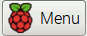

[//]: # (-*- markdown; coding: utf-8 -*-)
# Familiarización con GNU

<figure style="float:right; padding:10px">
  

  <figcaption style="font-size:smaller; font-style:italic">
  <div style="width:350px">
  Entorno gráfico en el que arranca el sistema inicialmente.
  </div>
  </figcaption>
</figure>

La Raspberry Pi cuenta con un completo sistema operativo, con entorno
gráfico y herramientas de programación de diverso tipo.  Vamos a
utilizar este entorno para realizar la mayor parte del taller.  Sin
embargo debemos precisar que la forma de trabajo habitual en
desarrollo de sistemas empotrados es que se utilice un PC y
programemos la Raspberry Pi remotamente.

*GNU/Linux* es el nombre habitual del sistema operativo que lleva
la Raspberry Pi.  *Raspbian* y *Debian* no son más que
distribuciones de este sistema operativo.  Es decir, *Raspbian*
es una seleccion de paquetes de GNU/Linux, compilados para una
arquitectura concreta, y empaquetados con ayuda de herramientas
específicas para conseguir una experiencia de usuario agradable.  En
lugar de ir aquí y allá en busca de instaladores y drivers como
hacemos en Microsoft Windows, en GNU se especializan en conjuntos de
paquetes con fines específicos.

*GNU* es el nombre correcto del sistema operativo. Quiere decir
*GNU's Not Unix*, es decir, GNU no es Unix. Es un acrónimo
recursivo.  Hace referencia a que no contiene ni una sola línea de
Unix, el sistema operativo privativo de AT&T, que luego vendió a SCO
y licenció a IBM, Sun, HP, Silicon Graphics, Fujitsu, Microsoft, etc.
El sufijo *Linux* se refiere al kernel (núcleo) del sistema
operativo.  *GNU* tiene su propio kernel, el *HURD*, pero
todavía no está listo para su uso general. Por eso la mayoría de las
distribuciones añaden a GNU alguno de los kernels libres que hay por
ahí (Linux, FreeBSD, NetBSD, etc.)

> **Info**

> 
> En 1983 Richard M. Stallman, que trabajaba como
> investigador en el AI Lab del MIT, decidió empezar el proyecto GNU
> con el objetivo de hacer innecesario el uso de cualquiero otro
> software no libre. Todavía está lejos de alcanzar su objetivo pero
> GNU ya se utiliza en multitud de equipos electrónicos.
> Puedes leer más sobre el objetivo inicial del proyecto en el
> [El manifiesto de GNU](http://www.gnu.org/gnu/manifesto.html)
> {{ "Stallman:1985:GM" | cite }}.

> En 1985 crea la *Free Software Foundation* con el objetivo de
> difundir el *movimiento del software libre* y de ayudar al
> desarrollo del sistema GNU.  Escucha al propio Richard Stallman
> [explicando la filosofía del
> movimiento](http://audio-video.gnu.org/video/short--2008--rms--free-software-and-beyond-part-1--spanish.ogv).


Nada más conectar la Raspberry Pi a la alimentación arrancará en un
entorno gráfico como el que se muestra en la figura al comienzo del
capítulo.  En la parte superior aparecen los siguientes elementos.

*  Menú de aplicaciones.
*  Terminal de línea de órdenes.
*  Herramienta de configuración de Raspberry Pi.
*  Herramienta de administración de archivos.
*  Entorno integrado de desarrollo en Python (IDLE).
*  Editor de textos.
*  Navegador básico de web.

Desde el menú es posible ejecutar la mayoría de las aplicaciones
instaladas.  No obstante con los botones de lanzamiento rápido de
aplicaciones tendremos suficiente para la mayoría de las actividades
del taller.

## El sistema de archivos

<figure style="float:right; padding:10px">
  

  <figcaption style="font-size:smaller; font-style:italic">
  <div style="width:350px">
  Administrador de archivos.
  </div>
  </figcaption>
</figure>

Vamos primero a familiarizarnos con la estructura de carpetas y
archivos del sistema.  Para ello pincha sobre el botón de lanzamiento
rápido del administrador de archivos. La situación será similar a la
figura adjunta.

La caja de texto en la parte superior indica `/home/pi` que es la
carpeta actual.  Las rutas de los archivos y las carpetas utilizan el
caracter `/` como separador.  No es posible tener una carpeta con ese
carácter en el nombre porque el sistema no podría diferenciarlo de una
ruta de dos componentes.  La carpeta `/` sin más es la carpeta *raíz*,
de donde cuelga todo.  Aquí no hay nombres de unidades, todas las
unidades se ven en algún punto del arbol de carpetas que nace en la
carpeta raiz.  La ruta `/home/pi` hace referencia a que se encuentra
en la carpeta `pi` de la carpeta `home`.  Como puedes imaginar se
trata de la carpeta personal.  El nombre `home` se refiere a que
contiene todas las carpetas personales (casa en inglés). Y dentro de
esa carpeta, la carpeta `pi` es la del usuario `pi`.  Efectivamente,
`pi` es el nombre del usuario creado por defecto en el sistema cuando
se instala.  En el taller usaremos este usuario en exclusiva, pero te
animamos a que te hagas su propio usuario.  Verás que en esta carpeta
ya hay algunos archivos. Son ejemplos de programas en varios lenguajes
de programación, que usaremos en el curso.

Aunque el sistema no lo requiere, las distintas variantes de GNU
tienden a mantener una estructura común de carpetas.  Por ejemplo, los
siguientes suelen estar presentes en la práctica totalidad de los
sistemas GNU:

* `/home/` Carpetas personales de los usuarios.
* `/root/` Carpeta personal del administrador (usuario `root`).
* `/etc/` Archivos de configuración del sistema.
* `/boot/` Archivos necesarios para el arranque del sistema.
* `/bin/` Órdenes básicas (ejecutables del sistema).
* `/usr/bin/` Resto de órdenes del sistema (ejecutables).
* `/lib/` Bibliotecas básicas del sistema (biblioteca en inglés es *library*).
* `/usr/lib/` Resto de bibliotecas del sistema.
* `/usr/local/` Software instalado de forma manual, no perteneciente al sistema.
* `/tmp/` Carpeta temporal.
* `/dev/` Dispositivos del sistema. En GNU todos los dispositivs se ven como archivos especiales.

Usa el administrador de archivos para navegar por el sistema y
familiarizarte con él.  No te preocupes, como usuario `pi` no puedes
destruir nada esencial para el sistema. Te proponemos los siguientes
ejercicios:

1. Encuentra el archivo `wpa_supplicant.conf`. Se trata del archivo
  donde podrás *configurar* la red WiFi para que la Raspberry Pi se
  conecte automáticamente a tu punto de acceso.

1. Encuentra el archivo `parpadeo.py` que es un programa de ejemplo
  escrito en Python que usaremos en el curso.

1. Encuentra el programa `gcc`. Se trata del compilador de C.

1. Encuentra el programa `idle`. Se trata del entorno integrado de
  programación con Python.

> **Warning**

> Tradicionalmente en sistemas operativos se utiliza el
> término *directorio* para referirse a una carpeta.  Del mismo modo
> muchos textos en español hablan de *ficheros* para referirse a
> archivos.  Nosotros intentaremos utilizar el término *carpeta*
> (*folder* en ingles) que encaja mejor en la metáfora del escritorio.

> *File* es archivo en inglés.  Un *file* es una de esas carpetas de
> cartón que se meten en los archivadores de oficina.  El problema es
> que no se puede llamar carpeta también a los archivos.  Por eso se
> buscaron traducciones más neutras.  Fichero es realmente el
> archivador, más que el contenido del archivador. Así que *archivo*
> nos parece una traducción más correcta.

> Pero te avisamos porque en la documentación que leas por ahí es
> fácil que aparezcan.  **Directorio es lo mismo que carpeta y fichero
> es lo mismo que archivo**.

## El entorno de línea de órdenes

Ejecuta la terminal de línea de órdenes pulsando sobre el icono
correspondiente .  Aunque
aparentemente se trata de una interfaz primitiva ésta es una de las
formas más flexibles para comunicarse con el sistema operativo.

Al pulsar el icono veremos que se abre una nueva ventana. Esa ventana
corresponde al programa simulador de terminal.  Se comporta como una
consola antigua con teclado y pantalla alfanumérica.  A su vez el
programa terminal ejecuta otro programa que se encarga de interpretar
las órdenes textuales, la *shell*.  La *shell* es el intermediario
entre el usuario y el sistema operativo.

En GNU/Linux la *shell* que se utiliza normalmente se llama `bash`
(*Bourne Again SHell*).  Tiene multitud de características que la
convierten en un completo lenguaje de programación por sí misma.
Nosotros no veremos las características avanzadas, sino unas nociones
básicas que te permitirán desenvolverte con soltura durante el curso.

Cuando se ejecuta la *shell* aparece un pequeño texto antes del
cursor, es el *prompt*.

```
pi@rpi:~$ ▂
```

Antes de los dos puntos aparece el usuario y el nombre del ordenador
simulando una dirección de correo electrónico.  Antes del símbolo `@`
aparece el nombre del usuario que ejecuta la *shell*.  En este caso el
usuario es `pi`, que es el usuario por defecto, y el que usaremos en
nuestros ejemplos.  Después aparece el nombre del *host*, que hemos
configurado en la instalación como `rpi`.

Después de los dos puntos y antes del símbolo `$` aparece la carpeta
de trabajo.  La carpeta (o el directorio) de trabajo es aquella
carpeta en la que se encuentra actualmente la *shell*.  Todos los
procesos tienen una carpeta de trabajo y la *shell* no es una
excepción.  Se utiliza como base para determinar los archivos que se
localizan mediante *rutas relativas*.  Veremos esto enseguida.

Hay muchas referencias muy recomendables para entender la *shell* y
explotar todo su potencial.  Un excelente libro disponible de forma
gratuita es {{ "welsh02:_gnu_linux" | cite }} disponible en
[tldp.org](http://es.tldp.org/Manuales-LuCAS/LIPP2/lipp-2.0-beta.pdf).
Otra referencia actual y muy completa es 
{{ "blum15:_linux_comman_line_shell_scrip_bible" | cite }}.

## Gestión de archivos

Todas las operaciones que pueden realizarse con el administrador de
archivos también pueden realizarse con órdenes en la *shell*.  Veamos
un breve resumen de las órdenes más frecuentes.


### Listado de archivos: `ls`

La orden más básica para gestión de archivos es mostrar el contenido
de una carpeta.  Se realiza con la orden `ls`.  

Esta orden muestra el listado de los archivos y carpetas que cuelgan o
están contenidos en una carpeta concreto.  Por defecto, no muestra los
archivos ocultos, que son aquéllos cuyo nombre comienza con `.` Se
utiliza de la siguiente manera:

```
ls [OPCION] [ARCHIVO o CARPETA]
```

Además, esta orden acepta la siguientes opciones:

Opción&nbsp;&nbsp;&nbsp; | Significado
-----|----
`-a` | Muestra también los archivos ocultos, aquellos que empiezan por `.`
`-l` | Utiliza un formato de listado largo, con información de permisos, usuarios, tamaños, fecha, etc.
`-R` | Lista los subcarpetas de manera recursiva
`--help` | Muestra la ayuda de la orden, junto con una lista extendida de las opciones del mismo


Suponiendo que el intérprete de órdenes está en el home del
usuario, para listar el contenido de la carpeta `rpi`:

```
pi@rpi:~$ ls rpi
practicas
pi@rpi:~$ ls -R rpi
rpi/:
practicas

rpi/practicas:
practica1

rpi/practicas/practica1:
```

### Especificación de ruta: `cd`

Cambia al carpeta especificado.  Si no se especifica
ninguna ruta va al carpeta home del usuario.  Se utiliza de la
siguiente manera:

```
cd [RUTA]
```

Conviene conocer también cómo cambiar de carpeta
utilizando rutas relativas a la ubicación actual y no únicamente
con rutas absolutas.

```
pi@rpi:~$ cd rpi
pi@rpi:~/rpi$ cd ..
pi@rpi:~$ cd rpi/practicas/practica1
pi@rpi:~/rpi/practicas/practica1$ cd
pi@rpi:~$ cd /home/usuario/rpi/practicas/practica1
pi@rpi:~/rpi/practicas/practica1$
```

Las tres primeras líneas utilizan rutas relativas, dado que
la ruta no empieza por ``/''.  Por ejemplo, la primera línea utiliza
una ruta relativa en la que la carpeta `rpi` es hijo del
carpeta actual.  La segunda línea utiliza la carpeta especial
``..'', que representa al carpeta padre del actual.  Es decir, sube
un nivel.  La cuarta línea (sin especificar ruta) equivale a `cd
  ~`, es decir, cambia al carpeta (`home`) del usuario.

Si dentro de la carpeta `practica1` guardamos el código fuente
del *Hola Mundo* en un archivo `hello.c`, lo
compilamos y generamos el ejecutable como `hello`, se puede
comprobar lo siguiente:

```
pi@rpi:~$ cd rpi/practicas/practica1
pi@rpi:~/rpi/practicas/practica1$ ls
hello.c
pi@rpi:~/rpi/practicas/practica1$ gcc -o hello hello.c
pi@rpi:~/rpi/practicas/practica1$ ./hello
Hola Mundo
pi@rpi:~/rpi/practicas/practica1$ cd
pi@rpi:~$ /home/usuario/rpi/practicas/practica1/hello
Hola Mundo
```

Para ejecutar un binario también será necesario especificar
la ruta donde el mismo se encuentra localizado.  La ruta se podrá
indicar de manera absoluta o relativa.  La línea 5 especifica la ruta
relativa a la posición actual, como es el mismo carpeta se indica
por `./`.  Sin embargo la línea 7 especifica la ruta absoluta.

### Creación de carpetas: `mkdir`

La orden `mkdir` permite la creación de carpetas en
aquellos puntos en los que el usuario tiene permisos para ello. Este
comando se utiliza de la siguiente forma:

```
mkdir [OPCION] CARPETA
```

la carpeta, salvo que se especifique una ruta absoluta,
lo creará como un subcarpeta que cuelga de la ubicación actual en
la consola.  Por ejemplo, suponiendo que nos encontramos en el home del
usuario `usuario`, se desea crear la carpeta `rpi` y dentro de
éste, otro que sea `practicas` y otro que sea `practica1`, que
cuelgue de `practicas`:

```
pi@rpi:~$ mkdir rpi
pi@rpi:~$ mkdir rpi/practicas
pi@rpi:~$ mkdir rpi/practicas/practica1
```


### Ubicación actual: `pwd`

Esta orden muestra la ruta completa al carpeta actual.

```
pi@rpi:~$ cd rpi/practicas/practica1
pi@rpi:~/rpi/practicas/practica1$ pwd
/home/usuario/rpi/practicas/practica1
```

### Borrado de archivos y carpetas: `rm`

Esta orden se utiliza para borrar archivos y carpetas.
Esta orden no se puede deshacer, de ahí que sea conveniente utilizarla
con cautela, o en su defecto, forzar la petición de comprobación
utilizando la opción `-i`.  Se utiliza de la siguiente manera:

```
rm [OPCION] FILE
```

Entre las diferentes opciones que acepta esta orden,
destacamos las siguientes:


Opción&nbsp;&nbsp;&nbsp; | Significado
-----|----
`-r` | Procesa subcarpetas de forma recursiva
`-i` | Pide confirmación para cada borrado
`-f` | Forzado, ignora archivos no existentes y elimina cualquier aviso de confirmación


La orden `rmdir` se puede utilizar también para borrar un
carpeta, y tiene el mismo efecto que el de borrado recursivo.

### Copia de archivos y carpetas: `cp`

Esta orden se utiliza para efectuar la copia de archivos y
carpetas el sistema de archivos.  Se utiliza de la siguiente
manera:

```
cp [OPCION] origen destino
```

Donde *origen* es el archivo o carpeta que se
desea copiar y *destino* la ubicación donde se copiará y
opcionalmente, si la ruta va acompañada de un nombre, indicará una
copia renombrada.  Por defecto, si el destino es una carpeta, se
copia con el mismo nombre que el origen.

Dentro de esta sección comentaremos también la orden `mv`.  Se
utiliza como la orden `cp`, con la diferencia de que en lugar de
crear una copia del objeto, la orden `mv`, mueve el objeto
*origen* a un *destino*.

```
pi@rpi:~$ cd rpi/practicas
pi@rpi:~/rpi/practicas$ cp -r practica1 practica2
```

## Usuarios y permisos

## Gestión de procesos

ps, top, kill

## Control de versiones

git

## Dispositivos

### Discos USB

### Puertos serie

