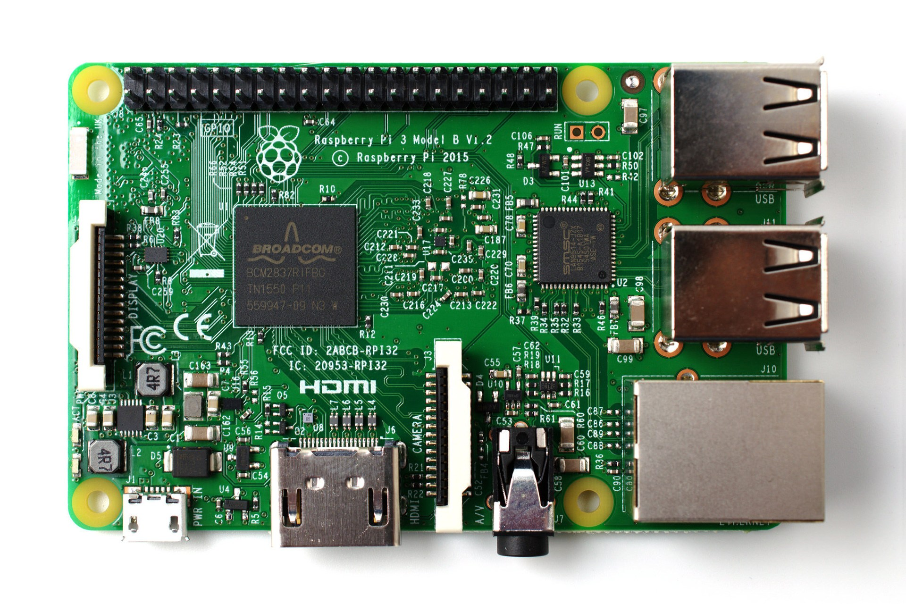

[//]: # (-*- markdown; coding: utf-8 -*-)
# La Raspberry Pi

<figure style="float:right;padding:10px">
  

  <figcaption style="font-size:smaller;font-style:italic;text-align:center">
	Raspberry Pi 3 modelo B. Foto de <a
	href="https://www.raspberrypi.org/wp-content/uploads/2016/03/pi3.jpg">raspberrypi.org</a>.
  </figcaption>
</figure>

En el año 2006, un grupo del Computer Lab de la Universidad de
Cambridge empezó a preocuparse por el nivel con el que llegaban los
alumnos de secundaria a la Universidad.  Por alguna razón los alumnos
que tenían alguna exposición previa con tecnologías informáticas
acumulaban conocimientos sobre aplicaciones concretas, en lugar de
conocimientos sobre las propias tecnologías.  Raspberry Pi surge como
una iniciativa de bajo coste para promover la experimentación con la
programación desde edades tempranas, aunque no por ello se trata de un
mero juguete.

<iframe src='https://cdn.knightlab.com/libs/timeline3/latest/embed/index.html?source=1O_kx6KaHBA3DeTRGWc1XvJHzJGTVgV95dR1xLzW9eu4&font=Default&lang=es&initial_zoom=2&height=500' width='100%' height='500' frameborder='0'></iframe>

## La familia Raspberry Pi

En la línea de tiempo de arriba puedes ver un conjunto de los hitos
más significativos relacionados con Raspberry Pi.  En la corta
historia de la *Raspberry Pi Foundation* ya se han generado un
respetable número de modelos:

<figure style="float:right; padding:10px">
  
  <figcaption style="font-size:smaller; font-style:italic">
  

	Vista lateral amplificada del montaje del BCM2835 y la memoria
	de los modelos originales de Raspberry Pi. Foto tomada del blog de
	<a href="http://www.raspberrypi.org/factory-pictures-from-south-wales/">raspberrypi.org</a>.
  

  </figcaption>
</figure>

* *Raspberry Pi modelo B* fue el primer modelo puesto a la venta, el
  29 de febrero de 2012.  El diseño original incluía dos modelos con
  el mismo circuito impreso.  Ambos se diseñaron alrededor de un SoC
  (*System On a Chip*) de Broadcom, el
  [BCM2835](https://www.raspberrypi.org/documentation/hardware/raspberrypi/bcm2835/)
  a 700MHz, pensado para aplicaciones móviles que requieran
  tratamiento de video o gráficos 3D (cámaras de vídeo, reproductores
  multimedia, teléfonos móviles, etc.).  La mayoría de los pines de
  entrada/salida del BCM2835 se dispusieron en una cabecera de 26
  pines.  El modelo B era la versión de gama alta, orientada a
  desarrolladores, con más memoria (512MB de RAM frente a 256MB) , un
  puerto Ethernet 100BaseTX y un *hub USB* con dos puertos USB 2.0.
  Los modelos originales incorporaban una ranura SD.  En septiembre de
  2012 se revisó ligeramente el diseño para corregir algunos
  problemas.  Esta revisión modifica ligeramente los pines de
  entrada/salida disponibles.

* *Raspberry Pi modelo A* es la versión reducida del modelo B.
  Incorpora la mitad de memoria RAM que el modelo B (256MB), no
  incluye interfaz Ethernet y solo incorpora un puerto USB 2.0.  Está
  pensada para aplicaciones finales donde el consumo y/o el coste sean
  factores importantes.

> **Info**
> 
> La logomarca de Raspberry Pi es una marca registrada de la
> *Raspberry Pi Foundation*.  Fue diseñada por Paul Bleech, que ganó
> el concurso de logos que organizó la fundación en 2011.

<figure style="float:right; padding:10px">
  

  <figcaption style="font-size:smaller; font-style:italic">
  

  Compute Module IO Board con el módulo
  insertado. Fuente: blog de
  <a href="http://www.raspberrypi.org/raspberry-pi-compute-module-new-product/">raspberrypi.org</a>.
  

  </figcaption>
</figure>

* En abril de 2014 se anuncia la *Raspberry Pi Compute Module*. Es
  similar al modelo B, pero en lugar de ranura SD incorpora 4GB de
  eMMC Flash e integra todo en un circuito impreso DDR2 SODIMM,
  similar al de las memorias de los portátiles.  Esto permite disponer
  de todos los pines del BCM2835 pero exige otro circuito impreso con
  el zócalo SODIMM y los conectores necesarios.  Se utiliza
  extensivamente en el desarrollo de productos basados en Raspberry
  Pi, como el *media player*
  [Slice](https://www.raspberrypi.org/blog/creating-and-kickstarting-slice-the-compute-module-based-media-player/)
  de FiveNinjas, los satélites
  [CubeSat](https://www.raspberrypi.org/blog/compute-module-cubesats/),
  la cámara
  [Otto](https://www.raspberrypi.org/blog/otto-a-hackable-camera-powered-by-raspberry-pi/),
  el [Cube Solver](https://www.raspberrypi.org/blog/cube-solver/) que
  es capaz de solucionar un *cubo Rubik*,
  [Sphinx](http://dock2office.com/raspberry-pi/) que sirve para
  utilizar una tableta como un ordenador de escritorio, etc.

<figure style="float:right; padding:10px"> 

  <figcaption style="font-size:smaller; font-style:italic">
	

	Plantilla de la especificación mecánica de HAT. Fuente: <a
	href="https://www.raspberrypi.org/blog/introducing-raspberry-pi-hats/">raspberrypi.org</a>.
	

  </figcaption>
</figure>

* En julio de 2014 se anuncia la *Raspberry Pi modelo B+*.  Se trata
  de un rediseño del modelo B, muy similar pero con importantes
  consecuencias.  Se amplía el número de pines de la cabecera de GPIO
  a 40 pines, se sustituye el zócalo SD por uno microSD, se aumenta el
  número de puertos USB a cuatro, se mejora la alimentación y el
  audio, se incluye en el mismo conector la salida de video compuesto
  y el audio (como muchos portátiles), y se corrige el factor de forma
  para que encaje completamente en el tamaño de una tarjeta de
  crédito.  La ampliación de la cabecera de pines se complementa muy
  poco después con la especificación
  [HAT](https://www.raspberrypi.org/blog/introducing-raspberry-pi-hats/)
  (*Hardware Attached on Top*) que determina las limitaciones físicas
  y eléctricas que deben cumplir las placas de expansión de *Raspberry
  Pi* para garantizar la compatibilidad futura.  Todas las Raspberry
  Pi serán compatibles con esta especificación desde esta fecha.
  *HAT* permite configuración automática de entradas/salidas digitales
  así como de los drivers por medio de dos pines dedicados (`ID_SD` e
  `ID_SC`).  Hoy en día hay multitud de *HATs* en el mercado (como
  ejemplo, véase la colección de
  [Adafruit](https://www.adafruit.com/categories/405), de
  [Pimoroni](https://shop.pimoroni.com/collections/hats) y de
  [The Pi Hut](https://thepihut.com/collections/raspberry-pi-hats)).

<figure style="float:right; padding:10px">
  

  <figcaption style="font-size:smaller; font-style:italic">
  

  Compute Module y Raspberry Pi modelo B. Fuente: blog de
  <a href="http://www.raspberrypi.org/raspberry-pi-compute-module-new-product/">raspberrypi.org</a>.
  

  </figcaption>
</figure>

* En noviembre de 2014 se anuncia la *Raspberry Pi A+* como el
  rediseño equivalente del modelo A.  Un cambio significativo es que
  se abandona la idea de usar el mismo circuito impreso.  De esta
  forma se consigue reducir sensiblemente el tamaño y con ello el
  precio.  Incorpora la cabecera HAT, que ya estará presente en todos
  los modelos posteriores, y se reduce significativamente el consumo.

* En febrero de 2015, casi en el tercer aniversario de la Raspberry Pi
  original, se anuncia la *Raspberry Pi 2 modelo B*.  Actualiza el
  procesador a un
  [BCM2836](https://www.raspberrypi.org/documentation/hardware/raspberrypi/bcm2836/)
  (quad-core Cortex-A7) a 900MHz e incorpora 1GB de RAM.  Por primera
  vez se abre la posibilidad de usar Microsoft Windows 10 en
  *Raspberry Pi* aunque el sistema operativo recomendado por la
  *Raspberry Pi Foundation* sigue siendo Raspbian.
  
* En noviembre de 2015 se anuncia la *Raspberry Pi Zero*. Se trata de
  una versión diminuta del modelo A+ con mayor velocidad (1GHz) y más
  memoria (512MB). Sin poblar los zócalos se llegó a bajar el precio a
  5$. El número 40 de la revista
  [The MagPi](https://www.raspberrypi.org/magpi/) incluía una
  Raspberry Pi Zero de regalo.  Parece que la presión de Google tras
  una reunión de Eric Schmidt y Eben Upton fue
  [decisiva](https://www.raspberrypi.org/magpi/making-pi-zero/) en su
  desarrollo.

* En febrero de 2016 se anuncia la *Raspberry Pi 3 modelo B*,
  coincidiendo con el cuarto cumpleaños de la *Raspberry Pi modelo B*
  original.  Se vuelve a actualizar el procesador por un BCM2837
  diseñado específicamente para la Raspberry Pi 3 (quad-core
  Cortex-A53) a 1.2GHz, incluye un BCM WiFi 802.11n y Bluetooth 4.1.  El
  cambio es muy importante, porque se pasa a una arquitectura de 64
  bits, aunque la compatibilidad hacia atrás sigue siendo total.

> **Info**
> 
> Si quieres conocer más sobre la historia de Raspberry Pi y su
> comunidad te recomendamos que visites el sitio web de la revista
> [*The MagPi*](http://www.raspberrypi.org/magpi/). Se trata de una
> revista de gran calidad y completamente gratuita en su versión
> electrónica.

|              | **CM** | **A+** | **B+** | **2B** | **Zero** | **3B** |
|--------------|:------:|:------:|:------:|:------:|:--------:|:------:|
|SoC (BCMxxxx) | 2835   | 2835   | 2835   | 2836   | 2835     | 2837   |
|Frecuencia    | 700MHz | 700MHz | 700MHz | 900MHz | 1GHz     | 1.2GHz |
|Arquitectura  | ARM6   | ARM6   | ARM6   | ARM7   | ARM6     | ARM8   |
|Núcleos       | 1      | 1      | 1      | 4      | 1        | 4      |
|Memoria RAM   | 512MB  | 256MB  | 512MB  | 1GB    | 512MB    | 1GB    |
|Memoria Flash | 4GB    | microSD| microSD| microSD| microSD  | microSD|
|GPIO pins     | 54     | 26     | 26     | 26     | 26       | 26     |
|Puertos USB   | 1      | 1      | 4      | 4      | 1        | 4      |
|Ethernet 10/100 | <i class="fa fa-square-o"/> | <i class="fa fa-square-o"/> | <i class="fa fa-check-square-o"/> | <i class="fa fa-check-square-o"/> | <i class="fa fa-check-square-o"/> | <i class="fa fa-check-square-o"/> |
|WiFi            | <i class="fa fa-square-o"/> | <i class="fa fa-square-o"/> | <i class="fa fa-square-o"/> | <i class="fa fa-square-o"/> | <i class="fa fa-square-o"/> | <i class="fa fa-check-square-o"/> |
|Bluetooth       | <i class="fa fa-square-o"/> | <i class="fa fa-square-o"/> | <i class="fa fa-square-o"/> | <i class="fa fa-square-o"/> | <i class="fa fa-square-o"/> | <i class="fa fa-check-square-o"/> |
|HDMI          | <i class="fa fa-check-square-o"/> | <i class="fa fa-check-square-o"/> | <i class="fa fa-check-square-o"/> | <i class="fa fa-check-square-o"/> | <i class="fa fa-check-square-o"/> | <i class="fa fa-check-square-o"/> |
|DSI ports     | 2      | 1      | 1      | 1      | 0        | 1      |
|Cam ports     | 2      | 1      | 1      | 1      | 0        | 1      |

## Los sistemas en chip de Broadcom

<figure style="float:right; padding:10px">
  

  <figcaption style="font-size:smaller; font-style:italic">
  

  Esquema de soldadura vertical *package on package*. Los
  sustratos del SoC (A) y de la memoria (B) se sueldan mediante
  una matriz de pequeñas bolitas de soldadura (2) uno encima del otro
  y todo ello sobre el PCB (1). Fuente: Tosaka en <a
  href="http://commons.wikimedia.org/wiki/File:Package_on_Package_(Side_view).PNG">Wikimedia
  Commons</a>
  

  </figcaption>
</figure>

La mayoría de los modelos de Raspberry Pi se basan en el Broadcom
BCM2835.  Este *sistema-en-chip* incorpora un núcleo ARM1176JZF-S de
bajo consumo y un coprocesador multimedia (GPU) de doble núcleo
VideoCore IV.  La GPU implementa OpenGL-ES 2.0 y es capaz de codificar
y decodificar vídeo FullHD a 30fps, a la vez que muestra gráficos
FullHD a 60fps en un LCD o en un monitor HDMI.  Una característica
llamativa de este procesador es su montaje apilado con la memoria RAM
(*package on package*). La estructura se muestra en la figura.  Por
este motivo el circuito impreso de la Raspberry Pi no deja ver
procesador alguno. Esta técnica permite reducir considerablemente el
tamaño del PCB (*Printed Circuit Board*) necesario.

Además del procesador y la GPU, el SoC de la Raspberry Pi
incorpora un amplio conjunto de periféricos:

* Temporizador.
* Controlador de interrupciones.
* Entradas/salidas digitales de propósito genérico, GPIO (*General
  Purpose Input-Output*). Dispone de 54 pero no todas están
  disponibles en la Raspberry Pi.
* Puerto USB.
* Audio PCM a través de bus I2S (*Integrated Interchip Sound*).
* Controlador de acceso directo a memoria, DMA.
* Maestro y esclavo de bus I2C (*Inter-Integrated Circuit*).
* Maestros y esclavo de bus SPI (*Serial Peripheral Interface*).
* Módulos para generación de pulsos de anchura variable, PWM.
* Puertos serie, UART.
* Interfaz para memorias eMMC, SD, SDIO.
* Interfaz HDMI

> **Info**
>  style="float:right;margin:10px"/> Aplicando técnicas de ingeniería
> inversa se documentó una parte sustancial de la GPU en el
> [repositorio GitHub de Herman Hermitage](https://github.com/hermanhermitage).
> Es posible que este trabajo haya influido en la
> [reciente decisión de Broadcom](https://www.raspberrypi.org/blog/a-birthday-present-from-broadcom/)
> de liberar la documentación oficial de Videocore IV.  Los usuarios
> avanzados pueden ya disfrutar de unas
> [bibliotecas de desarrollo](http://elinux.org/Raspberry_Pi_VideoCore_APIs)
> razonablemente maduras y un driver OpenGL acelerado completamente libre.

El BCM2836 de la *Raspberry Pi 2 modelo B* tiene básicamente la misma
arquitectura interna que su antecesor pero incorpora un procesador
Cortex-A7 de cuatro núcleos que sustituye al ARM117JZF-S del BCM2835 y
no utiliza la técnica de montaje *package-on-package*.  Tiene
importantes consecuencias desde el punto de vista del software, puesto
que este procesador implementa el repertorio de instrucciones de ARM
v.7 en lugar de ARM v.6 como su antecesor.

El BCM2837 de la *Raspberry Pi 3 modelo B* es un sistema-en-chip
diseñado específicamente para este modelo de Raspberry Pi.  Actualiza
el procesador por cuatro cores Cortex-A53 de 64 bits, pero sigue
incorporando la GPU Videocore IV porque se trata de una de las pocas
GPUs con documentación pública del fabricante.

El ARM Cortex-A53 tiene como nombre interno *Apollo* y suele usarse en
procesadores de alto rendimiento en combinación con el ARM Cortex-A57
(*Atlas*) siguiendo la configuración *big.LITTLE* (multiprocesador
heterogéneo).  El A53 es la versión de bajo consumo, reducido tamaño y
relativa simplicidad de la arquitectura ARMv8, mientras que A57 es la
versión de alto rendimiento, elevado consumo y mayor tamaño de la
misma arquitectura.  Por ejemplo, el Exynos 7 Octa o el Snapdragon 810
que incorporan muchos teléfonos móviles de gama alta sigue esta
configuración empleando cuatro núcleos de cada tipo.  En el caso del
BCM2837 se opta por incluir solo cuatro núcleos de bajo consumo, por
lo que no pretende competir en alto rendimiento, sino en eficiencia
energética.  Básicamente el rendimiento esperable es algo mejor que un
quad-core Cortex-A9 (por ejemplo, como el procesador del iPad 2) pero
a un coste sensiblemente inferior.

El Cortex-A53 es de 64 bits, pero mantiene compatibilidad con el
software de 32 bits.  Esto abre la posibilidad de utilizar un sistema
operativo de 32 bits y aplicaciones de 32 bits, o bien un sistema
operativo de 64 bits y aplicaciones de 32 y 64 bits indistintamente.
La Raspberry Pi Foundation solo distribuye de momento un sistema
operativo (Raspbian GNU/Linux) de 32 bits, y no tiene planes a corto
plazo de mantener una versión de 64 bits.

## Una Raspberry Pi para el taller

Este taller de iniciación podría realizarse sobre cualquier modelo de
Raspberry Pi.  La nueva Raspberry Pi Zero es ideal para prototipos de
equipos, pero dificulta notablemente el desarrollo.  Por ejemplo,
conectar un teclado y un ratón exigiría un hub USB OTG, la mera
actualización del sistema operativo requeriría algún tipo de conexión
de red, y la conexión de dispositivos externos al puerto GPIO requiere
incorporar cabeceras de pines o soldadura.  Todo esto está ya en la
Raspberry Pi modelo B+.

> **Info** El coste agregado de todos los componentes adicionales que
> sería preciso incorporar a la *Raspberry Pi Zero* para desarrollar
> cómodamente supera ampliamente el coste de la *Raspberry Pi B+*.

Por desgracia el precio del modelo B+ está subiendo debido a la caida
de la demanda desde la salida al mercado de la Raspberry Pi 2 modelo
B.  En esta coyuntura sale al mercado la Raspberry Pi 3 modelo B al
mismo precio que la Raspberry Pi 2 modelo B, pero incluyendo además
interfaz WiFi y Bluetooth.  Por este motivo nos decidimos por incluir
la nueva Raspberry 3 modelo B en esta edición.  Sin embargo todos los
ejemplos del taller son compatibles con cualquiera de los modelos.

## Interoperabilidad con otros productos

Alrededor de la Raspberry Pi Foundation ha surgido una enorme
comunidad de usuarios de todos los niveles que genera información y
productos. Hoy en día hay periféricos específicos de todo tipo para
Raspberry Pi. Hay cámaras, touch panels con pantalla TFT, y multitud
de tarjetas de interfaz con otros dispositivos.

Merece la pena destacar los esfuerzos por integrar periféricos de
otras plataformas que ya disfrutaban de una amplia comunidad de
usuarios.  Así por ejemplo, pueden utilizarse los periféricos de
[Lego Mindstorms](http://mindstorms.lego.com/) y las piezas de
[LEGO Technic](http://www.lego.com/es-es/technic) para construir
robots controlados por Raspberry Pi empleando
[BrickPi de Dexter
Industries](http://www.dexterindustries.com/BrickPi/).

También pueden utilizarse la enorme variedad de módulos de expansión
de Arduino (*shields*) con
[GertDuino de Gert van Loo](http://www.raspberrypi.org/tag/gertduino/),
o con
[ArduBerry de Dexter Industries](http://www.dexterindustries.com/Arduberry.html),
o con [AlaMode de WyoLum](http://wyolum.com/projects/alamode/) o con
[ArduPi de Cooking Hacks](http://www.cooking-hacks.com/documentation/tutorials/raspberry-pi-to-arduino-shields-connection-bridge).

Por último nos gustaría mencionar las interfaces de Raspberry Pi a
[Grove](http://www.seeedstudio.com/document/pdf/Introduction\%20to\%20Grove.pdf),
una arquitectura modular y abierta para construir sistemas
electrónicos al estilo de LEGO en los sistemas físicos.  Grove fue
inicialmente concebida para ser compatible con Arduino, y por tanto
pueden emplearse junto con los adaptadores mencionados arriba, pero
también pueden emplearse directamente mediante
[GrovePi de Dexter Industries](http://www.dexterindustries.com/GrovePi/),
una *base shield* especialmente concebida para Raspberry Pi.

<figure style="float:right; padding:10px">
  

  <figcaption style="font-size:smaller; font-style:italic">
  

  Memoria RAM (izquierda) y BCM2835 (derecha). Foto tomada del blog de
  <a href="http://www.raspberrypi.org/libraries-codecs-oss/">raspberrypi.org</a>.
  

  </figcaption>
</figure>
