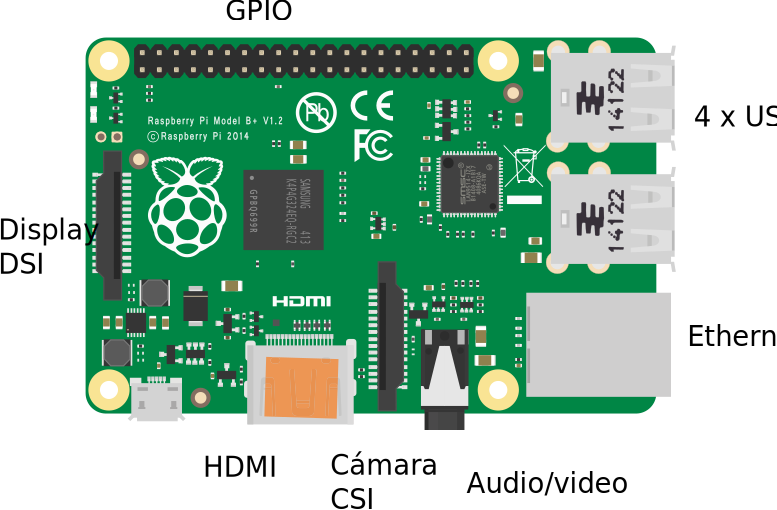
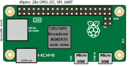
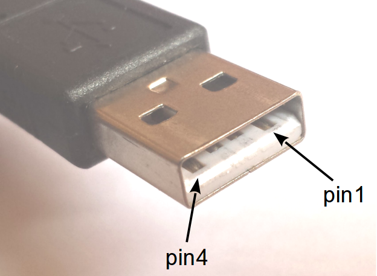

[//]: # (-*- markdown -*-)
# Introducción

<figure style="float:right;padding:10px">
  

  <figcaption style="font-size:smaller; font-style:italic">Raspberry
  Pi modelo B. Foto de <em>cowjuice</em> disponible en <a
  href="http://commons.wikimedia.org/wiki/File:Raspberry_Pi_Photo.jpg">Wikimedia</a>.
  </figcaption>
</figure>

En el año 2006, un grupo del Computer Lab de la Universidad de
Cambridge empezó a preocuparse por el nivel con el que llegaban los
alumnos de secundaria a la Universidad.  Por alguna razón los alumnos
que tenían alguna exposición previa con tecnologías informáticas
acumulaban conocimientos sobre aplicaciones concretas, en lugar de
conocimientos sobre las propias tecnologías.  Raspberry Pi surge como
una iniciativa de bajo coste para promover la experimentación con la
programación desde edades tempranas, aunque no por ello se trata de un
mero juguete.  El lanzamiento oficial fue el 29 de febrero de 2012.

> **Info**
> 
> La logomarca de Raspberry Pi es una marca registrada de la
> *Raspberry Pi Foundation*.  Fue diseñada por Paul Bleech, que ganó
> el concurso de logos que organizó la fundación en 2011.

Alrededor de la Raspberry Pi Foundation ha surgido una enorme
comunidad de usuarios de todos los niveles que genera información y
productos. Hoy en día hay periféricos específicos de todo tipo para
Raspberry Pi. Hay cámaras, touch panels con pantalla TFT, y multitud
de tarjetas de interfaz con otros dispositivos.

> **Info**
> 
> Si quieres conocer más sobre la historia de Raspberry Pi y su
> comunidad te recomendamos que visites el sitio web de la revista
> [*The MagPi*](http://www.raspberrypi.org/magpi/). Se trata de una
> revista de gran calidad y completamente gratuita en su versión
> electrónica.

Merece la pena destacar los esfuerzos por integrar periféricos de
otras plataformas que ya disfrutaban de una amplia comunidad de
usuarios.  Así por ejemplo, pueden utilizarse los periféricos de
[Lego Mindstorms](http://mindstorms.lego.com/) y las piezas de
[LEGO Technic](http://www.lego.com/es-es/technic) para construir
robots controlados por Raspberry Pi empleando
[BrickPi de Dexter
Industries](http://www.dexterindustries.com/BrickPi/).

También pueden utilizarse la enorme variedad de módulos de expansión
de Arduino (*shields*) con
[GertDuino de Gert van Loo](http://www.raspberrypi.org/tag/gertduino/),
o con
[ArduBerry de Dexter Industries](http://www.dexterindustries.com/Arduberry.html),
o con [AlaMode de WyoLum](http://wyolum.com/projects/alamode/) o con
[ArduPi de Cooking Hacks](http://www.cooking-hacks.com/documentation/tutorials/raspberry-pi-to-arduino-shields-connection-bridge).

Por último nos gustaría mencionar las interfaces de Raspberry Pi a
[Grove](http://www.seeedstudio.com/document/pdf/Introduction\%20to\%20Grove.pdf),
una arquitectura modular y abierta para construir sistemas
electrónicos al estilo de LEGO en los sistemas físicos. Grove fue
inicialmente concebida para ser compatible con Arduino, y por tanto
pueden emplearse junto con los adaptadores mencionados arriba, pero
también pueden emplearse directamente mediante
[GrovePi de Dexter Industries](http://www.dexterindustries.com/GrovePi/),
una *base shield* especialmente concebida para Raspberry Pi.

<figure style="float:right; padding:10px">
  

  <figcaption style="font-size:smaller; font-style:italic">
  

  Memoria RAM (izquierda) y BCM2835 (derecha). Foto tomada del blog de
  <a href="http://www.raspberrypi.org/libraries-codecs-oss/">raspberrypi.org</a>.
  

  </figcaption>
</figure>

En este taller veremos el uso básico de la Raspberry Pi y periféricos
y dispositivos. En ediciones sucesivas iremos incrementando el número
de dispositivos y nuevos proyectos de ejemplo.

Una de las principales diferencias de esta edición del taller es que
vamos a dedicar una buena parte del tiempo a hablar de arquitectura
software.

## La familia Raspberry Pi

Raspberry Pi se diseñó alrededor de un SoC (*System On a Chip*) de
Broadcom, el
[BCM2835](https://www.raspberrypi.org/documentation/hardware/raspberrypi/bcm2835/),
diseñado para aplicaciones móviles que requieran tratamiento de video
o gráficos 3D (cámaras de vídeo, reproductores multimedia, teléfonos
móviles, etc.).  Actualmente la versión más potente de Raspberry Pi,
la *Raspberry Pi 2*, utiliza una versión más avanzada del SoC de
Broadcom, el
[BCM2836](https://www.raspberrypi.org/documentation/hardware/raspberrypi/bcm2836/).

<figure style="float:right; padding:10px">
  

  <figcaption style="font-size:smaller; font-style:italic">
  

Vista lateral
  amplificada del montaje del procesador y la memoria de Raspberry
  Pi. Foto tomada del blog de
  <a href="http://www.raspberrypi.org/factory-pictures-from-south-wales/">raspberrypi.org</a>.
  

  </figcaption>
</figure>

El BCM2835 incorpora un núcleo ARM1176JZF-S de bajo consumo y un
coprocesador multimedia (GPU) de doble núcleo VideoCore IV de
Broadcom.  La GPU implementa OpenGL-ES 2.0 y es capaz de codificar y
decodificar vídeo FullHD a 30fps, a la vez que muestra gráficos FullHD
a 60fps en un LCD o en un monitor HDMI.  Una característica llamativa
de este procesador es su montaje apilado con la memoria RAM (*package
on package*). La estructura se muestra en la figura.  Por este motivo
el circuito impreso de la Raspberry Pi no deja ver procesador
alguno. Esta técnica permite reducir considerablemente el tamaño del
PCB (*Printed Circuit Board*) necesario.

El nuevo BCM2836 tiene básicamente la misma arquitectura interna que
su antecesor pero incorpora un procesador Cortex-A7 de cuatro núcleos
que sustituye al ARM117JZF-S del BCM2835.  Esto tiene importantes
consecuencias desde el punto de vista del software, puesto que este
procesador implementa el repertorio de instrucciones de ARM v.7 en
lugar de ARM v.6 como su antecesor.

Además del procesador y la GPU, el SoC de la Raspberry Pi
incorpora un amplio conjunto de periféricos:

<figure style="float:right; padding:10px">
  

  <figcaption style="font-size:smaller; font-style:italic">
  

  Esquema de soldadura vertical *package on package*. Los
  sustratos del SoC (A) y de la memoria (B) se sueldan mediante
  una matriz de pequeñas bolitas de soldadura (2) uno encima del otro
  y todo ello sobre el PCB (1). Fuente: Tosaka en <a
  href="http://commons.wikimedia.org/wiki/File:Package_on_Package_(Side_view).PNG">Wikimedia
  Commons</a>
  

  </figcaption>
</figure>

* Temporizador.
* Controlador de interrupciones.
* Entradas/salidas digitales de propósito genérico, GPIO (*General
  Purpose Input-Output*). Dispone de 54 pero no todas están
  disponibles en la Raspberry Pi.
* Puerto USB.
* Audio PCM a través de bus I2S (*Integrated Interchip Sound*).
* Controlador de acceso directo a memoria, DMA.
* Maestro y esclavo de bus I2C (*Inter-Integrated Circuit*).
* Maestros y esclavo de bus SPI (*Serial Peripheral Interface*).
* Módulos para generación de pulsos de anchura variable, PWM.
* Puertos serie, UART.
* Interfaz para memorias eMMC, SD, SDIO.
* Interfaz HDMI

La Raspberry Pi Foundation ha diseñado varias versiones de Raspberry
Pi que se acomodan a distintos requisitos.  En la corta historia de la
Raspberry Pi ya se han diseñado un buen número de modelos:

<figure style="float:right; padding:10px">
  

  <figcaption style="font-size:smaller; font-style:italic">
  

  Compute Module y Raspberry Pi modelo B. Fuente: blog de
  <a href="http://www.raspberrypi.org/raspberry-pi-compute-module-new-product/">raspberrypi.org</a>.
  

  </figcaption>
</figure>

* El modelo A no incorpora ningún periférico adicional. Dispone de
  256MB de RAM y deja algunos zócalos sin poblar. Sólo incorpora un
  puerto USB.
* El modelo B, cuenta con 512MB de RAM y además dispone de un
  [Microchip LAN9512](http://www.microchip.com/wwwproducts/Devices.aspx?product=LAN9512).
  Este periférico añade al sistema un *hub* USB 2.0 y un
  controlador Ethernet 10/100.
* El
  [Raspberry Pi Compute Module](http://www.raspberrypi.org/raspberry-pi-compute-module-new-product/)
  es un pequeño módulo con el mismo factor de forma que un conector
  SODIMM, el empleado en las memorias de los portátiles.  Al
  contrario que los diseños originales, el *Compute Module* no
  requiere una tarjeta SD para almacenar el sistema operativo, sino
  que incorpora una memoria eMMC de 4GB.
* Los modelos A+ y B+ actualizan ligeramente el diseño original de
  los modelos originales para corregir pequeñas deficiencias.  Más
  pines de GPIO, se sustituye la tarjeta SD por una microSD, se reduce
  el consumo hasta 1W, y se mejora el audio. También cuenta con más
  puertos USB, lo que hace innecesario el uso de un *hub*
  externo.
* *Raspberry Pi 2 modelo B* se presentó en febrero de 2015. Actualiza
  el procesador con el nuevo
  [BCM2836](https://www.raspberrypi.org/documentation/hardware/raspberrypi/bcm2836/README.md)
  y duplica la memoria RAM del modelo anterior.  El BCM2836 es muy
  similar al anterior pero sustituye el núcleo ARM1176JZF-S por un
  *quad-core Cortex A7* a 900MHz, que supone un incremento de
  rendimiento en torno a seis veces el del modelo anterior.
* *Raspberry Pi Zero* es el último miembro de la familia.  Se
  trata de una versión de muy bajo coste del modelo A+. Tiene 512MB de
  RAM, un BCM2835 a 1GHz y no incorpora zócalos para la cámara, para
  pantalla LCD, para monitor RCA o para auriculares.  Las
  características más destacables son su factor de forma reducido
  (6.5cm por 3cm) y su bajo precio (se estima en torno a 5$ sin
  ningún zócalo montado).

  | **RPi A** | **RPi B** | **RPi CM** | **RPi1 B+** | **RPi2 B** | **RPi Zero**
---|:---:|:---:|:---:|:---:|:---:|:---:|
    Arquitectura | ARM6 | ARM6 | ARM6 | ARM6 | ARM7 | ARM6
    Núcleos | 1 | 1 | 1 | 1 | 4 | 1
    Memoria RAM | 256MB | 512MB | 512MB | 512MB | 1GB | 512MB
    Memoria Flash | SD | SD | 4GB | microSD | microSD | microSD
    Ethernet 10/100 | no | sí | no | sí | sí | sí
    Puertos USB | 1 | 2 | 1 | 4 | 4 | 1
    GPIO pins | 21 | 21 | 54 | 26 | 26 | 26
    HDMI | sí | sí | sí | sí | sí | sí
    DSI ports | 1 | 1 | 2 | 1 | 1 | 0
    Cam ports | 1 | 1 | 2 | 1 | 1 | 0

<figure style="float:right; padding:10px">
  

  <figcaption style="font-size:smaller; font-style:italic">
  

  Compute Module IO Board con el módulo
  insertado. Fuente: blog de
  <a href="http://www.raspberrypi.org/raspberry-pi-compute-module-new-product/">raspberrypi.org</a>.
  

  </figcaption>
</figure>

La ventaja del *Compute Module* es que todas las interfaces
proporcionadas por el BCM2835 están disponibles. Corresponderá al
diseñador de la aplicación la decisión de cuáles se exponen en
conectores externos y cuáles no.

Tanto como ejemplo de integración del módulo, como herramienta de
desarrollo, la Raspberry Pi Foundation también distribuye un diseño
abierto (*Compute Module IO Board*) que expone todas las
interfaces en conectores accesibles, tal y como muestra la
figura.

En esta edición del taller nos centraremos en la Raspberry Pi Modelo
B+, que es la que actualmente tiene una mejor relación
precio-prestaciones para el desarrollo.
Sin embargo todo lo que describiremos en este taller es compatible con
todos los modelos actuales de *Raspberry Pi*.

> **Info** El coste agregado de todos los componentes adicionales que
> sería preciso incorporar a la *Raspberry Pi Zero* para desarrollar
> cómodamente supera ampliamente el coste de la *Raspberry Pi B+*.

La nueva Raspberry Pi Zero es ideal para prototipos de equipos, pero
dificulta notablemente el desarrollo.  Por ejemplo, conectar un
teclado y un ratón exigiría un hub USB OTG, la mera actualización del
sistema operativo requeriría algún tipo de conexión de red, y la
conexión de dispositivos externos al puerto GPIO requiere incorporar
cabeceras de pines o soldadura.  Todo esto está ya en la Raspberry Pi
modelo B+.

<figure style="float:right; padding:10px">
  

  <figcaption style="font-size:smaller; font-style:italic">
  

  Esquema general del
  circuito impreso de Raspberry Pi modelo B+. Fuente:
  <a href="https://www.mediawiki.org/wiki/File:Raspberry_Pi_B+_illustration.svg">Wikimedia</a>.
  

  </figcaption>
</figure>

<figure style="float:right; padding:10px">
  

  <figcaption style="font-size:smaller; font-style:italic">
  

  Esquema general del
  circuito impreso de Raspberry Pi Zero. Fuente:
  <a href="https://en.wikipedia.org/wiki/File:Location_of_connectors_and_ICs_on_Raspberry_Pi_Zero.svg">Wikipedia</a>.
  

  </figcaption>
</figure>

##La alimentación de Raspberry Pi

La alimentación le llega a través de un conector microUSB
independiente del que se utiliza para la conexión de periféricos.
Esto garantiza que no podemos meter la pata en la alimentación, todos
los alimentadores microUSB son seguros porque proporcionan una tensión
de 5V con la polaridad adecuada.

Si utilizas un modelo A o B original, para evitar problemas con los
dispositivos USB (especialmente cuando se usan interfaces de red WiFi
o Ethernet, o discos duros portátiles) es necesario utilizar un
*hub USB* alimentado externamente.

Es más, muchos de los hubs USB disponibles en el mercado
(especialmente los más baratos) permiten alimentar la Raspberry Pi
directamente desde el puerto USB al que se conecta (*upstream port*),
dejando desconectado el puerto de alimentación.  Es preciso aclarar
que esta característica conocida como retro-alimentación (*back
powering*) hace que la alimentación no pase por el circuito de
protección contra sobretensiones.  Por tanto es muy importante que el
hub empleado tenga
[protección contra sobre-corriente con un límite no superior a 2.5A](http://www.raspberrypi.org/upcoming-board-revision/).
Afortunadamente casi todos los circuitos integrados de los hub USB
incorporan el mecanismo de detección de sobre-corriente en el propio
chip, por lo que es bastante probable que el hub implemente dicha
protección.

Ha habido una amplia polémica en los foros acerca de qué formas de
alimentación son las ideales. Se han propuesto otras alternativas,
como la de
[utilizar el conector de GPIO para alimentar el circuito conectando directamente una fuente a los pines +Vcc y GND](http://www.raspberrypi.org/forums/viewtopic.php?f=44&t=55645). Pero
nuevamente se salta el fusible de protección, por lo que debemos
asegurar que se implementan las debidas protecciones contra
sobre-corriente.

Si investigas un poco este tema verás que hay una amplia variedad de
comentarios que parecen prevenir contra el *back powering* por
saltarse el fusible de protección.  Sin embargo ten presente que lo que
se pretende proteger es una Raspberry Pi de menos de 30€.  En el
caso de la Raspberry Pi Zero no llega a 5€. Si el hub no
implementa las protecciones necesarias es verdad que se pondría en
riesgo la Raspberry Pi, pero también se pondría en riesgo cualquier
otro dispositivo que se conecte en los puertos *downstream*.  En
particular se pondría en riesgo los discos duros, las cámaras, etc. La
mayoría de ellos tienen un coste comparable o superior a la Raspberry
Pi y nadie cuestiona que se conecten al hub. A fin de cuentas está
para eso.

> **Info** Si tu hub alimentado no permite *back powering* la
>  Raspberry Pi no se encenderá al conectarla al hub. En ese caso es
>  todavía mejor, es lo correcto según la especificación de USB.
>  Simplemente hay que conectar un cable de uno de los puertos del hub
>  al puerto microUSB de alimentación. Ocupamos un puerto más pero
>  estaremos seguros de que el circuito está protegido contra
>  sobrecorrientes.

Los modelos A+ y B+ ya tienen un *hub* USB incorporado y el
fusible de protección tiene una corriente nominal sensiblemente
superior (2A), por lo que se suele alimentar con un alimentador
microUSB de 2A normal, como los que se usan para cargar los teléfonos
modernos.

> **Warning**
> 
>  Si tu hub alimentado permite *back powering* pero
>  no estás seguro de que tenga protección contra sobre-corriente no
>  te arriesgues, corta el hilo rojo, correspondiente al pin 1 del
>  cable *upstream* y usa un cable microUSB en uno de los puertos
>  libres para alimentar la Raspberry Pi.

## La fuente de alimentación de la Raspberry Pi

La alimentación externa de la Raspberry Pi se utiliza para generar las
diferentes tensiones de alimentación que requieren.  La fuente de
alimentación de la Raspberry Pi genera tensiones de 5V, 3.3V, 2.5V y
1.8V que se necesitan en varias partes del PCB.

Esta parte del circuito de la Raspberry Pi es la que ha experimentado
una evolución más significativa.  Una amplia discusión sobre las
diferencias puede consultarse en el
[blog de Adafruit](https://learn.adafruit.com/introducing-the-raspberry-pi-model-b-plus-plus-differences-vs-model-b/power-supply).

Los modelos iniciales empleaban reguladores lineales mientras que los
modelos A+ y B+ emplean fuentes conmutadas mucho más eficientes.  La
diferencia en consumo puede ser notable.

Además es frecuente leer en los foros que los modelos originales se
resetean al desconectar dispositivos USB. Con los modelos A+ y B+ se
añade un circuito protector para la alimentación especialmente
diseñado para permitir las conexiones y desconexiones en caliente.

## Secuencia de arranque

Una vez que la Raspberry Pi recibe alimentación se inicia una
secuencia de operaciones que se conoce como *secuencia de arranque*.
Está básicamente documentada en [elinux.org](http://elinux.org/RPi_Software):

* Cuando la Raspberrypi Pi se enciende el núcleo ARM1176JZF-S está apagado, y la GPU
  VideoCore IV está encendida.  En este punto incluso la propia memoria SDRAM está
  deshabilitada.
* El pequeño núcleo RISC de la GPU empieza a ejecutar la primera etapa del
  *bootloader* que está almacenada en la ROM del BCM2835. Esta primera etapa lee la
  tarjeta microSD, que debe tener una primera partición en formato FAT32, y carga la segunda
  etapa del *bootloader*, que corresponde al contenido del archivo
  `bootcode.bin`.  Puesto que la memoria SDRAM sigue deshabilitada esta carga se
  produce en la memoria cache de segundo nivel, y la ejecuta.
* El código de `bootcode.bin` habilita la SDRAM y lee el archivo
  `start.elf` que contiene el firmware de la GPU en formato ELF (el típico de los
  binarios en GNU/Linux). Este archivo es también ejecutado por la GPU.  Entre otras cosas
  este archivo contiene los codecs de video y la implementación de OpenGL ES.
* El código de `start.elf` arranca la CPU ARM1176JZF-S. Un archivo adicional
  `fixup.dat` se usa para configurar la partición de la SDRAM entre la GPU y la
  CPU. A partir de aquí el sistema operativo contenido en el archivo `kernel.img`
  se ejecuta en la CPU ARM1176JZF-S.
* El archivo `kernel.img` es el primer archivo de la secuencia de arranque que
  ejecuta el procesador ARM. Habitualmente contendrá el núcleo del sistema operativo pero
  puede contener programas arbitrarios. Como ejemplos puede consultarse
    [el repositoro GitHub de David Welch](https://github.com/dwelch67/raspberrypi).

> **Info**
> 
> Aplicando técnicas de ingeniería inversa se documentó una parte
> sustancial de la GPU en el
> [repositorio GitHub de Herman Hermitage](https://github.com/hermanhermitage). Es
> posible que este trabajo haya influido en la
> [reciente decisión de Broadcom](https://www.raspberrypi.org/blog/a-birthday-present-from-broadcom/)
> de liberar la documentación oficial de Videocore IV.  Los usuarios
> avanzados pueden ya disfrutar de unas
> [bibliotecas de desarrollo](http://elinux.org/Raspberry_Pi_VideoCore_APIs)
> razonablemente maduras.

Esta secuencia de arranque implica que la Raspberry Pi requiere de una
tarjeta microSD para poder arrancar.  Sin embargo esto tiene una
ventaja clara, es imposible inutilizarla por errores de programación.
En la jerga habitual en sistemas empotrados se dice que no puede ser
enladrillada (*bricked* en inglés).

> **Warning**
> La primera etapa del *bootloader* solo sabe leer particiones
> formateadas en FAT32. Esto es especialmente relevante con las
> tarjetas microSD de gran tamaño, que habitualmente vienen
> formateadas en exFAT y Microsoft Windows 8 y posteriores también
> utilizan por defecto exFAT para formatearlas. Hay multitud de
> mensajes en los foros alertando de tarjetas que no funcionan con
> Raspberry Pi cuando lo único que pasa es que no están adecuadamente
> formateadas.

## Parámetros configurables

Todos los parámetros de configuración inicial de la Raspberry Pi se
buscan en un archivo opcional denominado `config.txt` que debe estar
en la misma partición FAT32 que el *bootloader*. Este fichero es leído
por la GPU antes de arrancar la CPU y puede verse como el equivalente
a las memorias Flash o EEPROM empleadas por el BIOS de los
computadores personales para guardar los parámetros de inicialización.

El formato del fichero es extremadamente simple. Consiste en líneas
del tipo `parámetro=valor` o líneas de comentarios que empiezan por el
signo #. Entre los parámetros configurables se encuentran los
diferentes modos de video y su configuración, la partición de la
memoria cache entre GPU y CPU, la posibilidad de deshabilitar la
memoria cache de nivel 2, la posibilidad de elevar la frecuencia de
diversos componentes por encima de las especificaciones del fabricante
(*overclocking*), los códigos de activación de los codecs no libres, o
los parámetros de arranque del sistema operativo.  Una detallada
explicación de la mayoría de estos parámetros puede encontrarse en
[elinux.org](http://elinux.org/RPiconfig).

Actualmente la distribución de software *Raspbian*, que es la que
vamos a usar en el taller, ya dispone de una herramienta de
configuración, que no hace sino editar de forma interactiva este
archivo.
