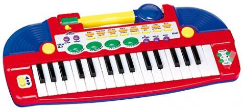

[//]: # (-*- mode: markdown; coding: utf-8 -*-)
# Piano de juguete

<figure style="float:right;padding:10px">
  
  <figcaption style="font-size:smaller;font-style:italic;text-align:center">
	Piano infantil como el que vamos a modificar.
  </figcaption>
</figure>

Vamos a analizar como caso de estudio un piano de juguete.  Supongamos
que tenemos un muchachito travieso que se ha subido en su piano de
juguete y ha estado saltando encima de él hasta que ha dejado de
sonar.  Estas cosas pasan, os lo aseguro, ya no hacen los pianos como
antes.  Supongamos que el muchachito está muy arrepentido y te pide
con su mejor cara de angelito que *le pongas pilas al piano*.  No vale
la pena explicarle que el problema es mayor, hay que hacer algo.
Armados con un destornillador y un poco de paciencia conseguimos
desmontarlo entero e identificamos el teclado de membrana que hay bajo
las teclas del piano.

<figure style="float:right;padding:10px">
<!--

-->
  
  <figcaption style="font-size:smaller;font-style:italic;text-align:center">
	Teclado de membrana bajo las teclas del piano.
  </figcaption>
</figure>

Las teclas están físicamente dispuestas como una línea pero
lógicamente dispuestas de forma matricial, como muestra la figura
adjunta.  Hay ocho columnas y tres filas.  Cuando se pulsa una de las
teclas se cortocircuita la columna correspondiente con la fila
correspondiente.  Es así de simple.

<figure style="float:right;padding:10px">
  
  <figcaption style="font-size:smaller;font-style:italic;text-align:center">
	Disposición matricial del teclado de membrana.
  </figcaption>
</figure>

Lo que vamos a hacer es eliminar el controlador actual del piano y
sustituirlo por una Raspberry Pi.  Lo ideal sería poner una Raspberry
Pi Zero, pero eso es un detalle menor, puesto que el diseño y el
software es exactamente igual con cualquier otro modelo actual.  Para
los altavoces podemos usar cualquier mecanismo utilizado en un
ordenador convencional.  A mi me gusta especialmente la idea de un
altavoz Bluetooth, que puede ser externo si queremos.  Se puede
conseguir uno resistente al agua por poco más de seis euros en
[Banggood.com](http://www.banggood.com/Mini-Waterproof-Wireless-Bluetooth-Speaker-For-iPad-iPhone-6-6-p-88071.html).

Bueno, ya tenemos el primer concepto, solo nos falta el software para
tener el prototipo. Hay dos cosas que debemos hacer:

* Detectar las pulsaciones de tecla evitando los rebotes típicos de
los teclados de membrana.

* Tocar notas correspondientes a cada tecla desde el momento que se
  aprieta hasta el momento que se libera.

La biblioteca *Reactor* tal y como la hemos explicado hasta ahora
implementa un tipo de entradas `input_handler` que vale perfectamente
para botones independientes.  Sin embargo con la disposición matricial
no es inmediato que funcione sin modificar nada.  Vamos a explicar
cómo enfrentaríamos este problema suponiendo que la biblioteca no lo
contempla.  Está claro que tenemos que hacer cambios en
`input_handler`, pero ¿cómo?

El otro problema, tocar notas, no es tan simple como parece a primera
vista.  No es cuestión de tocar un *mp3* correspondiente a cada nota y
listos. Podemos apretar varias notas a la vez y deberían sonar todas
simultáneamente.  Eso exige un proceso de síntesis de sonidos y
mezclado digital.

Todo se puede hacer, pero en este taller seguimos la filosofía KISS
(*Keep It Simple, Stupid*).  No vamos a trabajar en algo que ya está
resuelto, bastante trabajo tenemos con lo no resuelto.  Raspbian tiene
preinstalado [*Sonic-Pi*](http://sonic-pi.net), una fantástica
herramienta docente del propio Laboratorio de Computadores de la
Universidad de Cambridge, el mismo que hizo Raspberry Pi.  Nos basta
un simple
[tutorial](https://www.raspberrypi.org/learning/getting-started-with-sonic-pi/)
para ver que hace todo lo que necesitamos y muchísimo más.  Mejor, en
el futuro le añadiremos funcionalidad.

Solo falta ver cómo podemos usar *Sonic-Pi* desde nuestro programa.
Si hacemos una búsqueda rápida para encontrar una *command line
interface to sonic-pi* seguro que encontramos
[sonic-pi-cli](https://github.com/Widdershin/sonic-pi-cli).  Puede
valer, pero si miramos un poquito el código fuente veremos que en
realidad utiliza una conexión TCP al puerto 4557. Mmmm, osea que
Sonic-Pi ya tiene un protocolo para ser controlado de forma remota.
Fantástica idea, vamos a usar el `connector` de la biblioteca
*Reactor* para ésto.  Si exploramos un poco más el código de Sonic-Pi
parece que internamente utiliza otro programa que hace la síntesis de
sonido,
[*SuperCollider audio synthesis server*](http://supercollider.github.io/),
que resulta que tiene un ejecutable independiente llamado `scsynth`
con soporte de conexiones remotas UDP o TCP e incluso un cliente de
línea de órdenes llamado `sclang`.

Todos los elementos están claros, solo falta sentarse a diseñar el
pegamento:

* El servidor `scsynth` debe arrancarse previamente.  Podemos echar
  una ojeada al código de Sonic-Pi para ver qué opciones serían
  razonables.

* Nuestro programa debe explorar el teclado para detectar pulsaciones
  y levantamientos de tecla.

* Cuando se presiona una tecla debe comunicarse con `scsynth` para
  añadir a lo que ya se está tocando una nota más.

* Cuando se libera una tecla debe comunicarse con `scsynth` para
  quitar de lo que se esté tocando la nota correspondiente a esta
  tecla.

## Exploración del teclado

## Control remoto de SuperCollider

Es el momento de aprender algo sobre *SuperCollider* y de su control
remoto.  El control remoto utiliza una versión simplificada del
protocolo
[*Open Sound Control*](http://cnmat.berkeley.edu/user/adrian_freed/blog/2008/10/06/open_sound_control_1_1_specification).
Describiremos la versión TCP, que es la que vamos a usar.

* Todos los datos se codifican en *big-endian* (*network byte order*).

* Cada mensaje va precedido por un entero de 32 bits que contiene la
  longitud del mensaje. A continuación aparece una orden (*command*) o
  un paquete de órdenes (*bundle*).

* Cada orden (*command*) consiste en una cadena que representa la
  orden, seguida de una coma y una lista de letras que representan los
  tipos de los argumentos.  A continuación vendrían los valores de los
  argumentos en *big-endian*.

* Cada paquete de órdenes (*bundle*) empieza con la cadena `#bundle`
  (incluido el `'\0'` terminador de las cadenas C). A continuación una
  marca temporal de 64 bits y a continuación todas las órdenes
  incluidas en el paquete codificadas igual que en un mensaje normal
  (con la longitud precediendo a cada orden).

La lista completa de las órdenes soportadas está disponible en
[doc.sccode.org](http://doc.sccode.org/Reference/Server-Command-Reference.html).
Algunas órdenes reciben respuestas usando el mismo protocolo.

Básicamente el procedimiento puede extraerse de
[esta página](http://doc.sccode.org/Guides/ClientVsServer.html).  En
el momento en que se pulsa una tecla enviaremos una orden `/s_new` y
en el momento en que se libere la tecla enviaremos una orden
`/n_free`.  Previamente hay que configurar cada `SynthDef` o cargarlas
de un archivo externo.
