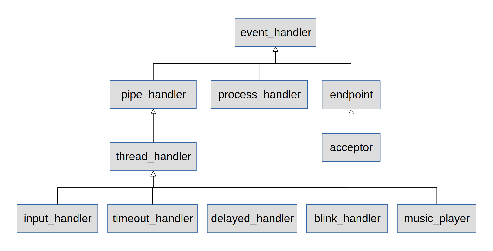

[//]: # (-*- markdown; coding: utf-8 -*-)

# La biblioteca `reactor`

Este capítulo tiene dos objetivos:

* Ofrecer unas pinceladas de los patrones de diseño que consideramos
  más importantes para el desarrollo con Raspberry Pi. Documentar
  brevemente los fundamentos y cómo se aplican.

* Proporcionar plantillas de aplicación totalmente funcionales y
  extensibles para aplicarlas en cualquier proyecto. En un capítulo
  posterior se desarrollarán en diversos casos de estudio, incluyendo
  la interacción a través de la red, la interacción con programas
  externos, etc.


## El patrón *reactor*

Uno de los mayores beneficios de utilizar programación orientada a
objetos es que nos abre la posibilidad de utilizar directamente la
mayor parte del catálogo de *patrones de diseño* disponibles en la
actualidad.  Un *patrón de diseño* es una solución de diseño bien
probada a un problema o conjuntos de problemas y suele describirse de
una manera semiformal en términos de objetos y relaciones entre ellos.
El primer libro publicado sobre este tema (se conoce popularmente como
*Gang of Four*, GOF) sigue siendo una referencia fundamental {{
"gamma95:_desig_patter" | cite }} pero ya no es la única.  Cabe
destacar la serie de volúmenes de *Pattern-Oriented Software
Architecture* (POSA)
{{ "buschmann96:_patter_orien_softw_archit_vol1" | cite }}
{{ "schmidt00:_patter_orien_softw_archit_vol2" | cite }}
{{ "kircher04:_patter_orien_softw_archit_vol3" | cite }}
{{ "buschmann07:_patter_orien_softw_archit_vol4" | cite }}
{{ "buschmann07:_patter_orien_softw_archit_vol5" | cite }}.

Para este taller es especialmente importante el patrón
[*reactor*](https://es.wikipedia.org/wiki/Reactor_(patr%C3%B3n_de_dise%C3%B1o))
que se encuentra descrito en el volumen 2 de POSA.  Se trata de un
patrón arquitectural, en el sentido de que determina la estructura de
la aplicación en términos de componentes y cómo se relacionan.  Nos
ayuda a organizar el programa cuando se trata de un *sistema
reactivo*.  Es decir, cuando el sistema responde lo más rápidamente
posible a *eventos* externos o internos.

Un sistema electrónico es muy frecuentemente un sistema reactivo.
Reacciona cuando se pulsan botones, o se detecta luz, o se detecta
proximidad, o se detecta humedad, o se recibe un flanco de la señal de
un *encoder*, o se activa un *final de carrera*, o se pulsa una tecla
del teclado, o se pulsa un botón del ratón, o se recibe un dato por la
red, ... Prácticamente todo lo que proporciona datos al sistema
(entradas) puede modelarse como fuentes de eventos.

Cualquier desarrollo progresará de forma incremental, primero con una
fuente de eventos, y luego otra, y luego otra.  No es infrecuente ver
programas que se convierten en un auténtico galimatías que es
imposible hacer funcionar.  La gama de aberraciones es muy amplia:

* Algunos utilizan un bucle infinito enorme, en el que se leen todas
  las entradas y se van haciendo cálculos parciales mezclados con el
  proceso de lectura de eventos.  Frecuentemente no es posible tener
  un resultado hasta que vengan otros eventos, así que se guardan
  valores en variables temporales para tratarlo en otras iteraciones
  del bucle.  La maraña de `if` encadenados se hace inmanejable.  El
  resultado es extremadamente difícil de seguir hasta para un experto.
  Solo pensar en añadir una nueva entrada produce escalofríos.

* Otros hacen todo en manejadores de interrupción. Al pulsar un botón
  se dispara un manejador de interrupcción que se utiliza directamente
  para cambiar el color de un LED.  Cuando el sistema es diminuto
  parece que funciona de maravilla.  Luego va creciendo y empiezan los
  problemas.  Primero fallos catastróficos inexplicables, que terminan
  en maldiciones contra los punteros de C.  Luego, cuando se es
  consciente de la necesidad de *async-safety* se empiezan a
  utilizar primitivas de sincronización y aparecen los interbloqueos.

No hay nada que podamos hacer para arreglar esto, la única solución
rentable a largo plazo es analizar el programa para ver cada requisito
funcional y volverlo a construir desde cero con una arquitectura
razonable.  Hay gente que no cree esto e invierte meses en intentar
depurar el software.

Incluso he llegado a ver casos en los que aparentemente se ha
conseguido que funcione, pero es una falacia, no es real. ¿Por qué?
Pues simplemente porque se equivoca el propósito del programa.  El
programa no está solo ni principalmente para ser ejecutado.  Está
fundamentalmente para ser leído y modificado.  Por eso usamos un
lenguaje de alto nivel.  La vida del programa no acaba cuando se
ejecuta.

Una arquitectura incorrecta pone una losa en la espalda de todos los
que tengan que modificar el programa en el futuro.  Es peor que no
hacer nada, es comprometer gasto en el futuro.  La productividad de
estos programadores habría que contabilizarla como un número negativo.

El patrón *reactor* no es la única arquitectura posible, pero es
probablemente la más apropiada para el tipo de sistemas de este
taller.  Consiste en asociar cada tipo de eventos con un objeto
manejador (`event_handler`).  El manejador tiene un método para
consumir los eventos pendientes de ese tipo (`handle`).  Por otro lado
hay un objeto `reactor` que encapsula todo lo que tiene que ver con la
demultiplexación de eventos (*dispatching*).  Cuando ocurre cierto
evento busca al manejador correspondiente para invocar su método
`handle_events`.

En el taller utilizaremos una implementación propia de este patrón que
se incluye en la carpeta `reactor`.  Incluye numerosas
implementaciones de diferentes `event_handler` para eventos de
interés.  Tómate tu tiempo para analizarlos en detalle.

Cada vez que incorporemos una nueva fuente de eventos es necesario
crear un manejador de eventos asociado y registrarlo en el `reactor`.
También puede considerarse el tiempo como una fuente de eventos que se
tratan con diversos manejadores especializados.

El `reactor` tiene un método `reactor_run` que implementa el
denominado *bucle de eventos*.  Es el bucle en el que se detecta si
hay eventos disponibles y en caso de que los hubiera se *despachan*
usando su manejador correspondiente.

Vamos a hacer un breve recorrido por los manejadores de eventos
incluídos en la biblioteca `reactor` del taller.

<figure style="float:right; padding:10px">
  

  <figcaption style="font-size:smaller; font-style:italic">
  <div style="width:90%">
  Jerarquía de manejadores incluidos actualmente en la biblioteca
  <em>reactor</em>.
  </div>
  </figcaption>
</figure>


## Eventos de teclado

El teclado en C suele leerse con funciones como `getchar`.  Pero ésta,
como todas las demás funciones de `stdio`, no produce un valor
inmediatemente cuando se pulsa una tecla. Se puede pulsar toda una
secuencia de teclas pero hasta que no se presione la tecla *Intro* no
se recibirá ni una sola pulsación.

Este modo de funcionamiento está pensado para aliviar la carga de
trabajo en el modo habitual de uso, para editar textos u órdenes.  Los
programas solo reciben información cuando tienen algo significativo
que hacer.

Las funciones de `stdio` utilizan siempre objetos de tipo `FILE`.
Incluso cuando no se indica (`printf`, `scanf`) trabajan con variables
`FILE` globales (`stdout`, `stdin`).  Estos objetos incorporan
*arrays* que actúan como *buffers* de la entrada.  Retienen los
caracteres leídos hasta que se disponga de suficiente información.
Evidentemente con `FILE` nunca vamos a conseguir una respuesta
inmediata al pulsar una tecla.

Tenemos que mirar por tanto a la interfaz del *sistema operativo*, lo
que usa `stdio` en su implementación.  Y aquí estamos de enhorabuena,
porque GNU replica el modelo de Unix que se caracteriza por su
simplicidad.

* En Unix todo son archivos o dispositivos que se comportan como
  archivos (teclado, ratón, terminales, puertos serie, discos,
  micrófono, red, gráficos, etc.)

* Todos los archivos y dispositivos se manejan con cuatro operaciones
  básicas: `open`, `read`, `write`, `close` y excepcionalmente con una
  quinta `ioctl`.

* Para usar un archivo o dispositivo debe abrirse con `open`.  A
  partir de entonces se obtiene un entero (*descriptor de archivo*)
  que representa el archivo en todas las demás llamadas.

* En todos los programas la entrada estándar está disponible como un
  archivo ya abierto con el *descriptor de archivo* 0.  Análogamente
  la salida estándar y la salida de error estándar están disponibles
  en los descriptores 1 y 2 respectivamente.

Esta uniformidad de Unix es lo que explota nuestra implementación del
*reactor* para que la demultiplexión de eventos sea siempre de
archivos Unix.  Ya veremos qué hacer cuando no hay tales archivos
(e.g. GPIO).

Visto esto parece que lo único que tenemos que hacer es leer del
descriptor 0 usando `read`.  Pero si lo intentamos veremos que sigue
sin recibirse las teclas hasta que se pulse *Intro*.  El motivo es que
el dispositivo está configurado para que solo interrumpa al procesador
si tiene pendientes cierto número de caracteres, o si ha pasado cierto
tiempo desde la última interrupción, o si se ha pulsado *Intro*.

En los archivos `console.h` y `console.c` de la biblioteca `reactor`
te proporcionamos un par de funciones `console_set_raw_mode` y
`console_restore`.  La primera permite la realimentación inmediata del
teclado, configurando los parámetros adecuados y devuelve un *puntero
opaco* con información de la configuración previa.  La segunda permite
restaurar la configuración previa. Veamos un ejemplo de uso en
combinación con el `reactor`.

Siguiendo el patrón *reactor* encapsulamos la interacción con
cualquier fuente de eventos como un *event handler*:

```
#include <reactor/reactor.h>

static void keyboard(event_handler* ev);

event_handler* keyboard_handler_new() {
    return event_handler_new(0, keyboard);
}

static void keyboard(event_handler* ev) {
    char buf[1];
    if (read(ev->fd, buf, 1) < 0 || buf[0] == 'q')
        reactor_quit(ev->r);
    printf("Pulsado %c\n", buf[0]);
}
```

Este manejador de ejemplo utiliza al `reactor` porque invoca a su
método `reactor_quit` (salir del bucle de eventos del *reactor*)
cuando detecta una condición de terminación.  Para ello utiliza uno de
los atributos del *event handler*.  Fíjate en la llamada a
`event_handler_new`.  Delegamos en `event_handler` todo lo que podemos
y le pasamos el descriptor de archivo 0 y la función de manejo de
eventos.  El descriptor 0 corresponde a la entrada estándar.

El programa principal es sencillo:

```
#include <reactor/reactor.h>
#include <reactor/console.h>

int main()
{
    void* state = console_set_raw_mode(0);
    reactor* r = reactor_new();
    reactor_add(r, keyboard_handler_new());
    reactor_run(r);
    console_restore(0, state);
	return 0;
}
```

Primero ponemos la entrada estándar (descriptor 0) en modo *raw* para
tener respuesta inmediata de las pulsaciones de tecla. Luego
construimos el *reactor* y todos sus manejadores de eventos (en este
caso solo el del teclado).  Registramos los manejadores en el
*reactor* y entramos en el bucle de eventos (`reactor_run`).  Una vez
terminado el programa dejamos la consola en el estado normal.

Algunos de vosotros estaréis pensando que esto es matar moscas a
cañonazos, que es mucho más simple un bucle sin más, sin reactor ni
manejadores.  Algo de este estilo:

```
int main()
{
    void* state = console_set_raw_mode(0);
    for(;;) {
        char buf[1];
        if (read(0, buf, 1) < 0 || buf[0] == 'q')
            break;
        printf("Pulsado %c\n", buf[0]);
    }
    console_restore(0, state);
}
```

Funciona exactamente igual, es mucho más corto y hasta se entiende
mejor. ¿Por qué complicarlo?  Pues porque la vida es compleja, no es
así de simple.  No hay una fuente de eventos, hay decenas.  No hay que
procesar un evento, sino varios.  No son eventos independientes, sino
relacionados, hay eventos periódicos, hay fuentes que aparecen y
desaparecen, etc.  Te proponemos un ejercicio, empieza con este
ejemplo y sigue con él haciendo en paralelo todos los ejemplos que te
mostramos.  Después si lo consigues comparamos.

Si te frustra escribir tanto cambia de lenguaje.  El problema no está
en el programa, sino en el lenguaje, que es demasiado primitivo.  Usa
C++ o Python.


## Eventos en una entrada digital

Las patas de GPIO configuradas como entradas son una fuente frecuente
de eventos para el sistema.  De hecho en un sistema empotrado será
mucho más frecuente que eventos de un teclado USB.  Los teclados de
los sistemas empotrados se implementan frecuentemente con patas de
GPIO.

Para tratar estos eventos en cualquier conjunto de entradas incluimos
el `input_handler`.  Se configuran automáticamente como entradas con
*pull down* y se detectan tanto las transiciones de nivel bajo a alto
(*press*) como de nivel alto a bajo (*release*).

```
#include <reactor/reactor.h>
#include <reactor/input_handler.h>
#include <wiringPi.h>
#include <stdio.h>

static void press(input_handler* ev, int key) { printf("Press %d\n", key); }
static void release(input_handler* ev, int key) { printf("Release %d\n", key); }

int main()
{
    int buttons[] = { 18, 23, 24, 25 };

    wiringPiSetupGpio();
    reactor* r = reactor_new();
    reactor_add(r, (event_handler*) input_handler_new(buttons, 4,
						      press, release));
    reactor_run(r);
}
```

Este ejemplo muestra cómo configuraríamos un conjunto de cuatro
botones en la Raspberry Pi. Se detectarían tanto las pulsaciones como
las liberaciones de cada botón.


## Eventos disparados por tiempo

Además de los eventos que ocurren en el entorno, hay otra magnitud de
importancia capital en los sistemas reactivos, el tiempo.  Hay
multitud de características que dependen del tiempo.  Por ejemplo, un
simple LED puede parpadear durante unos segundos.  Esto exige contar
el tiempo en que el LED se enciende o se apaga y también el tiempo
total de parpadeo.

### Eventos periódicos

Nuestra implementación del *reactor* implementa *periodic handlers*.
Un *periodic handler* crea un nuevo hilo que va generando eventos cada
cierto número de milisegundos en un descriptor especial denominado
*pipe* (tubería).  Realmente los detalles no es necesario conocerlos,
pero conviene saber que aunque aparentemente el tiempo no está
relacionado con un archivo nuestra implementación lo traduce a eventos
en un archivo especial.

Usar *periodic handlers* es igual de sencillo que cualquier otro:

```
#include <reactor/reactor.h>
#include <reactor/periodic_handler.h>
#include <stdio.h>

void handler(event_handler* ev)
{
    puts("Tick");
}

int main()
{
    reactor* r = reactor_new();
    reactor_add(r, (event_handler*)periodic_handler_new(1000, handler));
    reactor_run(r);
    return 0;
}
```

Este ejemplo imprime un mensaje cada 1000 milisegundos, es decir, cada
segundo. El tiempo no es absolutamente preciso.  En GNU/Linux no es posible 

Los manejadores de eventos se desinstalan automáticamente cuando
ocurre una excepción, así que si queremos ejecutar un evento cierto
número de veces podemos hacerlo contando el número de disparos.

```
void handler(event_handler* ev)
{
    static int i = 0;
	puts("Tick");
    if (++i >= 5)
	    Throw Exception(0,"");
}

int main()
{
    reactor* r = reactor_new();
    reactor_add(r, (event_handler*)periodic_handler_new(100, handler));
    reactor_run(r);
    return 0;
}
```

> **Warning**
> Este ejemplo dispara el periodic cinco veces. ¿Qué pasaría si pasado
> cierto tiempo añadimos otra vez al reactor otro *periodic handler*
> igual?  ¿Funcionaría?  Propón una solución y discútela con tus
> compañeros.

### Eventos retardados

Otro tipo de eventos disparados por tiempo es el caso de los eventos
retardados.  Por ejemplo, pasado cierto tiempo si no se cumple cierta
condición salir del programa.

```
#include <reactor/reactor.h>
#include <reactor/delayed_handler.h>

void timeout(event_handler* ev)
{
    if (condicion_de_salida(ev))
        reactor_quit(ev->r);
}

int main()
{
    reactor* r = reactor_new();
    ...
    reactor_add(r, (event_handler*) delayed_handler_new(1500, timeout));
    reactor_run(r);
}
```

Un `delayed_handler` precisamente hace esto.  Espera cierto tiempo de
milisegundos antes de invocar el manejador.  Una vez invocado se
desinstala automáticamente.

### Parpadeo de un LED

Un caso de evento temporal que es muy frecuente en un sistema
empotrado es el de hacer parpadear un LED cierto número de veces.
Esto se consigue con un manejador especial denominado `blink_handler`.
Se indica el pin donde se conecta, el número de milisegundos que debe
permanecer en cada estado (encendido o apagado) y el número de
parpadeos (ciclos encendido/apagado) que debe realizar.  Se encarga
automáticamente de configurar como salida el pin y de destruir el
manejador una vez terminada la secuencia.

```
#include <reactor/reactor.h>
#include <reactor/blink_handler.h>
#include <wiringPi.h>

int main()
{
    wiringPiSetupGpio();
    reactor* r = reactor_new();
    reactor_add(r, (event_handler*) blink_handler_new(18, 200, 5));
    reactor_run(r);
}
```

En este caso el LED conectado a la pata GPIO18 parpadeará 5 veces con
un periodo de 400ms (200ms encendido y 200ms apagado).


## Programación en red (patrón *acceptor-connector*)

Ya hemos visto la interfaz de programación *socket* que ofrece
GNU/Linux para programar comunicaciones en red.  Solo nos falta
organizarlo de manera razonable.  Hemos visto que en las
comunicaciones se pueden identificar dos roles, el rol del *servidor*
y el rol del *cliente*.  El rol del *servidor* es pasivo, espera hasta
que ocurra un evento (la conexión) y entonces reacciona.

Acceptor-Connector es un patrón de diseño propuesto por Douglas
C. Schmidt {{ "schmidt97:_accep" | cite }} y utilizado extensivamente
en ACE (*Adaptive Communications Engine*), su biblioteca de
comunicaciones.  Se ocupa de la primera parte de la comunicación,
desacopla el establecimiento de conexión y la inicialización del
servicio del procesamiento que se realiza una vez que el servicio está
inicializado.  Para ello intervienen tres componentes: *acceptor*,
*connector* y manejadores de servicio o *service handlers*.  Un
*connector* representa el rol activo, y solicita una conexión a un
*acceptor*, que representa el rol pasivo. Cuando la conexión se
establece ambos crean un manejador de servicio que procesa los datos
intercambiados en la conexión.

Veamos un ejemplo sencillo, un servidor de *echo*.  Se trata de un
programa que devuelve lo mismo que se le envía por cualquier conexión.

```
#include <reactor/reactor.h>
#include <reactor/socket_handler.h>

void handle_echo(event_handler* ev)
{
    char buf[128];
    int n = event_handler_recv(ev, buf, sizeof(buf));
    event_handler_send(ev, buf, n);
}

int main()
{
    reactor* r = reactor_new();
    reactor_add(r, (event_handler*)acceptor_new ("10000", handle_echo));
    reactor_run(r);
    return 0;
}
```

El `acceptor` se encargará de llamar a *listen* y *accept* cuando sea
preciso.  En el momento en que se establezca una nueva conexión se
creará un `event_handler` que actúa de *service handler* con el
*socket* esclavo y con la función de procesamiento que se le indica.
En este caso escucha en el puerto TCP 10000.

El `conector` es similar, salvo por el hecho de que en el constructor
establece la conexión con el otro extremo.  Si éste no está disponible
se elevará una excepción.  Si solo se pretende usarlo para enviar
datos al servidor ni siquiera es necesario añadirlo al *reactor*.

```
#include <reactor/reactor.h>
#include <reactor/socket_handler.h>

void handler(event_handler* ev)
{
    char buf[128];
    int n = event_handler_recv(ev, buf, sizeof(buf));
    buf[n] = '\0';
    printf("Got: %s\n", buf);
}

int main()
{
    reactor* r = reactor_new();
    connector* c = connector_new("localhost", "10000", handler);
    reactor_add(r, (event_handler*)c);
    connector c_aux = *c;
    
    void producer(event_handler* ev)
    {
	    static int i;
		char buf[128];
		snprintf(buf, 128, "Prueba %d", i++);
		connector_send(&c_aux, buf, strlen(buf));
    }

    reactor_add(r, (event_handler*)periodic_handler_new(1000, producer));
    reactor_run(r);
    return 0;
}
```

El `connector` crea el *event handler* para atender la conexión.
Podemos usarlo directamente con `connector_send` y `connector_recv` o
bien añadirlo a un `reactor` para responder de forma automática.  En
este ejemplo creamos un evento periódico que envía por el conector un
mensaje distinto cada vez y añadimos el `connector` al *reactor* para
recibir el mensaje de eco del servidor anterior.

Nota que el evento periódico no usa el puntero al conector
directamente.  En su lugar hace una copia de todo el objeto y usa esa
copia.  El motivo es simple, la memoria del objeto conector puede ser
liberada en cualquier momento (por ejemplo, si se pierde la conexión).
En ese caso ese espacio de memoria será ocupado por otros objetos y el
campo correspondiente al descriptor de archivo (el socket en este
caso) podría ser alterado.  El evento periódico necesita enviar al
descriptor correcto, aunque haya sido cerrado por un problema de
comunicaciones.  Si está cerrado se elevará una excepción y el evento
periódico también se desinstalará automáticamente, como cabría
esperar.

Los sistemas en los que un componente actúa fundamentalmente con el
rol de servidor, mientras que los otros componentes actúan como
clientes siguen la *arquitectura cliente-servidor*.  Es la típica en
la *World-Wide-Web*.

Otras aplicaciones no tienen una división tan marcada.  En un momento
dado una aplicación que normalmente se comporta como servidora puede
comportarse como cliente y al revés.  Este tipo de sistemas en que
todos los componentes toman rol de cliente o de servidor
indistintamente se denominan arquitecturas *peer-to-peer*.

## Un *music player* como manejador

Un sistema electrónico puede necesitar emitir sonidos. Con la
Raspberry Pi, y especialmente con las últimas versiones, tenemos
capacidades de sonido bastante sofisticadas y sería una pena si nos
quedamos en simples *beeps*.

Actualmente la forma más habitual de guardar sonido o música de
calidad es emplear el formato MP3, que es relativamente complejo.
Pero no hay necesidad de decodificar los archivos en nuestros
programas.  Tenemos decenas de programas que hacen precisamente eso.
Solo hay que usarlos, desde nuestros propios programas.

Una forma de usar otro programa desde nuestro programa es emplear un
manejador especial denominado `process_handler`.  Hablaremos de esto
más adelante.  Otra forma es utilizar un manejador a medida para
controlarlo.  Es este último método el que ilustra el `music_player`
de la biblioteca *reactor*.  Se trata de un manejador de eventos que
funciona como un *music player* empleando para ello el programa
`mpg123`.  Para no interferir en el hilo principal la mayor parte del
trabajo se deja en un hilo auxiliar que se encarga de ejecutar
`mpg123` cuando es necesario, pero todo eso es invisible para el
usuario.  Veamos un ejemplo:

```
#include <reactor/reactor.h>
#include <reactor/console.h>
#include <reactor/music_player.h>
#include <unistd.h>

static int read_key(int fd);

int main(int argc, char* argv[])
{
    const char* carpeta = "/usr/share/scratch/Media/Sounds/Music Loops";
    void* state = console_set_raw_mode(0);
    reactor* r = reactor_new();
    music_player* mp = music_player_new(carpeta);

    void keyboard(event_handler* ev) {
        int key = read_key(ev->fd);
        if ('q' == key)
            reactor_quit(r);
        else if (' ' == key)
            music_player_stop(mp);
        else if (key >= '0' && key <= '9')
            music_player_play(mp, key - '0');
    }

    reactor_add(r, (event_handler*)mp);
    reactor_add(r, event_handler_new(0, keyboard));
    reactor_run(r);
    reactor_destroy(r);
    console_restore(0, state);
}

static int read_key(int fd)
{
    char buf[2];
    if (0 < read(fd, buf, 1))
        return buf[0];
    return -1;
}
```

En este ejemplo combinamos un manejador para el teclado con un
manejador `music_player`.  Al pulsar alguno de los números de 0 a 9
interrumpirá la canción en curso y sonará la canción correspondiente,
al pulsar espacio parará y al pulsar `q` saldrá del programa.

> **Info**
> Debes acostumbrarte a combinar manejadores.  Te proponemos el
> siguiente ejercicio: construir un *music player* tipo iPod con la
> Raspberry Pi.  Usa botones para ir a la siguiente canción o la
> anterior, pausar, etc.  Se trata de combinar un `input_handler` con
> el `music_player`.

## Otros manejadores

La biblioteca *reactor* evoluciona. Examina el código porque muy
probablemente verás manejadores nuevos que no hemos descrito.
Experimenta con ellos y no tengas miedo de definir tus propios
manejadores cada vez que surja una necesidad.  

En esta sección describiremos algunos manejadores incluídos en
*reactor* que no están pensados para ser usados por el usuario final,
sino por otros manejadores.

### *Pipe handler*

Cuando queremos traducir eventos de otro tipo para que sean
demultiplexados por el *reactor* se puede utilizar un `pipe_handler`.
Una *pipe* es un objeto especial del sistema operativo que relaciona
una pareja de descriptores de archivo.  Todo lo que se escribe en un
descriptor (el extremo de escritura) se puede leer por el otro
(extremo de lectura).

Por ejemplo, imagina que quieres traducir determinadas interrupciones
en eventos del *reactor*.  Basta escribir desde la propia rutina de
servicio a interrupción con `pipe_handler_write`.  Si estás en un hilo
que no tiene contexto de excepciones propio te interesará utilizar en
su lugar `pipe_handler_write_ne`, que no eleva excepciones sino que
devuelve un código de error.

Otro ejemplo podría ser un dispositivo I2C o SPI.  Puede que el
dispositivo interrumpa directamente o puede que haya que hacer
consultas periódicas.  En cualquier caso el mecanismo para detectar
los eventos es distinto a un archivo Unix, por lo que necesitaremos un
`pipe_handler` para adaptar.

Muchos de los manejadores que hemos visto están hechos con un
`pipe_handler`.  Los `input_handler`, `music_handler`,
`timeout_handler`, `delayed_handler` o `blink_handler` son ejemplos de
manejadores basados en `pipe_handler`.

### *Thread handler*

En muchas ocasiones un `pipe_handler` necesita de la cooperación de un
hilo de ejecución independiente, que muestrea el dispositivo o realiza
algún otro tipo de acción para traducir eventos como el tiempo a
escrituras en una *pipe*.

Manejar hilos distintos no es complicado pero tiene sus detalles,
especialmente en cuanto a la terminación de hilos que no se comportan
adecuadamente.  Para simplificarlo se proporciona un `thread_handler`
que deriva de `pipe_handler`.  Todos los manejadores que actualmente
derivan de `pipe_handler` son también `thread_handler`.  Esto parece
sugerir que `pipe_handler` no es realmente necesaria.  Sin embargo
creemos que es interesante para cualquier manejador que traduce
directamente interrupciones a eventos del *reactor*.

Te preguntarás entonces por qué no lo hemos utilizado.  La respuesta
tiene que ver con la biblioteca *wiringPi*.  Esta biblioteca tiene
soporte de detección de cambios en una entrada digital mediante
interrupciones.  Sin embargo la API es demasiado primitiva, no hay
forma de discriminar la pata que ha generado la interrupción a menos
que se utilicen distintas rutinas de servicio para cada pata.  De
momento eso implica que necesitamos implementar un mecanismo de
barrido aún cuando se activen las interrupciones.  Es algo que
probablemente cambiará con el tiempo.

Veamos un ejemplo sencillo de `thread_handler`:

```
#include <reactor/reactor.h>
#include <reactor/thread_handler.h>
#include <stdio.h>
#include <stdlib.h>
#include <unistd.h>
#include <time.h>
#include <errno.h>
    
static void* productor(thread_handler* h) {
    struct timespec t = { .tv_sec = 0, .tv_nsec = 500000000 };
    for(int i = 1; !h->cancel; ++i) {
    	pipe_handler_write_ne(&h->parent, &i, sizeof(i));
	    nanosleep(&t, NULL);
    }
    return NULL;
}

static void consumidor(event_handler* ev)
{
    int n;
	pipe_handler_read((pipe_handler*)ev, &n, sizeof(n));
    printf("Got %d\n", n);
    if (n > 9)
    	reactor_quit(ev->r);
}

int main()
{
    reactor* r = reactor_new();
    thread_handler* p = thread_handler_new(consumidor, productor);
    reactor_add(r, (event_handler*)p);
    reactor_run(r);
    reactor_destroy(r);
}
```

Para evitar problemas los argumentos del constructor son de tipo
diferente.  El primer argumento es una función de manejo de eventos
normal, porque está previsto que se use como cualquier otro manejador.
La segunda es el hilo por lo que tiene una signatura ligeramente
diferente, compatible con la que corresponde en las funciones de
creación de hilos del sistema operativo.

### *Process handler*

Los programas con hilos son relativamente complejos de depurar porque
un comportamiento inadecuado en un hilo puede afectar al
comportamiento del resto de los hilos.  Es muy recomendable para los
programadores noveles reducir el uso de múltiples hilos a casos
relativamente simples y con escasa interacción entre hilos.  El
`thread_handler` al estar basado sobre el `pipe_handler` implementa un
mecanismo de comunicación completamente ajeno a los problemas de
sincronización entre hilos, por lo que los hilos pueden ser
prácticamente independientes.

Cuando el trabajo se complica también aparecen nuevas necesidades de
sincronización y con ello es frecuente que aparezcan problemas de
interbloqueo y *condiciones de carrera*.  Depurar este tipo de
problemas puede llegar a ser extremadamente complejo.

Cuando la funcionalidad de los hilos es compleja puede que interese
desacoplar el sistema en procesos independientes que interactúan
mediante procedimientos de comunicación de bajo acoplamiento (pipes,
memoria compartida, archivos, etc.).  Los procesos garantizan un mayor
nivel de aislamiento que los hilos y esto contribuye a que sean más
fáciles de depurar.

Un ejemplo de esta aproximación es Google Chrome.  Cada pestaña del
navegador se ejecuta como un proceso independiente por lo que un
posible fallo en una pestaña no puede afectar a las demás.  Google
prima de esta forma la estabilidad frente a la eficiencia.

Otra razón para usar procesos en lugar de hilos es la necesidad de
interactuar con programas externos.  En ese caso las llamadas al
sistema para la ejecución de programas reemplazarán por completo el
proceso actual, por lo que no cabe plantear la opción de los hilos.

La biblioteca *reactor* proporciona un `process_handler` similar al
`thread_handler` pero con dos pipes configuradas para la comunicación
bidireccional entre ambos procesos.  Ambos procesos verán un
`process_handler` diferente y configurado para hablar con el otro
extremo.  Tienen el atributo `fd` para leer datos provenientes del
otro extremo y un nuevo atributo `out` para enviar datos al otro
extremo.  Cada extremo es libre de añadir su vista del
`process_handler` a un `reactor` o directamente ejecutar un programa
externo.  Veamos un ejemplo:

```
#include <reactor/reactor.h>
#include <reactor/process_handler.h>
#include <reactor/delayed_handler.h>
#include <stdio.h>
#include <stdlib.h>
#include <unistd.h>

void parent (event_handler* ev) {
    process_handler* h = (process_handler*) ev;
    char buf[128];
    int n = read(ev->fd, buf, sizeof(buf));
    if (n > 0)
        printf("Padre: %s\n", buf);
    write(h->out, "padre", 6);
}

void child (event_handler* ev) {
    process_handler* h = (process_handler*) ev;
    char buf[128];
    int n = read(ev->fd, buf, sizeof(buf));
    if (n > 0)
        printf("Hijo: %s\n", buf);
    write(h->out, "hijo", 5);
}

void quit(event_handler* ev) { reactor_quit(ev->r); }

int main() {
    reactor* r  = reactor_new();
    process_handler* h = process_handler_new(parent, child);
    process_handler_stay_forever_on_child(h);
    reactor_add(r, &h->parent);
    reactor_add(r, (event_handler*)delayed_handler_new(1000, quit));
    write(h->out, "main", 5);
    reactor_run(r);
    reactor_destroy(r);
}
```

En este ejemplo disponemos de dos procesos (padre e hijo) que
simplemente envían al otro extremo un mensaje de identificación de sí
mismos cuando reciben algo previamente.  Para iniciar el intercambio
de mensajes desde el programa principal enviamos un mensaje al proceso
padre.

Nota que inmediatamente después de crear el `process_handler` llamamos
a `process_handler_stay_forever_on_child`.  Se trata de una función
que configura un reactor con un único manejador, el `process_handler`
del hijo, y se queda en el bucle de eventos de este reactor hasta el
final del programa. Es muy habitual este patrón, por lo que se
proporciona una función para implementarlo.  El proceso padre no hace
nada al invocarla.

## Compilar con *reactor*

Por defecto actualmente la biblioteca *reactor* se compila como una
biblioteca estática `libreactor.a`.  Para poder compilar programas que
la usan solo hay que añadir las siguientes banderas al `makefile`:

```
REACTOR=/home/pi/git/rpi-src/c/reactor
CFLAGS=-pthread -ggdb -I$(REACTOR)
LDFLAGS=-pthread -L$(REACTOR)/reactor
LDLIBS=-lreactor -lwiringPi -lpthread
```

La variable `REACTOR` tiene la ruta relativa o absoluta donde está
instalado reactor.  Ajusta su valos si la cambias.  El compilador
necesita utilizar la bandera `-pthread` para generar correctamente el
código de los hilos y la bandera `-I$(REACTOR)` para encontrar los
archivos de cabecera.  El montador también necesita la bandera
`-pthread` para construir correctamente ejecutables con hilos y
`-L$(REACTOR)/reactor` para encontrar la biblioteca estática.
Finalmente añadimos las bibliotecas que utiliza (*reactor*, *wiringPi*
y la biblioteca de manejo de hilos *pthread*).

Todos los ejemplos del taller vienen con un `makefile` completamente
funcional pero deliberadamente simple.  Analízalos en detalle.
