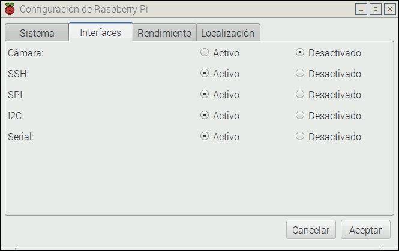

[//]: # (-*- mode: markdown; coding: utf-8 -*-)

# Uso de SPI

SPI es un protocolo alternativo a I2C que utilizan algunos
dispositivos. Hoy en día es frecuente encontrar dispositivos que
implementan tanto I2C como SPI y en ese caso probablemente es mejor
decantarse por I2C porque utiliza menos pines.

<figure style="float:right;padding:10px">
  
  <figcaption style="font-size:smaller;font-style:italic;text-align:center">
    Activación de interfaces en la aplicación de configuración.
  </figcaption>
</figure>

Al igual que con I2C, el primer paso para realizar programas que
utilizan la interfaz SPI es activarlo con la aplicación de
configuración de la Raspberry Pi, en la pestaña *Interfaces*.
Recuerda que hay que reiniciar la *Raspberry Pi* para que el cambio
surta efecto.

La programación es sencilla en cuanto que solo utiliza dos funciones,
pero puede ser realmente enrevesada de entender la comunicación con
algunos dispositivos SPI.  El motivo es que en SPI para poder leer
datos hay que escribir datos, de hecho se lee a la vez que se escribe.
Esto hace que en los dispositivos reales haya que hacer muchas
transacciones que se descartan por completo.

Este ejemplo escribe en una memoria EEPROM 25LC010A de Microchip.

``` C
#include <stdio.h>
#include <wiringPiSPI.h>
#include "25LC010A.h"

int main (void) {
    wiringPiSPISetup(0, 10000000);

    char enable = _25LC010_WREN;
    wiringPiSPIDataRW (0, &enable, 1);

    char cmd[] = {
      _25LC010_WRITE, 0,
      1, 2, 3, 4, 5
    };
    wiringPiSPIDataRW (0, cmd, sizeof(cmd));

    return 0;
}
```

La función `wiringPiSPISetup` inicializa la comunicación para el canal
0 a 10Mz. Hay dos canales disponibles (0 y 1) que utilizan las mismas
patas salvo la de selección `SPI_CE0` y `SPI_CE1` respectivamente.

Las llamadas a `wiringPiSPIDataRW` realizan una transacción SPI
donde se escribe y se lee de manera concurrente un conjunto de bytes.
El significado preciso de lo que se lee y se escribe depende del
dispositivo y en algunos casos puede requerir descartar parte o toda
la información.  En este caso el primer byte es la orden y a
continuación se envían los argumentos.

Pueden consultarse más detalles en el artículo de Gordon Henderson
disponible en [projects.drogon.net](https://projects.drogon.net/understanding-spi-on-the-raspberry-pi/).

## Medir tiempos de forma precisa

La medición del tiempo de descarga de un condensador se ha propuesto
como técnica para
[medir magnitudes analógicas usando las entradas digitales](https://learn.adafruit.com/basic-resistor-sensor-reading-on-raspberry-pi/overview)
de la Raspberry Pi.  La propuesta de Adafruit utiliza el número de
iteraciones de un bucle para medir el tiempo.  Como ellos mismos
reconocen esto no es muy preciso.

Raspbian es un sistema de tiempo compartido. La Raspberry Pi ejecuta
varios programas a la vez y esto implica que el procesador puede
[desalojar](https://en.wikipedia.org/wiki/Preemption_(computing))
nuestro programa para ejecutar otro programa. En ese caso el número de
iteraciones del bucle será sensiblemente menor de lo normal. Pero,
¿cómo sabemos si ha habido desalojo? La triste realidad es que un
programa de usuario no puede saberlo, no tiene control sobre esto.  Ni
siquiera es ésta la única causa de incertidumbre, puede haber
interferencia de los manejadores de interrupción, de los manejadores
de dispositivo, etc.

Pero hay una forma de medir el tiempo con bastante precisión, usando
la pata MISO de la interfaz SPI y una pata de salida digital.

Supongamos que tenemos un dispositivo sensor cuya medida se
materializa en el valor de una resistencia.  Puede tratarse de una
LDR, como en el caso del artículo de Adafruit, o de un simple
potenciómetro, o un termistor, o un sensor piezoresistivo, o un sensor
magnetorresistivo, ...  Construimos un circuito RC similar a la
figura.

<figure style="float:right; padding:10px">
  
  <figcaption style="font-size:smaller; font-style:italic">
  <div style="width:350px">
	Montaje para la medición precisa de una resistencia.
  </div>
  </figcaption>
</figure>


Descargamos el condensador poniendo la pata GPIO22 a nivel bajo
durante un tiempo suficiente.  Configuramos la pata GPIO22 como
entrada para que quede en alta impedancia y empezamos una
transferencia SPI de gran tamaño.  El buffer debe estar lleno de ceros
hasta que la carga del condensador es suficiente para poder ser
interpretada como un 1. El primer byte distinto de cero marca el
instante de tiempo en que el condensador está razonablemente
cargado. Este tiempo es proporcional a RC y por tanto a R.  Se puede
realizar un calibrado para medir con precisión absoluta, pero en
cualquier caso tenemos una medida precisa que nos permite comparar.

El código es sumamente sencillo:

``` C
#include <stdio.h>
#include <stdlib.h>
#include <unistd.h>
#include <wiringPi.h>
#include <wiringPiSPI.h>

enum {
    BUF_SIZE = 4096,
    DISCHARGE = 22
};

int main (void) {
    wiringPiSPISetup(0, 500000);

    char* buf = malloc(BUF_SIZE);

    wiringPiSetupGpio();
    pinMode(DISCHARGE, OUTPUT);
    digitalWrite(DISCHARGE, 0);
    sleep(1);
    pinMode(DISCHARGE, INPUT);

    wiringPiSPIDataRW (0, buf, BUF_SIZE);
    for (int i = 0; i < BUF_SIZE; ++i)
        if (buf[i] != 0) {
            printf("%d %02x\n", i, buf[i]);
            break;
        }
    free(buf);
    return 0;
}
```

El programa imprime la posición del buffer donde la entrada empieza a
ser distinta de cero y el primer valor distinto de cero. Esa posición
habría que multiplicarla por 8 para traducirla a ciclos de SCLK y
podría ajustarse con el valor para obtener el número exacto de ciclos.

La precisión depende del periodo de reloj empleado.  En el ejemplo
hemos empleado un reloj de 500KHz, pero puede subirse hasta 32MHz con
seguridad.  El problema es que a mayor reloj, mayor es el buffer que
tenemos que usar en la transferencia SPI.

Para buffers mayores de 4KB hay que especificarlo en la carga del
módulo del kernel para SPI (driver SPI).  Si se usa carga manual con
wiringPi la orden para ampliar el buffer a 256KB sería:

en /boot/cmdline.txt spidev.bufsiz=262144

```
gpio load spi 256
```

Puede mejorarse el código haciendo búsqueda por bisección. Es
deliberadamente simple para que se entienda desde el punto de vista
conceptual.

El resultado es que podríamos medir RC con una precisión de hasta 1/32
us. Si usamos un condensador de 1uF esto implica que podemos medir R
con una precisión de 1/32 Ohm. Incluso si usamos el reloj de 500KHz
tendremos una precisión de 2 Ohm, que tampoco está nada mal.

Los resultados reales pueden ser algo peores por *jitter* o
inestabilidad en SCLK o ruido en la resistencia. Un condensador
cerámico en paralelo con el electrolítico puede ayudar a quitar ruido
de alta frecuencia.  En cualquier caso el método es mucho más preciso
que la propuesta original de Adafruit, y no depende del estado de
carga del sistema.


